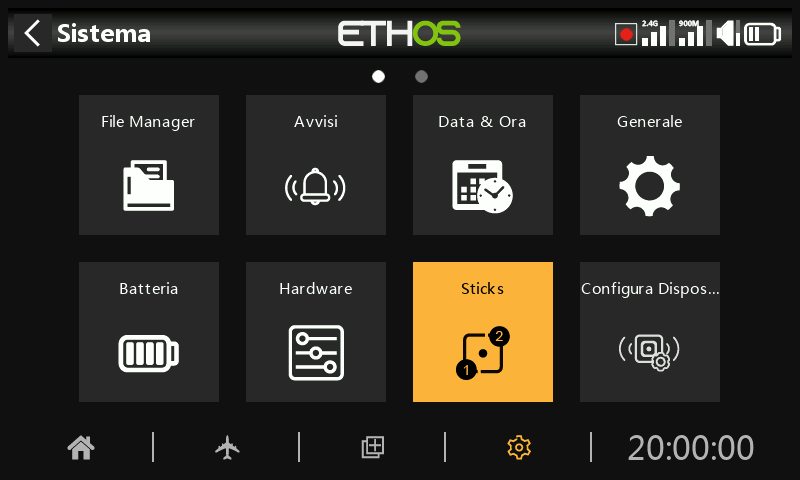
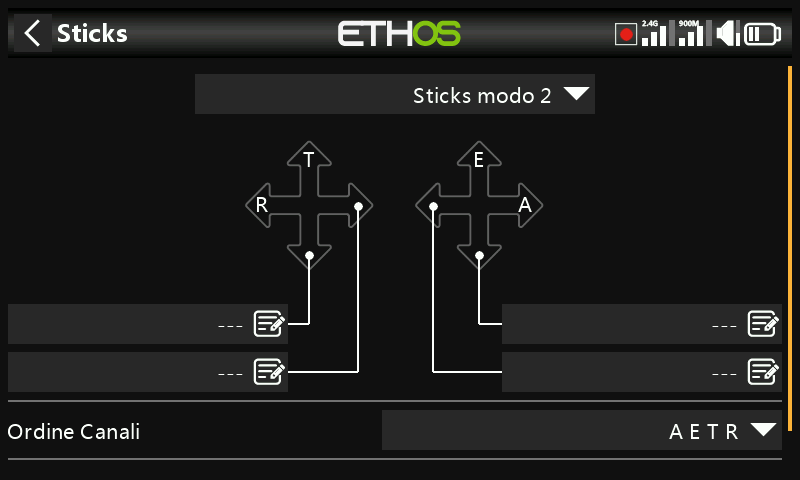
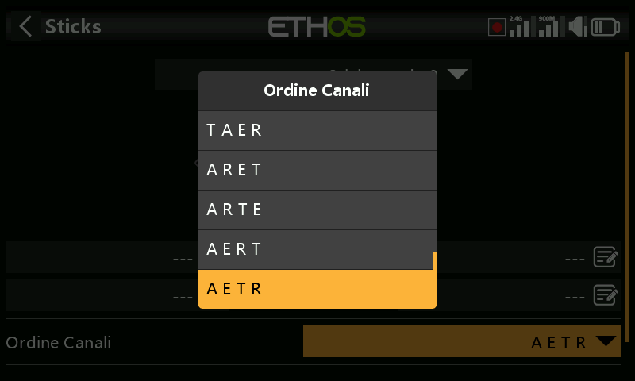
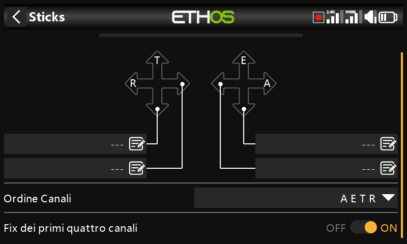

# Sticks

Seleziona la modalità stick che preferisci. La modalità 1 prevede il throttle e l'alettone sullo stick destro e l'elevatore e il timone su quello sinistro. La modalità 2 prevede Gas - Throttle e timone sullo stick di sinistra e alettone ed elevatore su quello di destra.

Per impostazione predefinita, gli stick hanno i nomi elencati sopra per le modalità di stick standard del settore. Possono essere rinominati a piacere.

## Ordine dei canali

L'ordine dei canali definisce l'ordine in cui i quattro ingressi degli stick vengono assegnati ai canali nei mix quando si crea un nuovo modello con la procedura guidata. L'ordine predefinito è AETR. Se ci sono più superfici di ogni tipo, verranno raggruppate a meno che i primi quattro canali non siano fissi, vedi sotto. Ad esempio, per due alettoni l'ordine dei canali sarà AAETR.

## I primi quattro canali sono fissi

Se questa opzione è attivata, il raggruppamento dei canali non avverrà sui primi quattro canali. Se l'ordine dei canali è AETR, la procedura guidata creerà un modello adatto ai ricevitori stabilizzati SRx. Ad esempio, un modello con 2 alettoni, 1 elevatore, 1 motore, 1 timone e 2 flap verrà creato con un ordine di canali AETRAFF. Se questa opzione non è abilitata, l'ordine dei canali sarà AAETRFF.
