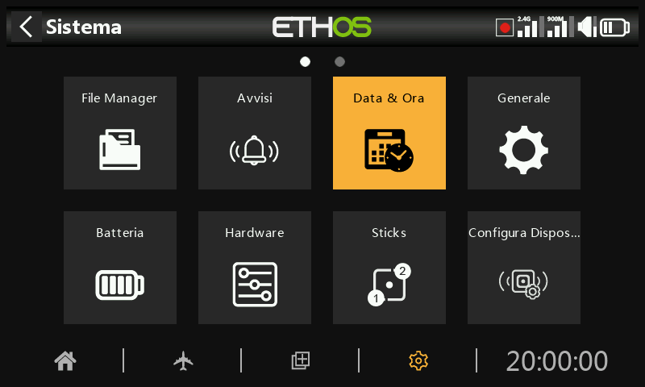

# Data e ora

Le impostazioni di Data e Ora sono:

## Formato 24 ore

L'orologio viene visualizzato in formato 24 ore quando è abilitato.

## Visualizza i secondi

L'orologio visualizza i secondi quando è abilitato.

## Data

Clicca per aprire la finestra di dialogo per l'impostazione della data. Deve essere impostato sulla data corrente. Viene utilizzata nei log.

## Ora

Fai clic per aprire la finestra di dialogo delle impostazioni dell'ora. Deve essere impostato sull'ora corrente. Viene utilizzata nei log.

## Fuso orario

Permette di configurare il fuso orario dell'utente.

## Regola la velocità dell'RTC

L'orologio in tempo reale può essere calibrato per compensare qualsiasi deriva dell'orologio, fino a 41 secondi al giorno.

Per la calibrazione, calcola quanti secondi guadagna o perde il tuo orologio in 24 ore.

Imposta il valore di calibrazione a 12 volte questo numero di secondi, rendendolo negativo se l'orologio funziona velocemente e positivo se è lento. Per ottenere la massima precisione, puoi verificare che l'orologio sia preciso e regolare leggermente il valore di calibrazione. Il valore di calibrazione attuale può essere impostato da -500 a +500.

## Regolazione automatica dal GPS

Se abilitata, l'ora e la data verranno impostate automaticamente dai dati del sensore GPS remoto.
