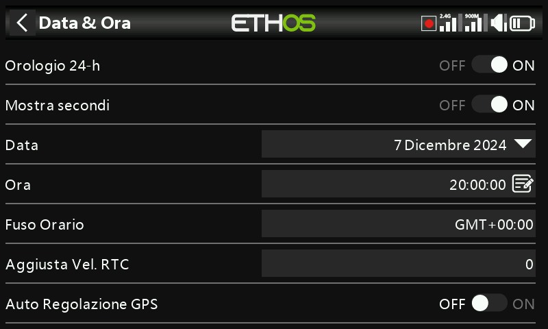

# Data e ora

- **Formato 24 ore** — commuta l'orologio tra la visualizzazione a 12 e a 24 ore.
- **Mostra secondi** — aggiunge i secondi alla visualizzazione dell'orologio.
- **Data** / **Ora** — imposta la data e l'ora correnti; entrambe vengono utilizzate
  per la registrazione dei dati.
- **Fuso orario** — il tuo fuso orario locale.
- **Regola velocità RTC** — compensa la deriva dell'orologio in tempo reale, fino a 41
  secondi al giorno. Misura di quanti secondi l'orologio anticipa o ritarda nell'arco di 24
  ore e imposta il valore di calibrazione a **12 volte tale numero di secondi**
  — negativo se l'orologio anticipa, positivo se ritarda (intervallo
  da −500 a +500). Ricontrolla dopo un giorno o due e affina la regolazione.
- **Regolazione automatica da GPS** — se attivata, imposta automaticamente la data e
  l'ora a partire dai dati di un sensore GPS remoto.
