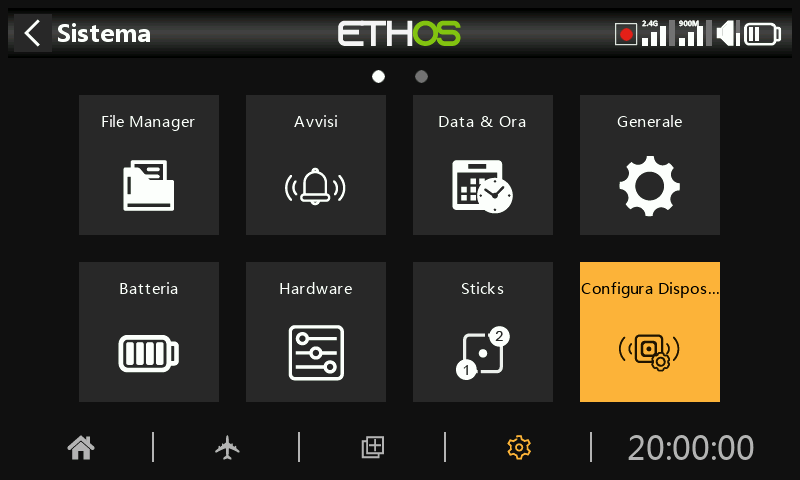
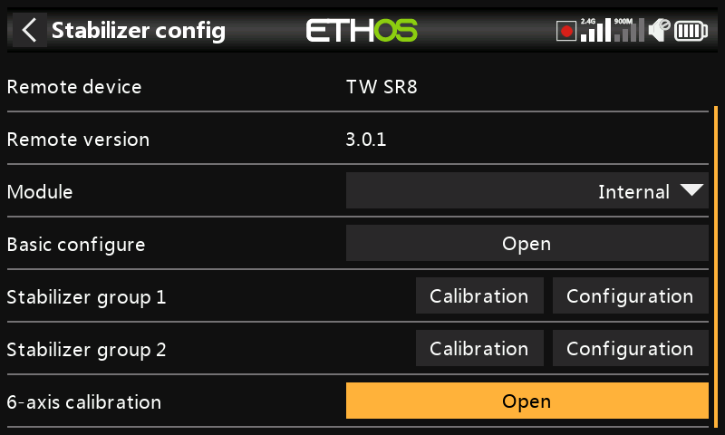
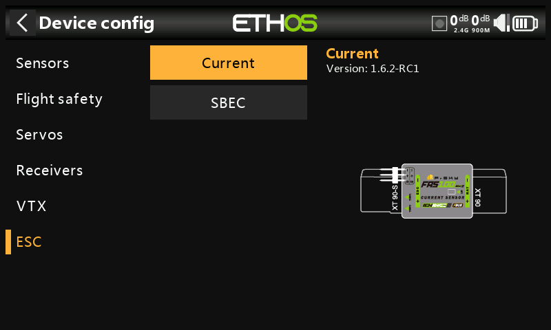
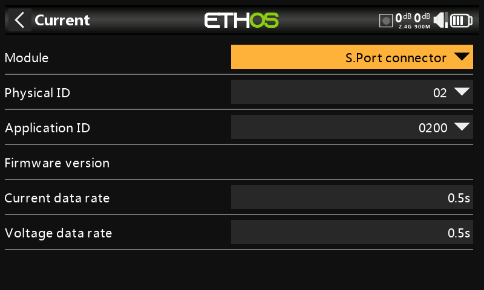
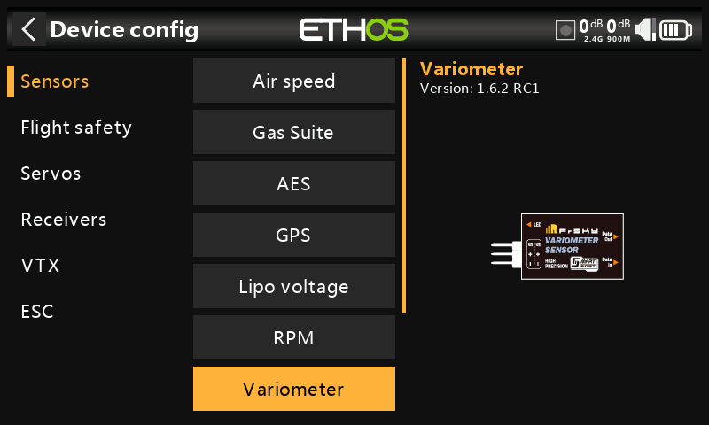

# Configurazione del dispositivo

La sezione 'Configurazione dispositivi' contiene strumenti per la configurazione di dispositivi come sensori, ricevitori, la suite di gas, servocomandi e trasmettitori video.

Attualmente sono supportati i seguenti dispositivi:

- Sensori
- Sicurezza in volo
- Servi
- Ricevitori
- VTX
- ESC
- Sensori fai-da-te (se viene rilevato un sensore fai-da-te, la voce fai-da-te apparirà sotto la categoria del dispositivo).

Per ulteriori dettagli, consulta il manuale del dispositivo.

Tieni presente che il menu "Configurazione dispositivo" di ETHOS ti permette di modificare gli ID fisici e gli ID applicativi dei sensori S.Port. Se hai più di un dispositivo con la stessa funzione, devi collegarli uno alla volta, scoprirli in Telemetria / "Scopri nuovi sensori", poi in "Configurazione dispositivo" cambiare l'ID fisico e l'ID applicazione, quindi tornare indietro e riscoprirli con il nuovo ID. Consulta la sezione [Telemetria di SmartPort](../model-setup/telemetry.md).

Device Config è ora estensibile e l'utente (e FrSky) può aggiungere pagine tramite Lua.

## Esempio di ricevitore

I ricevitori stabilizzati FrSky possono ora essere configurati tramite "Device config" dopo l'installazione dei necessari script Lua di configurazione. Questi sono facilmente installabili con un clic dalla libreria Lua di FrSky Suite; consulta la sezione dedicata alla [libreria Lua](#Lua_library).

Panoramica

È possibile scegliere tra «Stabilizer config» per i ricevitori più recenti e «SxR» per i  
ricevitori meno recenti

Opzione Config Stabilizzatore

L’opzione di ‘Stabilizer config’ è utilizzata per le nuove riceventi come le: TD SR12, TD 	SR18, TD SR10, TD SR6, TW SR12, TW SR8, TW SR10, Archer+ SR10+, Archer+ SR8, 	Archer+ SR12+, SR6 Mini, SR6 Mini E, SR6BL15A, and SR6Lite.

Opzione SXR

Si prega di far riferimento alla Opzione [SxR](#SxR option) qui sotto per le riceventi più vecchie come 	le ACCST D16 S6R, ACCST D16 S8R, Archer SR6, Archer SR8 Pro, Archer SR10 Pro, 	R9 Stab, R9 Stab OTA.

Configurazione dello stabilizzatore

L’opzione è usata per le nuove riceventi come quelle della lista precedentemente

Nota per la versione 3.0.x

Si prega di notare che dopo l'aggiornamento del firmware Rx alla versione 3.0.x è necessario eseguire un'operazione di reset di fabbrica e quindi un nuovo binding e una riconfigurazione (in particolare delle funzioni Stab, compresa la calibrazione a 6 assi) di tutte le funzioni. Ciò è dovuto all'aggiunta della nuova funzione di salvataggio dei dati Failsafe sul lato Rx. Si noti che la funzione Failsafe deve essere resettata e controllata attentamente dopo l'aggiornamento dei ricevitori. Il reset di fabbrica del ricevitore si trova alla voce Opzioni del ricevitore nel setup RF.

Il processo è stato semplificato, ma ti risulterà subito familiare se hai già utilizzato SxR o Srx Lua.

Le configurazioni completate possono essere salvate sul PC o su backup e ripristinate Questo non include I dati di calibrazione.

I nuovi modelli di ricevitori hanno due gruppi di stabilizzazione. Il gruppo 1 copre i canali 1-6, mentre il gruppo 2 copre i canali 7-11. Se non utilizzi i pin 7-11 per la stabilizzazione, disattiva il gruppo 2 di stabilizzazione.

La funzione di calibrazione a 6 assi è ora integrata. Questa operazione deve essere eseguita una volta sui nuovi ricevitori e quando si esegue l'aggiornamento alla versione 3.0.x (dopo il reset di fabbrica).

Calibrazione dei gruppi 1 e 2

Nella funzione di calibrazione dei gruppi 1 e 2, la fase di autoverifica è stata sostituita da una calibrazione indipendente di gran lunga superiore del livello dell'aereo, del centro del canale e dei punti finali del canale. Inoltre, ogni canale può essere attivato/disattivato.

Configurazione dei gruppi 1 e 2

Le impostazioni di stabilizzazione vengono eseguite in questa sezione.

Le configurazioni completate possono essere salvate sul PC o possono essere ripristinate le copie di backup. Questo non include i dati di calibrazione.

FrSky North America ha redatto [una guida completa ](https://docs.google.com/document/d/1l4pE8nvk-KvRSlBYujmPA-Qt_G_CbVQaioiFv69BMls/edit?tab=t.0#heading=h.xbt6jdtpyqla)alla configurazione di un ricevitore stabilizzato che copre tutti i dettagli.

C'è anche un [video del processo di configurazione ](https://youtu.be/0pKSzxyJrB8?si=PFuby_4TNiMnONvM)realizzato dal pilota del team FrSky Juan Sanchez Garcia.  Fa un lavoro eccellente spiegando la configurazione in tutti i dettagli.

Opzione SxR

I ricevitori di vecchia generazione (come ACCST D16 S6R, ACCST D16 S8R) e i ricevitori Archer & Archer Pro (come Archer SR6, Archer SR8 Pro, Archer SR10 Pro, R9 Stab, R9 Stab OTA) utilizzano l'opzione SxR.

Questi ricevitori, anche se denominati SRx anziché SxR e con il guadagno (Gain) assegnato al canale 9, utilizzano l'opzione SxR.

I ricevitori più recenti con “Stabilizzazione avanzata” e il controllo del guadagno (Gain) sul canale 13 utilizzano l'opzione “Configurazione stabilizzatore”

I vecchi ricevitori SxR possono essere calibrati e configurati tramite l'opzione "SxR".

## Configurazione via Connetore S.Port sulla trasmittente

Il supporto per la configurazione dei dispositivi S.Port e FBUS direttamente dal trasmettitore è disponibile tramite il connettore S.Port sul trasmettitore.

Configurazione dispositivi FBUS

Collegare il dispositivo FBUS alla connessione S.Port nella parte superiore della radio. Il cavo bianco o giallo va sul lato con una tacca.

Vai su System/Device config e scorri fino al tuo dispositivo FBUS, ad esempio un sensore di corrente FAS40 ADV. Premi Enter.

Una volta aperta la pagina di configurazione, fare clic su Modulo e selezionare “Connettore S.Port”.

Apporta le modifiche alla configurazione, ricordando che l'ID fisico e

l'ID applicazione devono essere entrambi univoci.

Quindi scorri più in basso e tocca il pulsante “Salva su flash”.

Consulta anche la sezione “Come fare” “[Come configurare un sistema FBUS](https://www.deepl.com/en/translator?utm_term=&utm_campaign=IT%7CSearch%7CC%7CDSA%7CEnglish&utm_source=google&utm_medium=paid&hsa_acc=1083354268&hsa_cam=20627207960&hsa_grp=157168539729&hsa_ad=676252350153&hsa_src=g&hsa_tgt=dsa-437115340933&hsa_kw=&hsa_mt=&hsa_net=adwords&hsa_ver=3&gad_source=1&gclid=CjwKCAiAtYy9BhBcEiwANWQQL3EXIE2Cf7NSZZ0OYMKRgJCFeuGlPViCbNUpEZbVFRHTE1YdWYCrcBoCvrYQAvD_BwE#How%20to%20configure%20an%20FBUS%20system)” per ulteriori esempi.

Configurazione dei dispositivi S.Port

Collegare il dispositivo S.Port alla connessione S.Port nella parte superiore della radio. Il cavo bianco o giallo va sul lato con una tacca.

Vai a Configurazione sistema/dispositivo e scorri fino al tuo dispositivo S.Port, ad esempio un variometro. Premi Invio.

Una volta aperta la pagina di configurazione, fare clic su Modulo e selezionare “Connettore S.Port”.

Apporta le modifiche alla configurazione, ricordando che l'ID fisico e l'ID applicazione devono essere entrambi univoci.

Quindi scorri verso il basso e tocca il pulsante “Salva su flash”.
