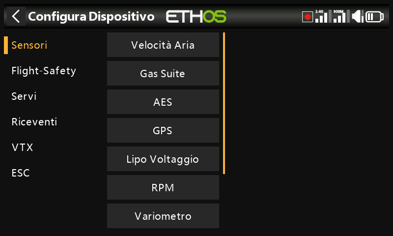
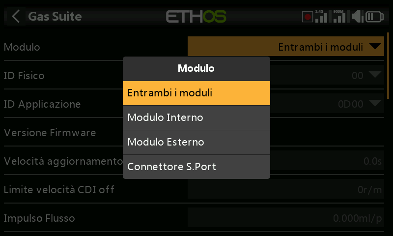
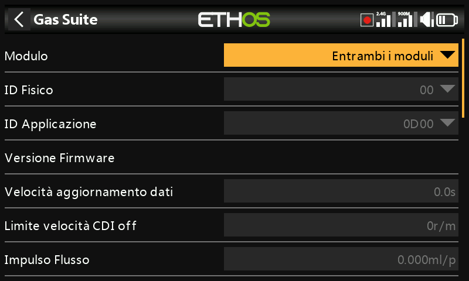

# Dispositivi

Nel menu si chiama **Device config** — sono gli strumenti per configurare le
periferiche collegate tramite S.Port/FBUS: sensori, ricevitori, la "gas
suite", servi, VTX ed ESC. La voce **DIY sensors** compare automaticamente
non appena viene rilevato un sensore DIY. Per i dettagli completi consulta il
manuale specifico di ciascun dispositivo; questa pagina tratta gli aspetti
comuni a tutti.

!!! note
    Questo non ha nulla a che vedere con la scelta del modulo RF (interno o
    esterno) con cui trasmette un *modello*: quella è un'impostazione
    specifica del modello, descritta in
    [Sistema RF](../model-setup/rf-system.md).

Device config è estensibile: sia gli utenti sia FrSky possono aggiungere
pagine tramite Lua.

## Riassegnazione degli ID dei sensori

Le schermate Device config di Ethos permettono di modificare direttamente il
**Physical ID** e l'**Application ID** S.Port di un dispositivo. Se hai più
di un dispositivo con la stessa funzione, collegali **uno alla volta**:
rileva ciascuno in
[Telemetria → Rileva nuovi sensori](../model-setup/telemetry.md), modificane
qui in Device config il Physical ID e l'Application ID, quindi torna indietro
e rilevalo di nuovo con il nuovo ID.

## Esempio: ricevitori

I ricevitori stabilizzati FrSky possono essere configurati qui una volta
installato il relativo script Lua di configurazione (un clic, dalla Lua
Library di Ethos Suite). Ci sono due percorsi di configurazione, a seconda
della generazione del ricevitore:

- **Stabilizer config** — i ricevitori più recenti dotati di
  "stabilizzazione avanzata" (controllo del guadagno sul canale 13). Vengono
  resi disponibili due gruppi di stabilizzazione indipendenti: il Gruppo 1
  riguarda i canali 1–6, il Gruppo 2 i canali 7–11 — disattiva il Gruppo 2
  se non utilizzi i pin 7–11 per la stabilizzazione. È integrata una
  calibrazione a 6 assi, che deve essere eseguita una volta su un ricevitore
  nuovo e ripetuta dopo ogni aggiornamento al firmware v3.0.x (a seguito di
  un ripristino delle impostazioni di fabbrica). Nella calibrazione di
  ciascun gruppo, il vecchio passaggio di "self-check" è stato sostituito
  dalla calibrazione indipendente dell'assetto orizzontale del modello, del
  centro del canale e dei fine corsa del canale, e ogni canale può essere
  attivato/disattivato singolarmente. Le configurazioni (non i dati di
  calibrazione) possono essere salvate su PC e da lì ripristinate.
- **SxR** — i ricevitori più datati, comprese le unità legacy e
  Archer/Archer Pro, oltre a ricevitori come l'SR10 Pro che (nonostante il
  nome "SRx") hanno il Gain sul canale 9 anziché sul 13.

  

!!! warning "Dopo l'aggiornamento al firmware ricevitore v3.0.x"
    Esegui un ripristino delle impostazioni di fabbrica (che si trova nelle
    opzioni del ricevitore, nella configurazione RF), quindi rifai il binding
    e riconfigura tutto da capo — in particolare le funzioni Stab e la
    calibrazione a 6 assi. Questo è necessario per la nuova funzione di
    salvataggio dei dati di failsafe introdotta con la v3.0.x; al termine
    verifica attentamente il funzionamento del failsafe.

FrSky North America pubblica una guida dettagliata alla configurazione dei
ricevitori stabilizzati, ed è disponibile un video esplicativo del FrSky Team
Pilot Juan Sanchez Garcia che tratta gli stessi argomenti.

## Configurazione tramite il connettore S.Port della radio

I dispositivi S.Port e FBUS possono essere configurati anche direttamente
tramite il connettore S.Port posto sulla parte superiore della radio, senza
passare da un ricevitore connesso.

1. Collega il dispositivo al connettore S.Port della radio (cavo
   bianco/giallo verso il lato con la tacca).
2. Vai in **System → Device config**, scorri fino al dispositivo (ad
   esempio un sensore di corrente FAS40 ADV) e premi `ENT`.
3. Nella pagina di configurazione, imposta **Module** su **S.Port
   connector**.
4. Apporta le modifiche desiderate — il Physical ID e l'Application ID
   devono essere entrambi univoci — quindi scorri verso il basso e tocca
   **Save to flash**.

Questo vale sia per i dispositivi FBUS (vedi anche [Guida pratica:
configurare un sistema FBUS](../how-to/fbus-setup.md)) sia per i normali
dispositivi S.Port come un variometro.
