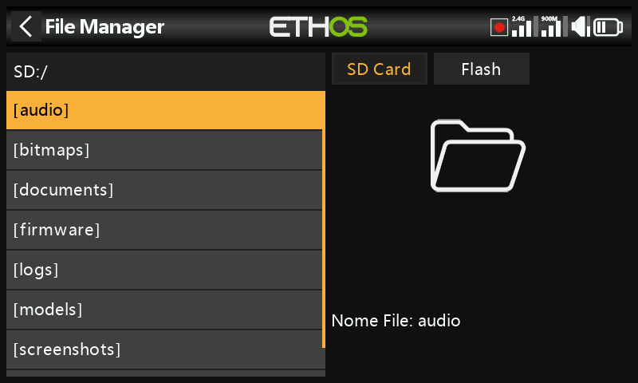
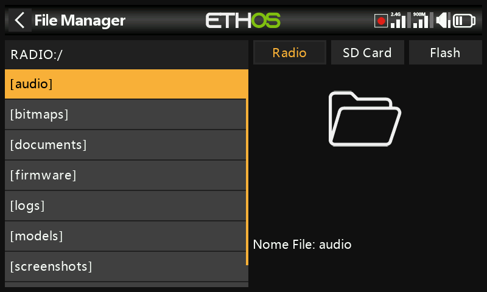
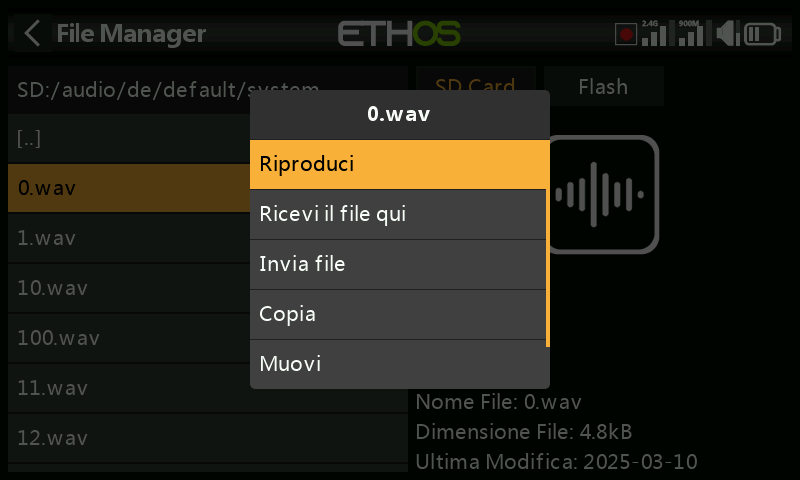
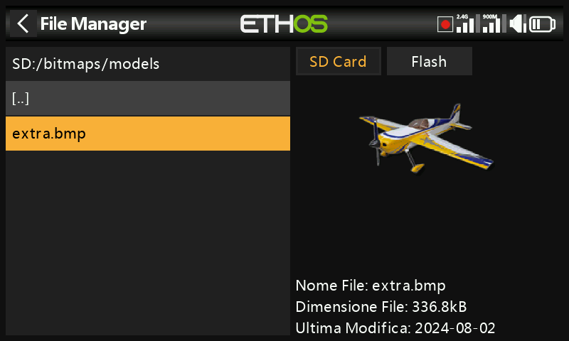
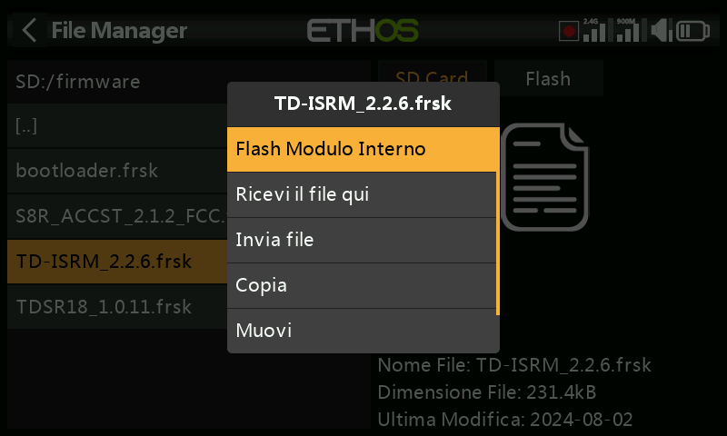
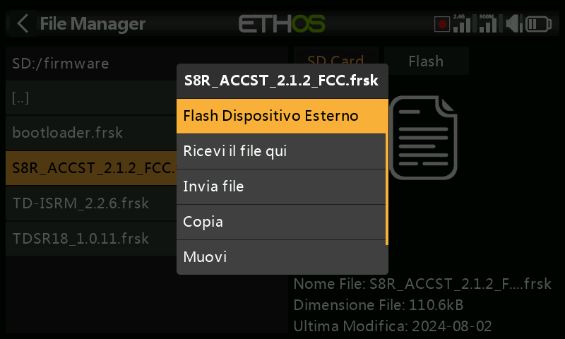
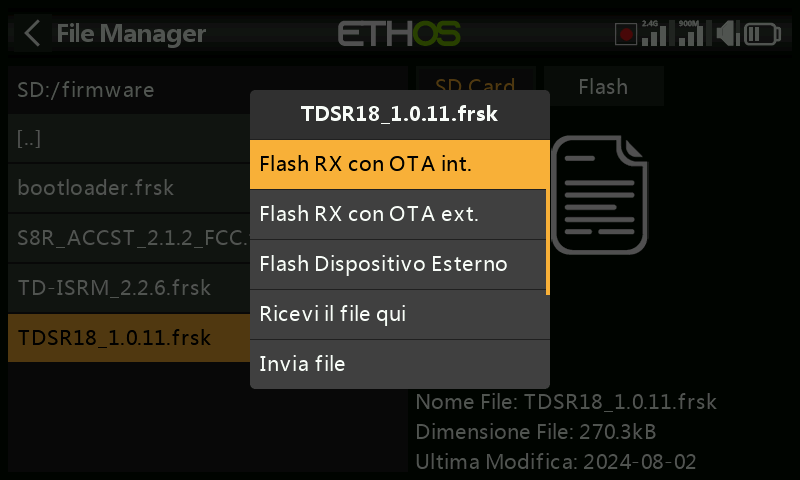
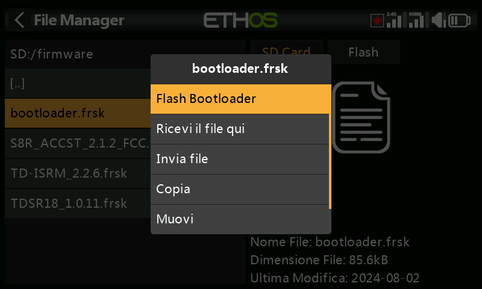
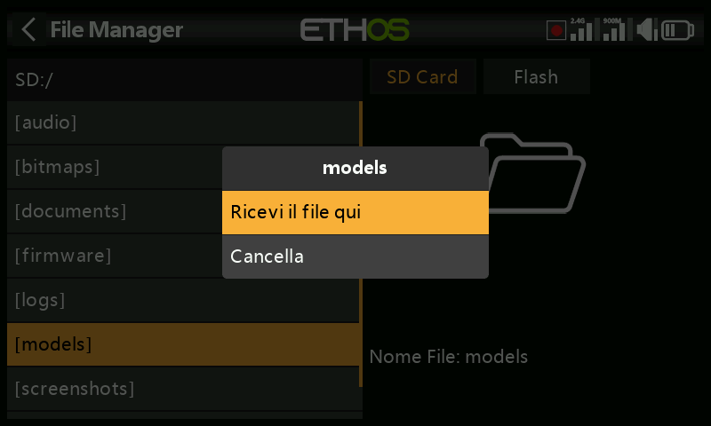
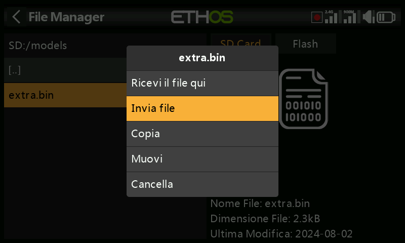

# Gestore di file

Il "File manager" serve per gestire file e cartelle e per accedere al firmware flash del modulo RF, della porta S.Port esterna, dei dispositivi OTA (Over The Air) e dei moduli esterni.

Nota che quando si aggiorna il firmware del sistema, potrebbe essere necessario aggiornare anche i file contenuti nella chiavetta e nella scheda SD o eMMC.

Si prega di notare che a partire dalla versione Ethos 26.1 la radio non utilizza più la memoria Flash interna per memorizzare le bitmap e i font di sistema. Questi file sono ora parte integrante del firmware Ethos, riducendo i tempi di avvio e aumentando la velocità dell'interfaccia utente (nessun caricamento dinamico per le bitmap).

ETHOS dispone di una funzione di trasferimento di file Bluetooth da radio a radio. Fai riferimento all'esempio riportato nella sezione [Condivisione di file via Bluetooth](file-manager.md).

Nota: sia il Bootloader che il firmware di sistema sono memorizzati nella memoria flash interna su tutte le radio FrSky a partire dal modello originale X9D.

Tocca "Gestione file" per aprire l'esploratore di file.

La serie X20/S/HD richiede una scheda SD da 32 giga o meno formattata in fat32. Le schede SanDisk Ultra Micro SDHC Classe 10 16gig sono una buona opzione. I file sono disponibili sul sito web di FRSky.

Le radio X18 e X20 Pro/R/RS utilizzano una scheda eMMC interna per l'archiviazione dei file, ma è possibile aggiungere una scheda SD esterna. Tocca la scheda "Radio" per esplorare la memoria della scheda eMMC.

Il sistema creerà alcune delle cartelle se l'utente non le ha create, come Logs, Models e Screenshots. La cartella Firmware è stata creata manualmente per conservare il firmware dei dispositivi, come i ricevitori, ecc.

Percorso dell'unità della scheda SD quando è collegata a un PC:

Scheda SD (lettera dell'unità)/ o

RADIO (lettera dell'unità)/ {radio con scheda eMMC interna}

## Menu File manager

Il File manager dispone di un menu opzioni. Tocca i 3 puntini verticali nella barra dei menu (o scorri all'indietro).

Il menu File manager offre due opzioni:

• È possibile ricevere un modello tramite Bluetooth. Per ulteriori dettagli, consulta la 	cartella “modelli” riportata di seguito.  
	• È possibile creare una nuova cartella nella cartella aperta quando si richiama questo 	menu.

## Opzioni di ordinamento del File Manager

Tocca l'icona “Opzioni di ordinamento” accanto all'icona del menu del File Manager sopra per aprire la finestra di dialogo delle opzioni di ordinamento:  
  
• È possibile ordinare i file in base al nome o alla data dell'ultima modifica.  
• È possibile ordinare i file in ordine crescente o decrescente.  
  
Questa opzione è estremamente utile per trovare il file di log più recente nella cartella “logs”.

## Cartelle di primo livello

Le cartelle di livello superiore sono:

audio/

Questa cartella è dedicata ai file audio.

audio/en/gb	Voce inglese  
audio/en/us	Voce americana  
**audio/it/default**	voce predefinita

Queste cartelle contengono i file audio dell'utente che possono essere riprodotti con la funzione speciale "Riproduzione audio". Consulta la sezione [Modello/Funzioni speciali ](#Special_Functions_section)e la sezione [Scelta delle voci](general.md)

Il formato deve essere 16kHz o 32kHz PCM lineare a 16 bit o alaw (EU) a 8 bit o mulaw (US) a 8 bit. I nomi dei file wav possono contenere 31 caratteri più l'estensione.

audio/en/gb/system  
audio/en/us/system  
*audio/it/default/system*

Queste cartelle sono per i file audio di sistema, ad es.

| hello.wav | Il saluto "Benvenuto in Ethos |
| --- | --- |
| bye.wav	 | Questo non è fornito da Ethos, ma puoi aggiungere il tuo file WAV di addio. |

Tocca la cartella \[audio\] per visualizzare il contenuto della cartella.

Tocca un file WAV e seleziona l'opzione Play per ascoltarlo.

Il file può anche essere copiato, spostato o cancellato. Esistono anche opzioni per inviare o ricevere il file via Bluetooth. Consulta la sezione [Condivisione di file via Bluetooth ](file-manager.md)qui di seguito.

Nota: tutte e tre le cartelle vengono aggiornate da FrSky Suite, indipendentemente da quella o quelle che hai selezionato nelle opzioni della voce.

bitmaps/

Questa cartella è dedicata ai file bitmap.

bitmaps/models/

Questa cartella è per le immagini dei modelli utente configurati in "Modello / Modifica modello" e nelle procedure guidate per i nuovi modelli.

Nota che il File Manager mostra i dettagli del file nel pannello laterale destro,  come il nome, la grandezza e l’ultima data di modifica.

bitmaps/user/

Questa cartella è per le bitmap utente diverse dalle immagini del modello impostate in "Modello / Modifica modello".

Il formato di immagine consigliato è il seguente: BMP:

Formato BMP a 32 bit

8 bit per colore

Canale alfa (utilizzato per la trasparenza dell'immagine)

Dimensioni: 300x280px

Questo formato riduce il carico di calcolo del microcontrollore a Edge della radio. Inoltre, ETHOS ridimensiona i BMP al volo, ma non i PNG o i JPG.

Regole di denominazione dei file immagine:

Regola 1: usa solo i seguenti caratteri: A-Z, a-z, 0-9, ()!-\_@#;\[\]+= e Spazio

Regola 2: il nome non deve contenere più di 11 caratteri, più 4 per l'estensione. Se il nome è più lungo di 11 caratteri, viene visualizzato nel File Manager ma non appare nell'interfaccia di selezione dell'immagine del modello.

Strumenti di conversione delle immagini

FrSky Suite dispone di strumenti di conversione delle immagini. Consulta la sezione [Gestione immagini ](#Image_manager)di FrSky Suite.

-

documents/

Questa cartella è dedicata ai documenti.

documents/user/

Questa cartella contiene i documenti di testo degli utenti. Possono essere richiamati nel widget "Testo".

Firmware/

Questa cartella contiene i file del firmware. Qui vengono archiviati gli aggiornamenti del firmware per il modulo RF interno, i moduli esterni e altri dispositivi come i ricevitori ecc. Da qui è possibile eseguire il flashing tramite la porta S.Port esterna della radio o OTA (Over The Air). Il nuovo firmware deve essere copiato nella cartella Firmware dopo aver messo la radio in modalità boot-loader e averla collegata a un PC via USB.

Tocca la cartella Firmware per visualizzare i file del firmware che sono stati copiati in questa cartella.  Seleziona il firmware appropriato per il tuo dispositivo, quindi tocca l'opzione Flash nella finestra di dialogo a comparsa. L'esempio sopra mostra l'aggiornamento del modulo RF interno.

L'esempio precedente mostra un ricevitore S8R che sta per essere aggiornato tramite la connessione S.Port della radio.

L'esempio precedente mostra un ricevitore TD-R18 che sta per essere aggiornato Over-The-Air tramite il collegamento wireless al ricevitore collegato.

L'esempio precedente mostra l'aggiornamento del bootloader.

I file possono anche essere copiati, spostati o eliminati.

i18n

Questa cartella contiene i file di traduzione delle lingue.

Logs/

I registri dei dati vengono memorizzati qui.

Per visualizzare i registri, è più comodo modificare le opzioni di ordinamento del File Manager in modo che i registri più recenti siano in cima.  
  
Passa alla cartella dei registri, quindi tocca l'icona “Opzioni di ordinamento” accanto all'icona del menu del file manager in alto per aprire la finestra di dialogo delle opzioni di ordinamento. Tocca per ordinare come “Ultima modifica” e “Ordine decrescente”.

Scorri fino al file di log recente desiderato. Tieni presente che File Manager visualizza i dettagli del file nel riquadro di destra, compreso il nome completo del file, che è molto utile per vedere il timestamp completo se è stato troncato nella vista a sinistra.  
  
Tocca il file di log e seleziona “Apri” per visualizzarlo. Per ulteriori dettagli, consulta la sezione “Visualizzatore di log”.

models/

La radio memorizza qui i file dei modelli. Questi file non possono essere modificati dall'utente, ma possono essere salvati o condivisi da qui. Inizialmente i modelli venivano nominati semplicemente da model01.bin in poi, ma a partire da Ethos v1.2.11 viene utilizzato il nome del modello, ad esempio un modello chiamato "Extra" avrà un nome di file "Extra.bin". Se esiste più di un modello "Extra", i modelli aggiuntivi saranno denominati "Extra01.bin" e così via.

Quando si modificano i nomi dei modelli nella schermata "Modifica modello", anche il nome del file del modello (.bin) verrà modificato. Il nome del file del modello sarà tutto in minuscolo (il nome effettivo del modello con maiuscole e minuscole viene salvato all'interno del file bin). Non tutti i caratteri sono supportati per il nome del file bin del modello, quindi potrebbe non corrispondere esattamente al nome del modello.

Ci sono delle sottocartelle per ogni cartella di categoria di modello creata dall'utente.

screenshot/

Le schermate create dalla funzione speciale Screenshot vengono memorizzate qui nel formato “.png” si prega di consultare la sezione Modello / [Funzioni speciali](#Special_Functions_section).

scripts/

Questa cartella è utilizzata per memorizzare gli script Lua. Gli script possono essere organizzati in cartelle individuali e i file di supporto possono essere inclusi in una struttura di cartelle.

**Attenzione**! Si prega di notare che gli script Lua aumentano il tempo di avvio della radio. Se sono implementati correttamente, il ritardo non dovrebbe essere percepibile, ma se non è così, il ritardo può essere quasi indefinito.

I tipi di script Lua includono widget, attività, sorgenti e strumenti. Sono utilizzati anche per il controllo di moduli esterni.

Widgets

I widget sono utilizzati nelle viste principali per visualizzare le informazioni desiderate, come la telemetria e lo stato della radio, ecc. Per ulteriori dettagli, consultare la sezione [Configurazione schermate](#Configure Screens section).

Attività e sorgenti dati

Utilizzando gli script Lua è possibile creare sorgenti personalizzate, come ad esempio sensori personalizzati, o creare attività che eseguono azioni personalizzate, come ad esempio la registrazione dei dati in un file al termine del volo. Una volta installata nella cartella scripts/, il menù Lua appare nella sezione Modello per gestire l'attività o la sorgente per ciascun modello. Fare riferimento alla pagina [Lua per](#Lua) maggiori dettagli.

Strumenti

Ad esempio gli strumenti di configurazione del ricevitore stabilizzato che appaiono nei menu di sistema.

script per moduli esterni

Ogni modulo esterno di terze parti ha un proprio file Lua e deve essere memorizzato nella propria cartella.

script/multi

scripts/elrs

scripts/ghost

scripts/crossfire

Per maggiori informazioni, consulta il post sui [moduli esterni di terze parti ](https://www.rcgroups.com/forums/showpost.php?p=49550649&postcount=18844)nella discussione su X20 ed Ethos su rcgroups.

radio.bin

Questo file si trova nella cartella principale e viene creato dal sistema radio quando si inizializza e contiene le impostazioni del sistema. Prima di aggiornare il firmware, è necessario eseguire un backup insieme alla cartella dei modelli di cui sopra, per consentire il downgrade alla versione precedente, se necessario

Il file firmware.bin deve essere salvato nella cartella principale della scheda SD o eMMC quando si effettua un aggiornamento del firmware della radio. Dopo aver salvato il nuovo file firmware.bin, l'aggiornamento verrà automaticamente flashato nella radio quando questa sarà scollegata dal PC. (Tieni presente che potrebbe essere necessario aggiornare contemporaneamente il contenuto della scheda SD o eMMC e della chiavetta della radio).

sdcard.version

Questo file contiene la versione della sdcard ed è utilizzato e gestito da FrSky Suite.

## Condivisione di file tramite Bluetooth

ETHOS dispone di una funzione di trasferimento file Bluetooth da radio a radio.

Sulla radio ricevente, utilizzando File Manager, naviga fino alla cartella del modello in cui desideri ricevere il file o il modello. Premi a lungo Invio e seleziona "Ricevi il file qui".

Sulla radio di invio, vai al file che vuoi inviare e toccalo. Poi seleziona "Invia file" e segui le istruzioni su entrambe le radio.

Se la radio è già collegata a un altro dispositivo Bluetooth in Telemetria / Bluetooth o Trainer / Modalità di collegamento / Bluetooth o Generale / Audio / Bluetooth (solo X20S/Pro) ti verrà chiesto se desideri scollegare il dispositivo.
