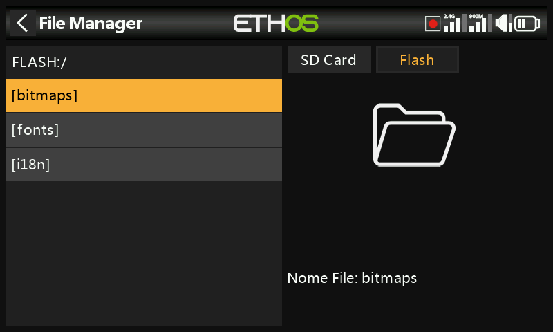

# Gestione file

Gestione file permette di esplorare la memoria della radio e di aggiornare il
firmware del modulo RF interno, dei dispositivi collegati via S.Port, dei
dispositivi OTA (Over-The-Air) e dei moduli esterni.

## Organizzazione della memoria

Tocca **Flash** (oppure premi `PAGE` per cambiare unità) per esplorare l'unità
flash USB virtuale interna della radio, utilizzata per le bitmap e i font di
sistema:

- `bitmaps/system` — le bitmap utilizzate per le schermate e le icone
- `fonts/` — i font per le diverse lingue selezionabili

Sia il bootloader sia il firmware di sistema risiedono in questa memoria flash
interna, su tutte le radio FrSky fino alla X9D originale.

La serie **X20/X20S/X20HD** utilizza una SD card formattata FAT32, di capacità
pari o inferiore a 32GB (una SanDisk Ultra Micro SDHC Class 10 da 16GB è
un'ottima scelta). Le **X18** e **X20 Pro/R/RS** utilizzano per impostazione
predefinita una eMMC interna (a cui è possibile affiancare una SD card esterna)
— tocca **Radio** per esplorarla. Ethos crea automaticamente le cartelle
`Logs/`, `models/` e `screenshots/` se mancanti; `Firmware/` è invece una
convenzione manuale per i file di firmware dei dispositivi, come i ricevitori.

## Cartelle di primo livello {: #top-level-folders }

- **`audio/`** — file audio utente e di sistema, suddivisi per voce
  (`audio/en/gb`, `audio/en/us`, `audio/en/default`). I file utente vengono
  riprodotti dalla [funzione speciale Play Audio](../model-setup/special-functions.md);
  i file di sistema comprendono `hello.wav` (il messaggio di benvenuto "Welcome
  to Ethos" — è possibile aggiungere un `bye.wav`, che però non è fornito).
  Formato: PCM a 16kHz o 32kHz, lineare a 16 bit, oppure A-law (EU)/µ-law (US)
  a 8 bit; nomi file fino a 31 caratteri più estensione. Tutte e tre le cartelle
  voce vengono mantenute sincronizzate da Ethos Suite, indipendentemente da
  quale sia effettivamente selezionata.

  

- **`bitmaps/`** — `bitmaps/models/` contiene le immagini dei modelli
  dell'utente (impostate in [Modifica modello](../model-setup/model-edit.md) o
  nelle procedure guidate di creazione di un nuovo modello); `bitmaps/user/`
  contiene tutto il resto. Formato consigliato: BMP a 32 bit, 8 bit per colore,
  con canale alpha, 300×280px — in questo modo la decodifica a bordo della radio
  resta poco onerosa. Ethos ridimensiona i file BMP al volo, ma non i PNG/JPEG.
  I nomi file possono contenere solo `A-Z a-z 0-9 ()!-_@#;[]+=` e spazi, e non
  devono superare gli 11 caratteri (più un'estensione di 4 caratteri) per essere
  visibili nel selettore delle immagini del modello — i nomi più lunghi
  compaiono comunque in Gestione file, ma lì non risultano selezionabili. Gli
  strumenti di conversione immagini di Ethos Suite si occupano automaticamente
  della conversione di formato.

  

- **`documents/user/`** — documenti di testo dell'utente, richiamabili dal
  widget di visualizzazione **Text**.

- **`Firmware/`** — file di firmware per il modulo RF interno, i moduli esterni
  e altri dispositivi (ricevitori, ecc.), aggiornabili da qui via S.Port o OTA.
  Copia qui il nuovo firmware mentre la radio è in [modalità
  bootloader](../getting-started/usb-connection-modes.md) e collegata via USB;
  toccando un file di firmware e scegliendo **Flash** si avvia l'aggiornamento:

  
  
  
  

- **`I18n/`** — file di traduzione delle lingue.

- **`Logs/`** — registrazioni dei dati.

- **`models/`** — i file dei modelli veri e propri. Non possono essere
  modificati direttamente da qui, ma solo salvati come backup o condivisi. A
  partire da Ethos v1.2.11, un modello viene denominato in base al proprio nome
  anziché con la sequenza `model01.bin` (ad esempio un modello chiamato "Extra"
  diventa `Extra.bin`; un secondo "Extra" diventa `Extra01.bin`). Rinominando un
  modello in [Modifica modello](../model-setup/model-edit.md) viene rinominato
  anche il relativo file — sempre in caratteri minuscoli (il nome visualizzato
  con maiuscole e minuscole è memorizzato all'interno del file) e non tutti i
  caratteri del nome del modello vengono riportati nel nome del file. Dalla
  versione v1.1.0 Alpha 17, ogni categoria di modelli creata dall'utente
  dispone di una propria sottocartella.

- **`screenshots/`** — output della [funzione speciale
  Screenshot](../model-setup/special-functions.md).

- **`scripts/`** — script Lua, eventualmente organizzati in sottocartelle
  proprie con i relativi file di supporto. I tipi di script sono i **widget**
  (vedi [Display](../displays/index.md)), i **task e le sorgenti** (sensori
  personalizzati o azioni post-volo — installati qui, compaiono nel menu
  [Lua](../model-setup/lua-scripts.md) del modello) e i **tool** (ad esempio gli
  strumenti di configurazione dei ricevitori stabilizzati presenti nei menu di
  sistema). Ogni modulo esterno di terze parti dispone di un proprio script e
  di una propria cartella, ad esempio `scripts/multi`, `scripts/elrs`,
  `scripts/ghost`, `scripts/crossfire`.

  !!! warning
      Gli script Lua aumentano il tempo di avvio della radio. Il ritardo
      introdotto da uno script ben scritto è impercettibile — uno script scritto
      male può ritardare l'avvio quasi indefinitamente.

- **`radio.bin`** (cartella principale) — il file delle impostazioni di sistema,
  scritto dalla radio stessa in fase di inizializzazione. Eseguine il backup
  insieme a `models/` prima di un aggiornamento del firmware, in modo da poter
  eventualmente tornare a una versione precedente.

- **`firmware.bin`** (cartella principale) — copia qui un nuovo file di firmware
  della radio per farlo installare automaticamente alla successiva
  disconnessione della radio dal PC. Potrebbe essere necessario aggiornare nello
  stesso passaggio anche il contenuto della SD card/eMMC e dell'unità flash
  interna.

- **`sdcard.version`** (cartella principale) — la versione del contenuto della
  SD card, gestita da Ethos Suite.

## Condivisione dei file via Bluetooth

Ethos può trasferire file da radio a radio tramite Bluetooth. Sulla radio
**ricevente**, spostati nella cartella di destinazione in Gestione file, premi a
lungo `ENT` e scegli **Receive file here**:

Sulla radio **mittente**, tocca il file, scegli **Send file** e segui le
indicazioni su entrambe le radio:

Se una delle due radio ha già una connessione Bluetooth attiva (telemetria,
collegamento maestro-allievo oppure, sulle X20S/Pro, audio), verrà chiesto se
disconnettere prima tale dispositivo.
