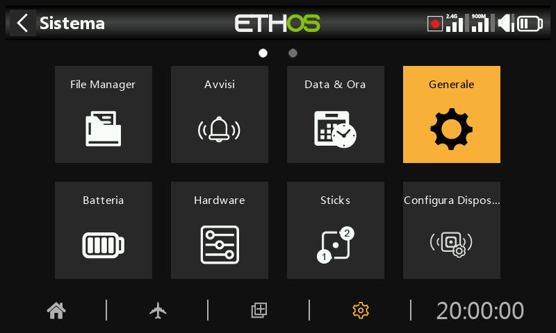
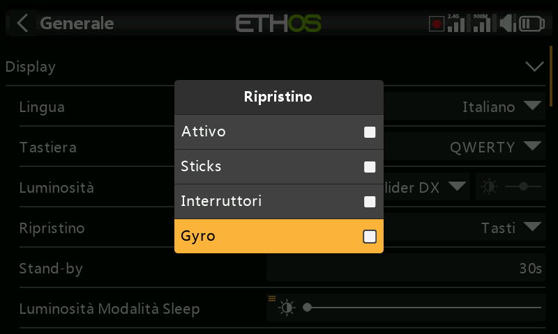
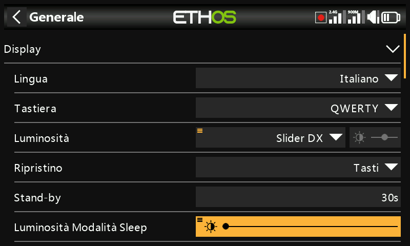
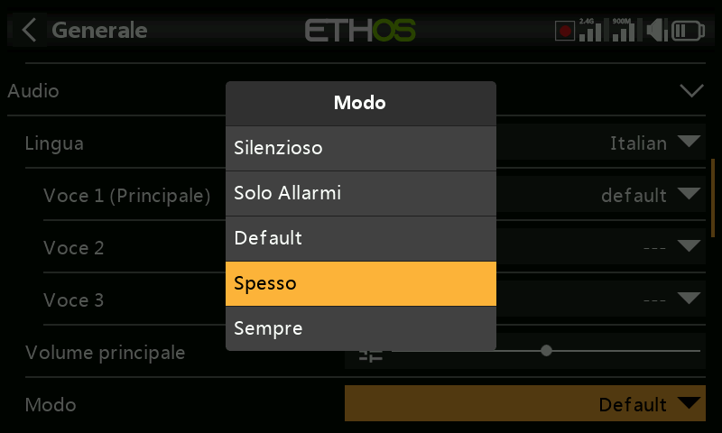
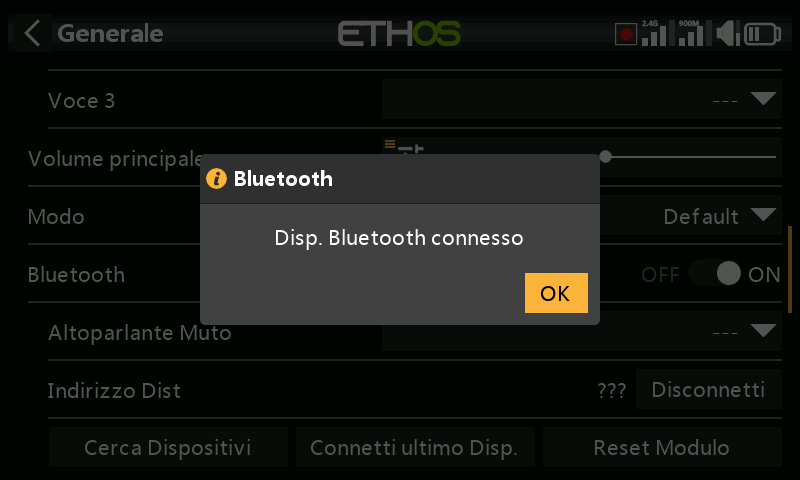
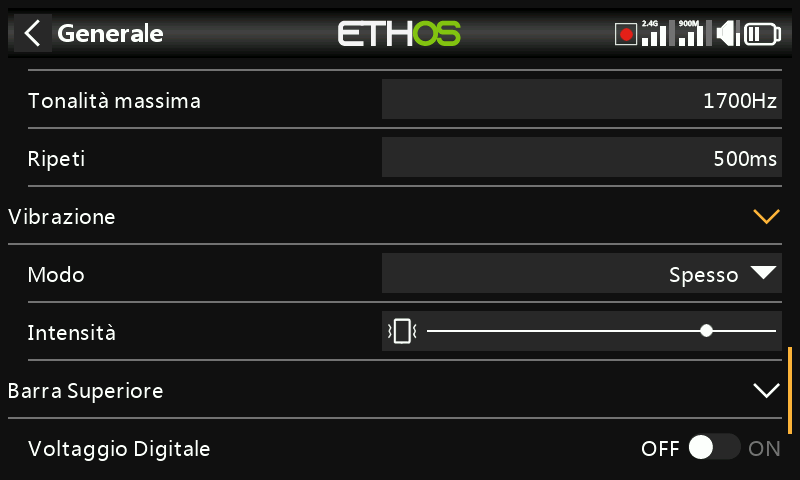
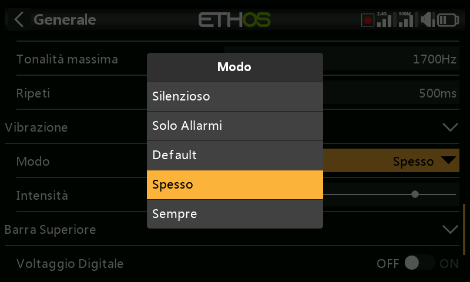

# Generale

Qui è possibile configurare quanto segue:

- Attributi del display LCD
- Le impostazioni audio
- Le impostazioni del vario
- Le impostazioni del feedback aptico
- La barra degli strumenti superiore

## Visualizza gli attributi

Gli attributi del display LCD possono essere configurati qui:

Lingua

Per i menu del display sono supportate le seguenti lingue:

Inglese

中文

Česky

Deutsch

Español

Français

עִברִית

Italiano

Nederlands

Norsk

Português Brasileiro

Polacco

Português

Tastiera

Permette di selezionare i layout delle tastiere virtuali QWERTY, QWERTZ e AZERTY.

Luminosità

Usa il cursore per controllare la luminosità dello schermo, da sinistra a destra per impostare la luminosità da scura a chiara. Premendo a lungo \[ENT\] si accede alle opzioni per utilizzare una sorgente o per impostarla al minimo o al massimo.

Tieni presente che se Luminosità (per la retroilluminazione ON) = 'Luminosità modalità Sleep' (per la retroilluminazione OFF), il touchscreen rimane attivo.

Opzione Potenziometro/slider

Tocca "Usa una sorgente", quindi seleziona un potenziometro o un cursore da utilizzare come controllo della luminosità.

L'esempio precedente mostra il controllo della luminosità tramite il cursore destro.

Attivazione Schermo

La retroilluminazione dello schermo può essere risvegliata dallo stato di sospensione in base a una o più delle seguenti opzioni:

Sempre acceso

La retroilluminazione rimane accesa in modo permanente.

Stick

La retroilluminazione si accende quando si azionano gli stick o i tasti.

Interruttori

La retroilluminazione si accende quando si azionano gli interruttori o i tasti.

Gyro

La retroilluminazione si accende quando si inclina la radio o si azionano i tasti.

Nota che possono essere attivate più opzioni.

Stand-by Schermo

Il tempo di inattività prima che la retroilluminazione si spenga. Quando si seleziona "Sempre acceso" come opzione di "Risveglio" del display, l'opzione Sleep è disattivata.

Luminosità della modalità Sleep/Stand-By

Usa il cursore per controllare la luminosità dello schermo durante la modalità di sospensione, da sinistra a destra per impostare la luminosità da scura a chiara.

Tieni presente che se Luminosità (per la retroilluminazione ON) = 'Luminosità modalità Sleep' (per la retroilluminazione OFF), il touchscreen rimane attivo.

Tema

Consente di scegliere tra diversi temi di visualizzazione. Il tema predefinito è “Scuro”, mentre ‘Chiaro’ è disponibile come alternativa. Inoltre, è possibile installare altri temi Lua. Per ulteriori dettagli, consultare la sezione “Temi di visualizzazione Lua alternativi”.

Colore di evidenziazione

Permette di selezionare il colore di evidenziazione da utilizzare nella visualizzazione. Il colore predefinito è il giallo (#F8B038).

## Impostazioni audio

Lingua audio

Permette di selezionare la lingua degli annunci vocali.

Scelta delle voci

La funzione di sistema vocale multiplo consente di selezionare diversi set di voci all'interno di una determinata lingua.

- Voce 1 (principale)

La voce principale viene utilizzata per tutti gli annunci di sistema che fanno parte del sistema operativo Ethos. Per impostazione predefinita, per l'inglese è possibile scegliere tra una voce americana (us) e una inglese (gb). Questi pacchetti coprono solo gli annunci di sistema.

Nell'esempio precedente la voce inglese "gb" è stata selezionata come "Voce 1 (principale)".

I file si trovano in queste cartelle:

*audio/**en**/us/system*

*audio/**en**/gb/system*

I file audio dell'utente possono essere installati per essere utilizzati con la funzione speciale "Riproduci audio" (in precedenza "Riproduci traccia" e "Riproduci sequenza"). La loro posizione deve essere:

*audio/**en**/us/* o

*audio/**en**/gb/* *o*

audio/it/

- Voce 2 e 3

I pacchetti vocali alternativi possono essere installati come Voice 2 o 3.

Per garantire l'output vocale appropriato per la Voce 2 o 3, dovrai aggiungere i tuoi file audio personalizzati a una struttura di cartelle simile a quelle standard mostrate in precedenza nella sezione Voce 1. Ad esempio, se stai usando il TTS e una voce chiamata Susan, la struttura delle cartelle sarà:

*audio/it/Susan*	per i file audio dell'utente

*audio/it/Susan/system*	per sostituire i file audio del sistema

Tieni presente che ogni voce deve avere una cartella /system, contenente i file audio necessari per gli annunci del valore di riproduzione e del timer. L'elenco dei file audio di sistema forniti di serie è incluso in un file .csv in ogni versione audio.

Puoi quindi scegliere la voce da utilizzare per ogni timer e per la funzione speciale "Riproduci audio". Opzionalmente, puoi assegnare una voce personalizzata come Voce 1 (principale) se desideri sostituire gli annunci del sistema con i tuoi.

- Voce 'default'

Per evitare problemi di conversione dalla versione 1.4.X, viene installata anche una voce predefinita. Durante l'installazione/aggiornamento, se l'audio di sistema Voce 1 (voce principale) non è già stato impostato, allora "Voce 1 (principale)" verrà impostato come "predefinito", poiché è certo che la cartella esiste.

I file si trovano in questa cartella:

audio/it/default/system

Alcuni file audio personalizzati comunemente richiesti vengono forniti per essere utilizzati con la funzione speciale "Riproduci audio" (in precedenza "Riproduci traccia" e "Riproduci sequenza"). La loro posizione è:

audio/it/default/

In questa cartella possono essere aggiunti altri file audio personalizzati dall'utente, se quest'ultimo desidera continuare a utilizzare la voce predefinita.

Volume principale

Usa il cursore per controllare il volume audio. Premendo a lungo \[ENT\] è possibile utilizzare un potenziometro. I segnali acustici durante la regolazione aiutano a valutare il volume.

Modalità audio

Silenzioso

Nessun audio. Si noti che all'avvio verrà emesso un avviso se il controllo "Modalità silenziosa" in Sistema / Avvisi è attivo.

Solo allarmi

Solo gli allarmi saranno emessi in audio.

Predefinito

I suoni sono abilitati.

Spesso

Verranno inoltre emessi dei segnali acustici di errore quando si cerca di superare il valore massimo o minimo dei numeri modificabili.

Sempre

Oltre ai suoni di "Spesso", verranno emessi anche dei segnali acustici quando si naviga nel menu.

Bluetooth (solo X20S/HD/Pro/R/RS)

I modelli X20S, HD e X20 Pro/R/RS dispongono di una modalità audio aggiuntiva per trasmettere l'audio a un dispositivo Bluetooth come le cuffie.

Tocca "Cerca dispositivi".

Viene visualizzato 'In attesa di dispositivi'. Accendi il tuo dispositivo Bluetooth e mettilo in modalità di accoppiamento.

Una volta trovato il dispositivo Bluetooth, verrà visualizzato il suo nome. Toccalo per selezionare il dispositivo.

Viene visualizzato 'In attesa del dispositivo'.

Quando la radio e il dispositivo sono accoppiati, viene visualizzato "Dispositivo Bluetooth connesso". Tocca OK.

Verrà visualizzata nuovamente la schermata Bluetooth, visualizzante la connesione.

Il dispositivo audio dovrebbe essere ora operativo.

Disconnetti

Seleziona il dispositivo per far apparire l’opzione di disconnesione.

Disattivazione dell'altoparlante

Per disattivare l'altoparlante del sistema (ad esempio quando si utilizza un auricolare BT), scegli tra sempre attivo, o solo quando la telemetria è attiva, o controllato da una fonte come un interruttore o qualsiasi altra condizione.

Il sistema ricorda il dispositivo Bluetooth. Per un funzionamento normale, accendi la radio e poi il dispositivo Bluetooth. Il dispositivo Bluetooth si connetterà, ma ci vorranno alcuni secondi prima che il silenziamento dell'altoparlante si attivi di nuovo.

## Vario

Le caratteristiche audio dei toni vario possono essere configurate qui.

Volume

Il volume relativo del tono vario.

Passo zero

L'intonazione del tono quando il tasso di salita è pari a zero.

Passo massimo

L'intonazione del tono alla massima velocità di salita.

Ripetere

Il ritardo tra i bip al passo zero.

Consulta il sensore [VSpeed ](../model-setup/telemetry.md)in Telemetria e la funzione speciale Esegui vario per gli altri parametri Vario.

## Aptico

Forza

Usa il cursore per controllare l'intensità della vibrazione aptica.

Modalità

Simile alla modalità Audio di cui sopra.

## Posizione di archiviazione (X18 e X20 Pro/R/RS)

Le radio X18 e X20 Pro/R/RS sono dotate di una eMMC (embedded MultiMediaCard) da 8Gb, un dispositivo di archiviazione composto da memoria flash NAND e da un semplice controller di archiviazione. Il sistema ETHOS seleziona di default l'archiviazione eMMC, rendendo facoltativo l'uso della scheda SD. Tuttavia, l'utente può scegliere di utilizzare la memoria eMMC o una scheda SD opzionale o una combinazione di entrambe.

Consulta la schermata di selezione della posizione di archiviazione riportata sopra. Se il sistema e i modelli vengono spostati sulla scheda SD, le cartelle e i file devono essere copiati sulla scheda SD prima di effettuare la selezione. Lo stesso vale per l'audio e le bitmap.

## Barra degli strumenti superiore

Tensione digitale

Lo stato della batteria nella barra degli strumenti superiore può essere modificato rispetto alla visualizzazione a barre predefinita per visualizzare la tensione della batteria della radio come valore digitale.

RSSI digitale

Allo stesso modo, lo stato dell'RSSI può passare da una visualizzazione a barre a un valore digitale sia per il 2.4G che per il 900M.

## Seleziona il modello all'accensione

Quando questa opzione è attivata, la schermata di selezione del modello viene visualizzata all'accensione, in modo da poter scegliere un modello prima che vengano visualizzati gli avvisi della lista di controllo del modello precedentemente selezionato. In questo modo si evita di dover cancellare gli avvisi della lista di controllo prima di selezionare un modello diverso.

Per impostazione predefinita, l'ultimo modello utilizzato nella sessione precedente viene evidenziato per la selezione.

## Preselezione della modalità USB

Le seguenti preselezioni sono disponibili quando la radio è collegata a un PC tramite cavo USB:

Non impostato

Se l'opzione è "Non impostato", al momento della connessione verrà visualizzata una finestra di dialogo per effettuare una selezione.

Joystick

Al momento della connessione, la radio entrerà automaticamente in modalità joystick per essere utilizzata con un simulatore RC.

Suite Ethos

Al momento della connessione, la radio entrerà automaticamente in "modalità Ethos" per comunicare con FrSky Suite. Fai riferimento alla [Modalità Ethos ](#Ethos_Mode)nella sezione FrSky Suite.

Seriale

Al momento della connessione, la radio entra automaticamente in modalità seriale, in cui le tracce di debug Lua vengono inviate all'USB-Serial, se presente. Il baud rate è di 115200bps. Un driver per la porta COM virtuale di Windows può essere trovato [qui](https://www.st.com/en/development-tools/stsw-stm32102.html).
