# Generale

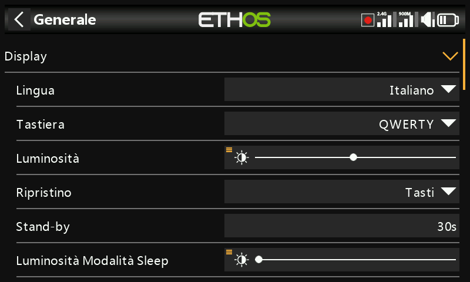

Riguarda gli attributi del display, le impostazioni audio, il vario, il feedback aptico e la barra degli strumenti superiore.

## Attributi del display

- **Lingua** — la lingua dei menu del display (English, 中文, Česky, Deutsch,
  Español, Français, עברית, Italiano, Nederlands, Norsk, Português
  Brasileiro, Polacco, Português e altre).
- **Tastiera** — permette di selezionare i layout delle tastiere virtuali
  QWERTY, QWERTZ e AZERTY.
- **Luminosità** — un cursore per la luminosità della retroilluminazione;
  premendo a lungo `ENT` si accede alle opzioni per utilizzare una sorgente
  (ad esempio un cursore, come nell'esempio seguente) oppure per impostarla al
  minimo o al massimo.

  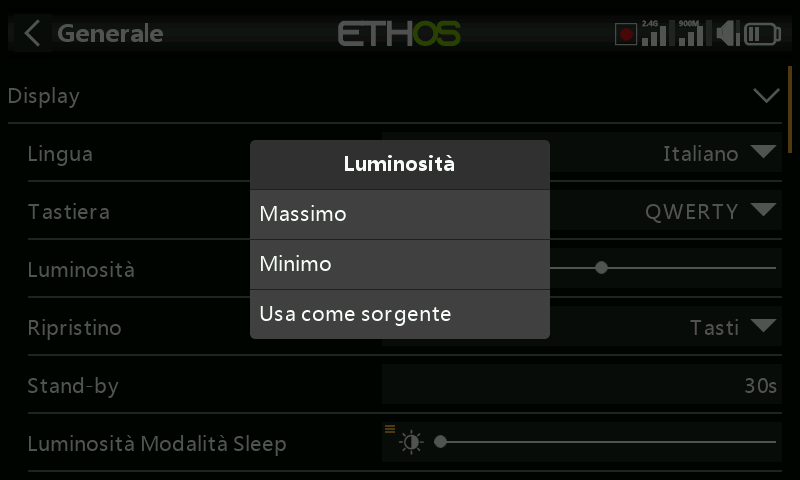
  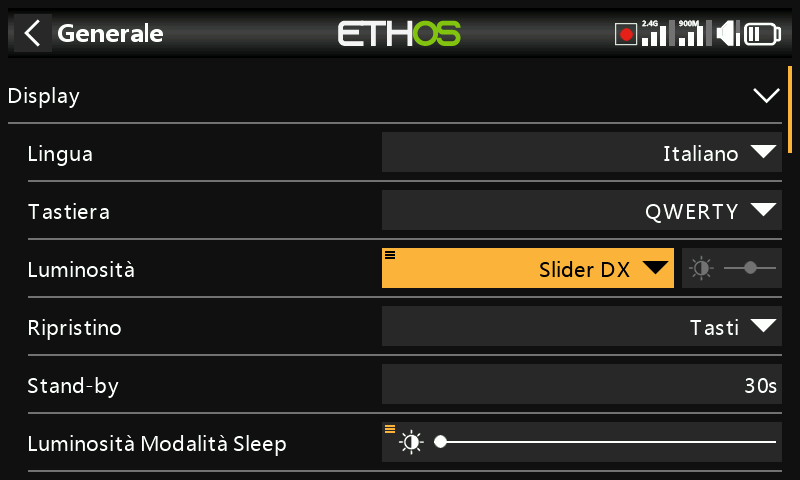

  !!! note
      Tieni presente che se **Luminosità** (per la retroilluminazione ON) =
      **Luminosità modalità Sleep** (per la retroilluminazione OFF), il
      touchscreen rimane attivo.

- **Attivazione schermo** — quali di queste opzioni risvegliano la
  retroilluminazione dallo stato di sospensione (possono essere attivate più
  opzioni): **Sempre acceso** (la retroilluminazione rimane accesa in modo
  permanente), **Stick**, **Interruttori**, **Gyro** (inclinando la radio). I
  tasti la risvegliano sempre, indipendentemente da queste impostazioni.
- **Stand-by** — il tempo di inattività prima che la retroilluminazione si
  spenga (disattivato quando si seleziona "Sempre acceso" come opzione di
  attivazione dello schermo).
- **Luminosità della modalità Sleep** — la luminosità della retroilluminazione
  durante la modalità di sospensione.
- **Modalità scura** — seleziona la modalità chiara o scura del display.
- **Colore di evidenziazione** — il colore di evidenziazione utilizzato
  nell'interfaccia (predefinito `#F8B038`).

## Impostazioni audio {: #audio-settings }

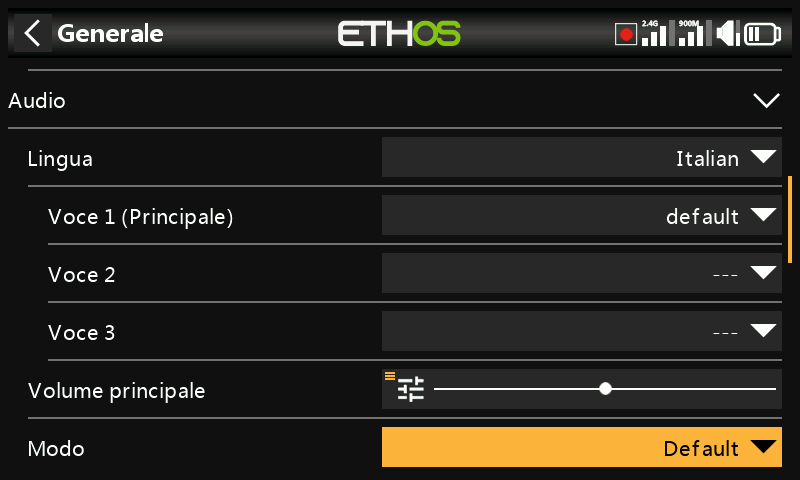

- **Lingua audio** — permette di selezionare la lingua degli annunci vocali.
- **Scelta delle voci** — Ethos supporta più pacchetti vocali simultanei:

  - **Voce 1 (principale)** — viene utilizzata per tutti gli annunci di
    sistema che fanno parte del sistema operativo Ethos. Per l'inglese è
    possibile scegliere tra il pacchetto americano (`us`) e quello inglese
    (`gb`), letti da `audio/en/us/system` e `audio/en/gb/system`. I file audio
    dell'utente per la [funzione speciale Riproduci
    audio](../model-setup/special-functions.md) vanno rispettivamente in
    `audio/en/us/` o `audio/en/gb/`.
  - **Voce 2 / Voce 3** — pacchetti vocali alternativi, ad esempio una voce
    TTS personalizzata. Ognuna richiede una struttura di cartelle simile a
    quella della Voce 1 — ad esempio una voce chiamata "Susan" richiede
    `audio/en/Susan/` per i file audio dell'utente e `audio/en/Susan/system`
    per i suoi file audio di sistema (ogni voce deve avere una cartella
    `/system`, poiché è da lì che attingono **Riproduci valore** e gli annunci
    dei timer; l'elenco dei file audio di sistema forniti di serie è incluso
    in un file `.csv` in ogni versione audio). Una volta installata, puoi
    scegliere la voce da utilizzare per ogni timer e per ogni funzione
    Riproduci audio — oppure assegnarla come Voce 1 se desideri sostituire
    completamente gli annunci di sistema.
  - **Voce "default"** — viene installata automaticamente come ripiego sicuro
    (e per evitare problemi di conversione dalle installazioni 1.4.X): se
    durante l'installazione/aggiornamento la Voce 1 non è già stata impostata,
    viene impostata su `default`, che legge da `audio/en/default/system`.
    Alcuni file audio personalizzati comunemente richiesti per Riproduci audio
    si trovano in `audio/en/default/`.

- **Volume principale** — un cursore per controllare il volume audio
  (premendo a lungo `ENT` è possibile utilizzare un potenziometro); i segnali
  acustici durante la regolazione aiutano a valutare il volume.
- **Modalità audio**:
  - **Silenzioso** — nessun audio (all'avvio verrà comunque emesso l'[avviso
    di modalità silenziosa](alerts.md), se attivo).
  - **Solo allarmi** — solo gli allarmi saranno emessi in audio.
  - **Predefinito** — i suoni sono abilitati.
  - **Spesso** — vengono inoltre emessi dei segnali acustici di errore quando
    si cerca di superare il valore massimo o minimo dei numeri modificabili.
  - **Sempre** — oltre ai suoni di "Spesso", vengono emessi anche dei segnali
    acustici quando si naviga nel menu.
  - **Bluetooth** (solo X20S/HD/Pro/R/RS) — trasmette l'audio a un dispositivo
    Bluetooth accoppiato (ad esempio delle cuffie). Tocca **Cerca
    dispositivi**, metti il dispositivo di destinazione in modalità di
    accoppiamento, quindi selezionalo una volta trovato:

    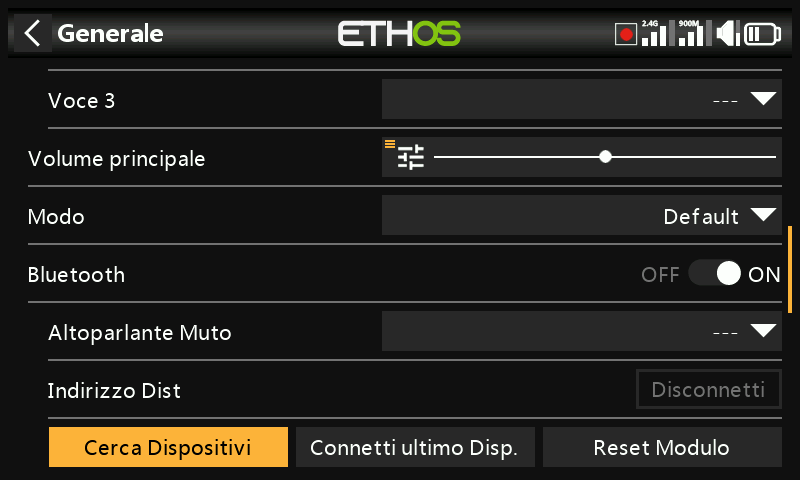
    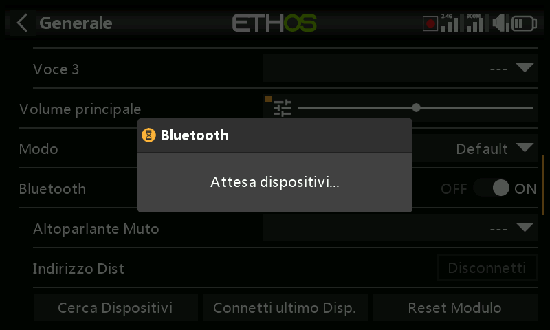
    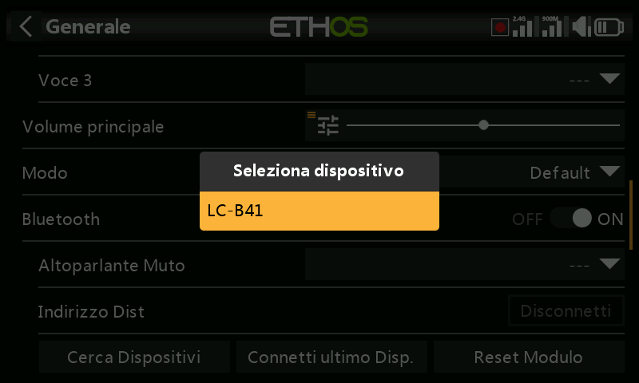
    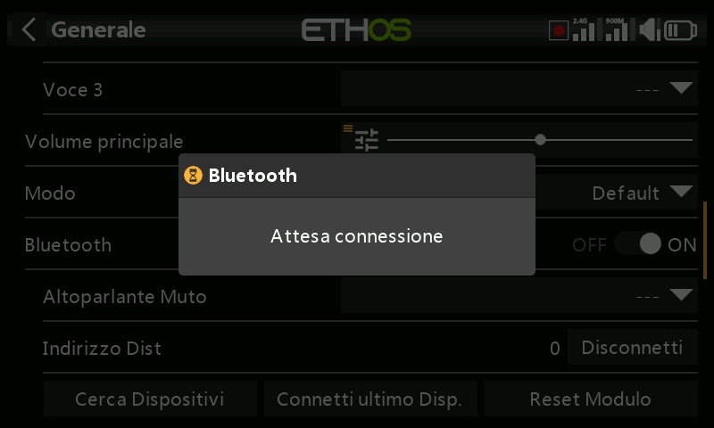
    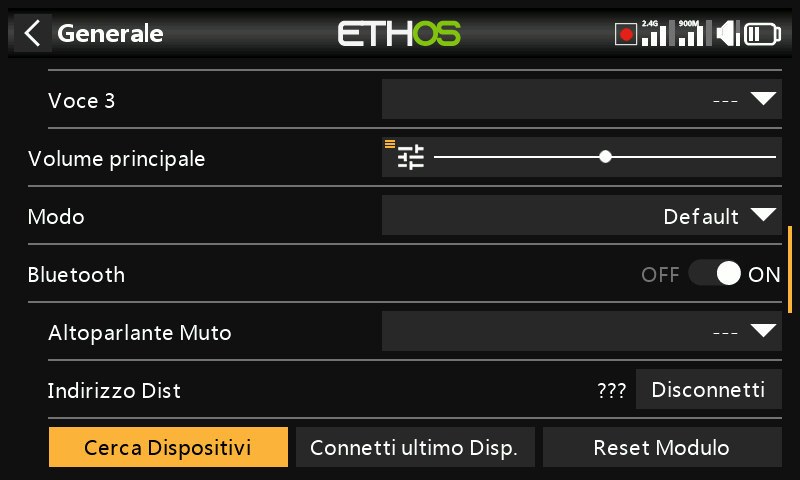

    **Disattivazione dell'altoparlante** controlla quindi l'altoparlante
    integrato: sempre attivo, solo quando la telemetria è attiva, oppure
    controllato da una sorgente come un interruttore. Il sistema ricorda il
    dispositivo Bluetooth; per un funzionamento normale accendi la radio e poi
    il dispositivo Bluetooth, e attendi alcuni secondi dopo la connessione
    prima che il silenziamento dell'altoparlante si attivi di nuovo.

## Vario {: #vario }

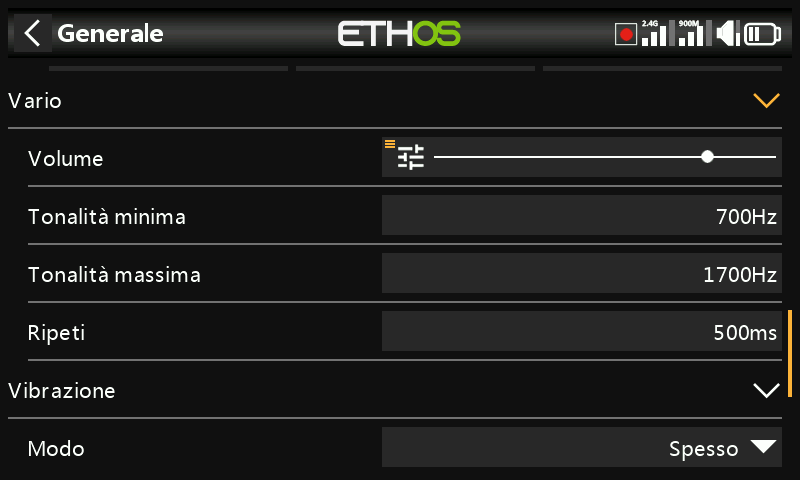

- **Volume** — il volume relativo del tono vario.
- **Passo zero** — l'intonazione del tono quando il tasso di salita è pari a zero.
- **Passo massimo** — l'intonazione del tono alla massima velocità di salita.
- **Ripetere** — il ritardo tra i bip al passo zero.

Consulta anche il sensore VSpeed in [Telemetria](../model-setup/telemetry.md) e
la [funzione speciale Esegui vario](../model-setup/special-functions.md) per
gli altri parametri Vario.

## Aptico

- **Forza** — un cursore per controllare l'intensità della vibrazione aptica.
- **Modalità** — le stesse opzioni della Modalità audio di cui sopra.

## Posizione di archiviazione (X18 e X20 Pro/R/RS) {: #storage-location-x18-and-x20-prorrs }

Queste radio sono dotate di una eMMC interna da 8 GB. Il sistema Ethos
seleziona di default l'archiviazione eMMC, rendendo facoltativo l'uso della SD
card — tuttavia puoi scegliere di utilizzare la eMMC, una SD card opzionale o
una combinazione di entrambe. Se il sistema e i modelli vengono spostati sulla
SD card, le cartelle e i file (audio e bitmap compresi) devono essere copiati
sulla SD card **prima** di effettuare la selezione.

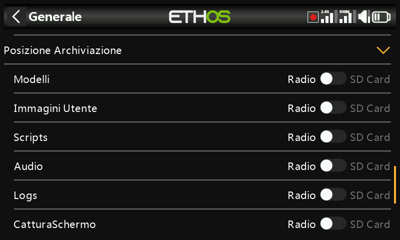

## Barra degli strumenti superiore

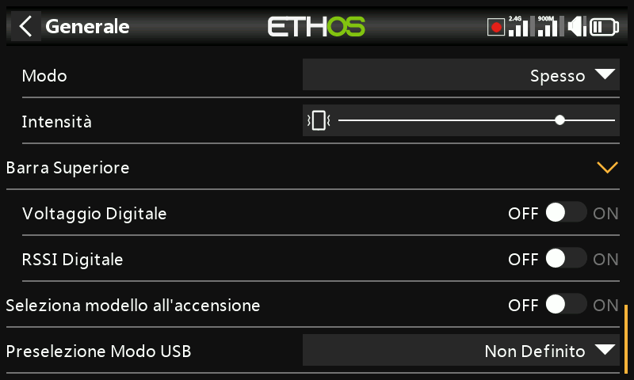

- **Tensione digitale** — visualizza la tensione della batteria della radio
  come valore digitale anziché come barra nella barra degli strumenti superiore.
- **RSSI digitale** — allo stesso modo, per l'RSSI a 2.4G e 900M.
- **Seleziona il modello all'accensione** — la schermata di selezione del
  modello viene visualizzata all'accensione, prima che vengano visualizzati
  gli avvisi della lista di controllo del modello precedentemente selezionato,
  in modo da poter cambiare modello senza doverli prima cancellare. Per
  impostazione predefinita viene evidenziato l'ultimo modello utilizzato.

  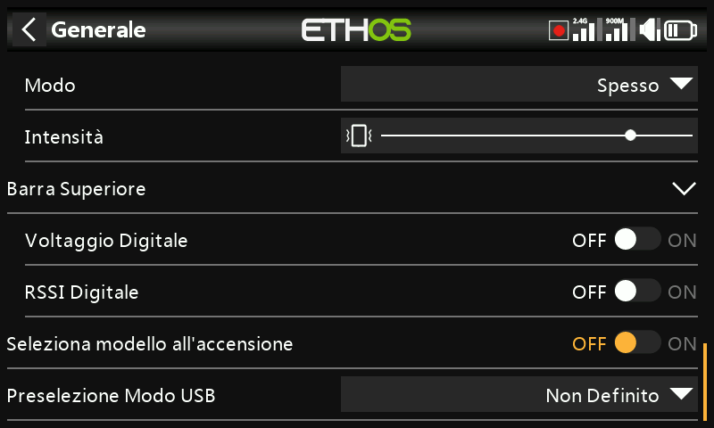

## Preselezione della modalità USB

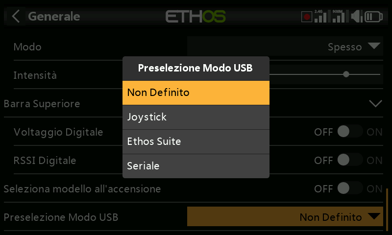

Cosa accade automaticamente quando la radio viene collegata a un PC tramite USB:

- **Non impostato** — al momento della connessione verrà visualizzata una
  finestra di dialogo per effettuare una selezione.
- **Joystick** — la radio entra automaticamente in modalità joystick per
  essere utilizzata con un simulatore RC.
- **Ethos Suite** — la radio entra automaticamente in modalità Ethos per
  comunicare con [Ethos Suite](../ethos-suite/index.md).
- **Seriale** — la radio entra automaticamente in modalità seriale, in cui le
  tracce di debug Lua vengono inviate all'USB-Serial a 115200 bps (potrebbe
  essere necessario un driver per la porta COM virtuale di Windows).
