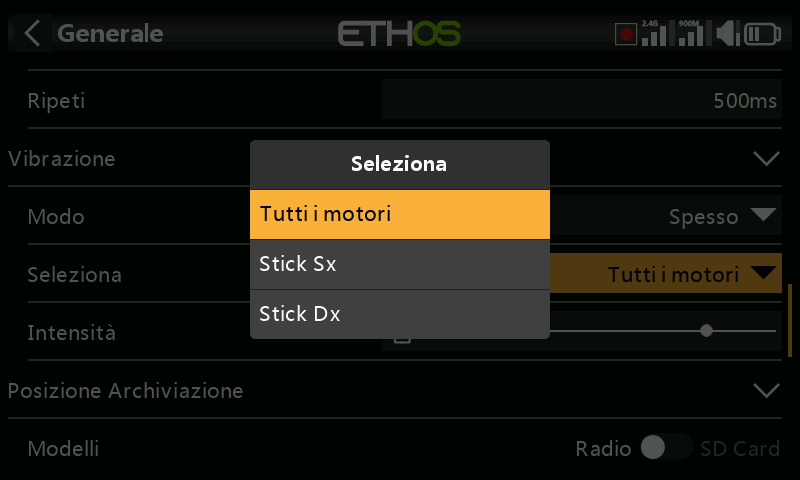

# Hardware

Test e calibrazione dei comandi fisici della radio, definizione dei tipi di
interruttore e mappa del "tasto home".

## Controllo dell'hardware {: #hardware-check }

Consente di verificare il funzionamento di tutti gli ingressi, controllando
che ciascuno venga rilevato correttamente.

- **X20 Pro/R/RS** — comprende anche i due interruttori a pulsante **K** e
  **L** sulle spalle posteriori, nonché i trim aggiuntivi **T5**/**T6**.
- **X18** — comprende anche i trim aggiuntivi **T5**/**T6**.

## Calibrazione analogica {: #analogs-calibration }

Viene eseguita in modo che la radio sappia esattamente dove si trovano i
centri e i limiti di ogni cardano, potenziometro e cursore. Viene eseguita
automaticamente all'avvio iniziale; deve essere ripetuta dopo la
sostituzione di un giunto cardanico, di un potenziometro o di un cursore.

## Calibrazione del giroscopio

Calibra il giroscopio integrato in modo che le uscite del sensore rispondano
correttamente all'inclinazione della radio: la posizione "livellata" diventa
l'angolo in cui normalmente si tiene la radio. Anche questa viene eseguita
automaticamente all'avvio iniziale.

## Filtro analogico

Il filtro del convertitore analogico-digitale per gli stick può essere
attivato/disattivato; il valore predefinito è ON e può migliorare il jitter
intorno al centro degli stick. Questa è l'impostazione **globale**; è
disponibile anche un'opzione specifica **per il modello** alla voce Filtro
analogico in [Modifica modello](../model-setup/model-edit.md).

## Impostazioni dei potenziometri e dei cursori {: #potssliders-settings }

I potenziometri e i cursori possono avere nomi personalizzati. L'**X20
Pro/R/RS** dispone inoltre di due potenziometri aggiuntivi,
**Ext1**/**Ext2**, utilizzati in genere quando si installano dei giunti
cardanici a 3 assi.

## Impostazioni degli interruttori {: #switches-settings }

- **Ritardo nel rilevamento del centro dell'interruttore** — garantisce che
  la posizione centrale degli interruttori a tre vie non venga rilevata
  quando l'interruttore passa dalla posizione alta a quella bassa con un
  unico movimento e viceversa; dovrebbe essere rilevata solo quando
  l'interruttore si ferma effettivamente nella posizione centrale.
  L'impostazione predefinita è 0ms, per adattarsi ai ricevitori stabilizzati
  FrSky quando rilevano il "Self check" su CH12.
- **Tipo di interruttore** — gli interruttori da SA a SJ possono essere
  definiti come **Nessuno**, **Momentaneo**, **2 POS** o **3 POS**, il che
  permette di scambiare gli interruttori (ad esempio assegnare
  all'interruttore momentaneo SH il ruolo normalmente svolto
  dall'interruttore a 2 posizioni SF), compatibilmente con quanto consente
  il cablaggio della radio (un ruolo a 3 posizioni generalmente non può
  essere assegnato a un hardware non cablato per tale scopo).

  
  

- **Rinomina** — gli interruttori possono essere rinominati dai nomi
  predefiniti SA–SJ a nomi personalizzati; questi nomi saranno globali per
  tutti i modelli.
- **X20 Pro** — dispone in più degli interruttori a pulsante **K**/**L**
  sulle spalle posteriori; inoltre le posizioni **M**/**N** possono essere
  cablate alla scheda di circuito, tipicamente utilizzate per gli
  interruttori di fine corsa.

## Mappa dei tasti della Home

Consente di riassegnare la destinazione dei tasti home `SYS`, `MDL` e
`DISP` (`TELE` sui modelli più vecchi).

- **`DISP`** — le opzioni di pressione breve e lunga possono essere
  riassegnate a qualsiasi pagina del Modello, del Sistema, a Configura
  schermate, alla pagina iniziale o alla Registrazione dei dati di volo. Per
  coerenza con la serie X10, la pressione lunga di `DISP` viene assegnata
  convenzionalmente alla pagina "Configura schermate".
- **`SYS`/`MDL`** — solo la pressione lunga può essere riassegnata (allo
  stesso insieme di destinazioni); una pressione breve richiama
  rispettivamente la sezione Sistema o Modello.

## Opzioni hardware specifiche per radio {: #radio-specific-hardware-options }

- **Attivazione dei gimbal aptici** (X20 Pro, X20R) — l'X20 Pro AW e X20RS
  sono dotati di gimbals MC20R con motori a feedback tattile (stick shaker);
  se i gimbals MC20R sono stati adattati a X20 Pro o X20R come opzione, è
  possibile abilitare qui i motori dei giunti cardanici (fare riferimento a
  [Funzioni speciali](../model-setup/special-functions.md) per la
  configurazione dei pattern aptici veri e propri).

  
  

- **Opzione encoder** (X20 Pro AW, X20R/RS) — questi modelli hanno un
  encoder rotativo più sensibile; l'opzione **mezzi passi** può essere
  attivata per ridurne la sensibilità.

  

## Ispettore del valore ADC {: #adc-value-inspector }

Mostra i valori grezzi di conversione analogico-digitale (ADC) degli
ingressi analogici letti dalla CPU:

**X20S**: 1 stick sinistro orizzontale, 2 stick sinistro verticale, 3 stick
destro verticale, 4 stick destro orizzontale, 5 Potenziometro 1, 6
Potenziometro 2, 7 cursore centrale, 8 cursore sinistro, 9 cursore destro.

**X20 Pro**: come sopra, ma con due canali aggiuntivi per i potenziometri
esterni (7 Ext1, 8 Ext2 — ad esempio potenziometri montati su stick)
inseriti prima dei cursori, che diventano quindi 9 cursore centrale,
10 cursore sinistro, 11 cursore destro.
