# Hardware

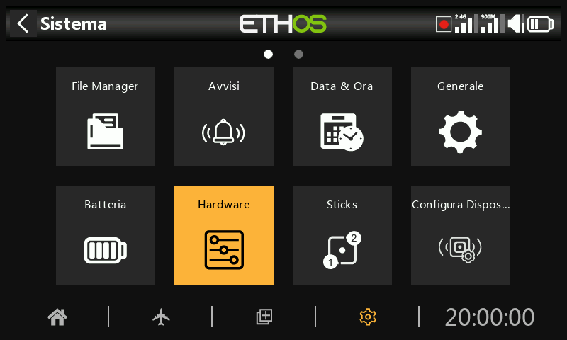

La sezione Hardware serve per testare tutti gli ingressi, eseguire la calibrazione analogica e del giroscopio e impostare i tipi di interruttori e la mappa del "tasto home".

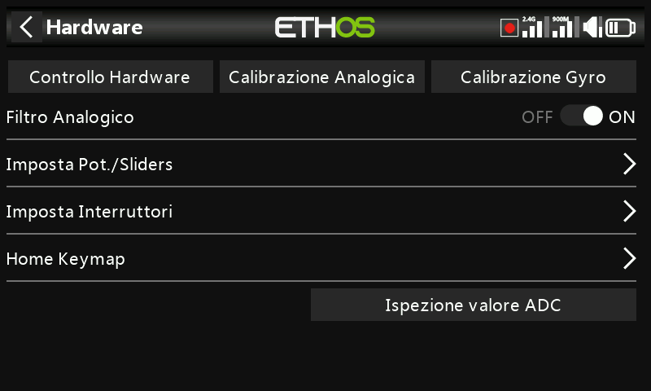

## Controllo dell'hardware

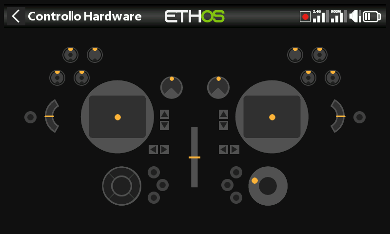

Il controllo dell'hardware consente di verificare il funzionamento di tutti gli ingressi.

X20 Pro/R/RS

La verifica dell'hardware delle radio X20 Pro/R/RS comprende i due interruttori a pulsante K e L sulle spalle posteriori, nonché i trim aggiuntivi T5 e T6.

X18

Le radio X18 hanno anche le versioni T5 e T6.

## Calibrazione analogica

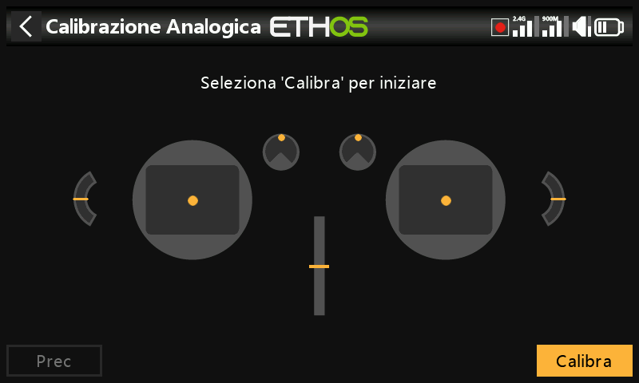

La calibrazione analogica viene eseguita in modo che la radio sappia esattamente dove si trovano i centri e i limiti di ogni cardano, potenziometro e cursore. Viene eseguita automaticamente all'avvio iniziale. Deve essere ripetuta dopo la sostituzione di un giunto cardanico, di un potenziometro o di un cursore.

## Calibrazione del giroscopio

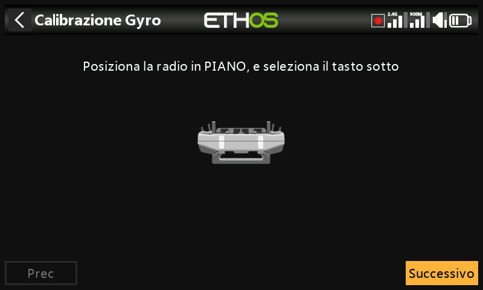

La calibrazione del giroscopio può essere eseguita in modo che le uscite del sensore del giroscopio rispondano correttamente all'inclinazione della radio. Viene eseguita automaticamente all'avvio iniziale. Ad esempio, la posizione "livellata" della radio è l'angolo in cui normalmente si tiene la radio.

## Filtro analogico

Il filtro del convertitore analogico-digitale per gli stick può essere attivato/disattivato con questa impostazione. Il valore predefinito è ON, che può migliorare il jitter intorno al centro degli stick. Questa è un'impostazione globale nella pagina Hardware. È disponibile un'opzione specifica per il modello nella sezione "Modifica modello" alla voce [Filtro analogico](../model-setup/model-edit.md).

## Impostazioni dei pulsanti e dei cursori

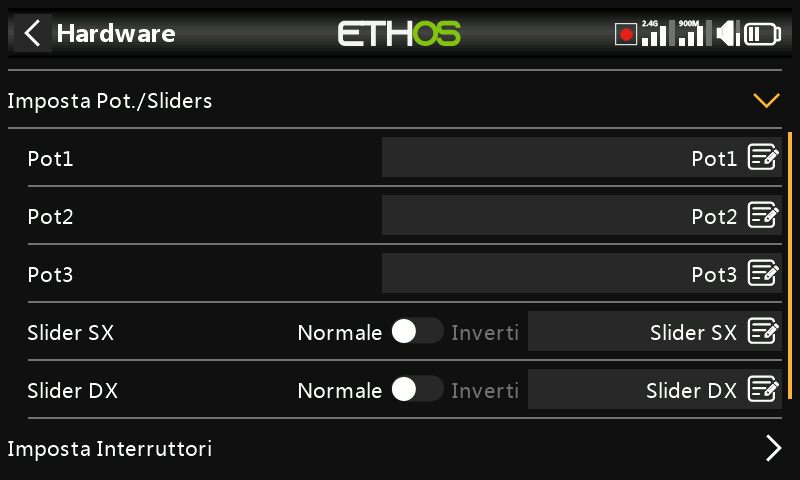

I Potenziometro e i cursori possono avere nomi personalizzati.

X20 Pro/R/RS

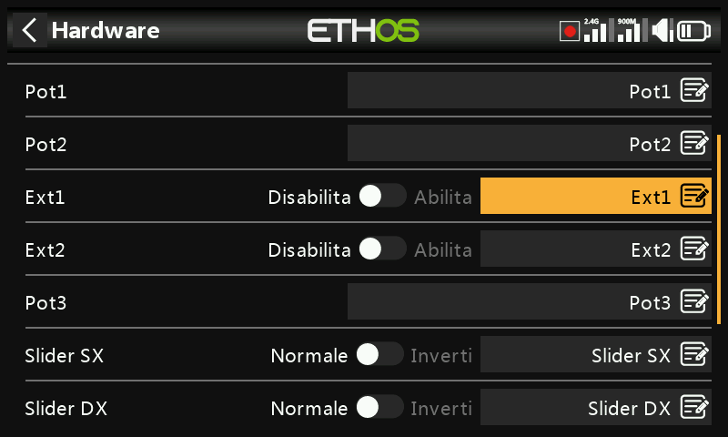

L'X20 Pro/R/RS dispone di due potenziometri aggiuntivi Ext1 e Ext2. Questi possono essere utilizzati in genere quando si installano dei giunti cardanici a 3 assi.

## Impostazioni degli interruttori

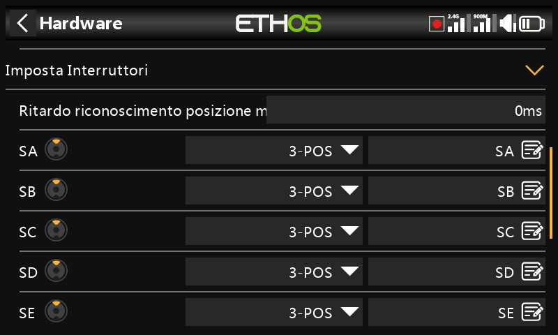

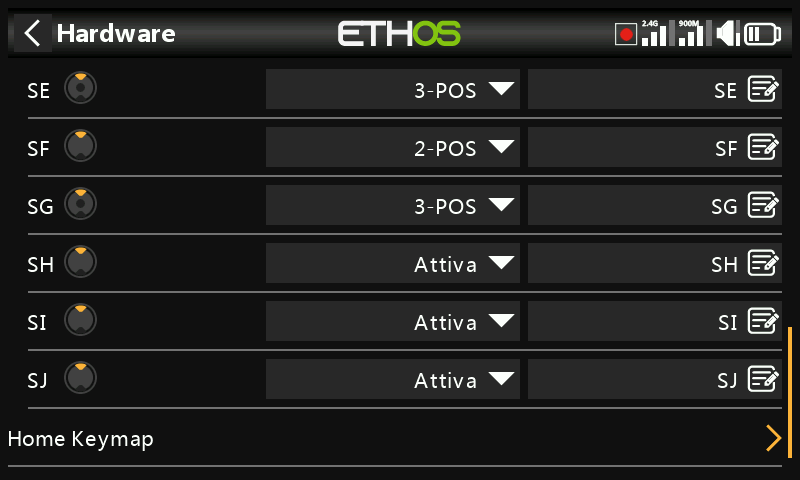

Ritardo nel rilevamento del centro dell'interruttore

Questa impostazione garantisce che la posizione centrale degli interruttori a tre vie non venga rilevata quando l'interruttore passa dalla posizione alta a quella bassa con un unico movimento e viceversa. Dovrebbe essere rilevata solo quando l'interruttore si ferma nella posizione centrale. L'impostazione predefinita è stata modificata a 0ms per adattarsi ai ricevitori stabilizzati FrSky quando rilevano il "Self check" su CH12.

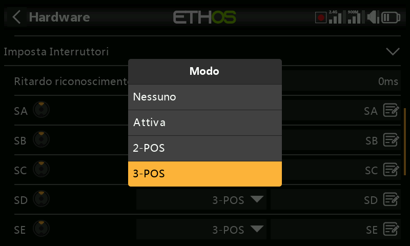

Gli interruttori da SA a SJ possono essere definiti come:

- Nessuno
- Momentaneo
- 2 POS
- 3 POS

Questo permette di scambiare gli interruttori, ad esempio l'interruttore momentaneo SH può essere sostituito con l'interruttore a 2 posizioni SF. Si noti che potrebbe non essere possibile sostituire un interruttore momentaneo o a 2 posizioni con uno a 3 posizioni se il cablaggio della radio non lo consente.

Gli interruttori possono anche essere rinominati dai nomi predefiniti SA e SJ a nomi personalizzati. Nota che questi nomi saranno globali per tutti i modelli.

X20 Pro

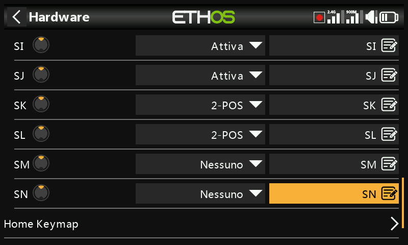

La X20 Pro dispone di due interruttori a pulsante SK e SL supplementari sulle spalle posteriori. Inoltre, le posizioni M e N possono essere cablate alla scheda di circuito, tipicamente utilizzate per gli interruttori di fine corsa.

Serie XE (esclusivamente)

Nella serie XE gli interruttori sono contrassegnati con le sigle da S1 a S14, che per impostazione predefinita corrispondono a SA-SN in Ethos. Se lo si desidera, è possibile modificare le etichette di Ethos in S1-S14 per rispecchiare le indicazioni presenti sulla radio, oppure assegnare qualsiasi altra denominazione desiderata.

Si noti che, grazie al suo livello di astrazione aggiuntivo, qualsiasi switch può essere mappato su qualsiasi posizione dello switch Ethos.

## Mappa dei tasti della Home

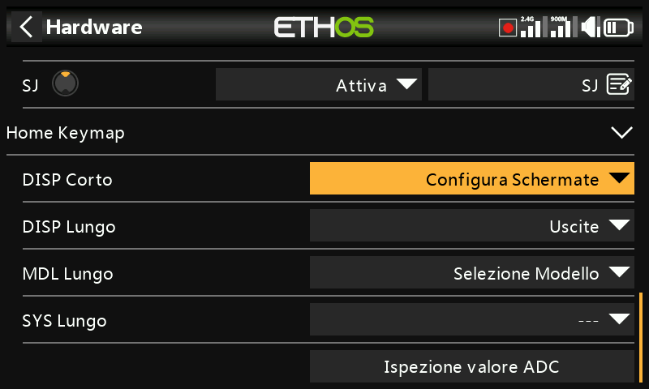

I tasti home \[SYS\], \[MDL\] e \[DISP\] (TELE sui modelli più vecchi) possono essere riassegnati in base alle esigenze dell'utente.

Tasto \[DISP\]

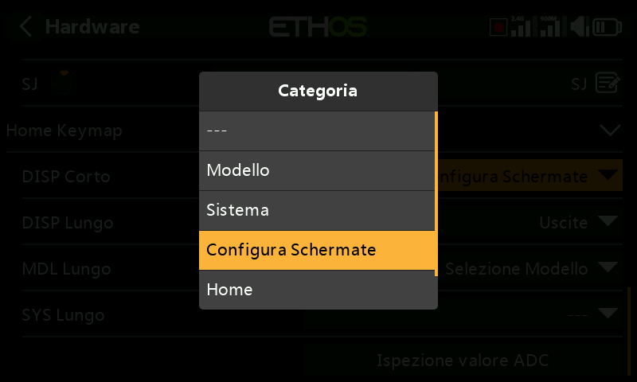

Per quanto riguarda il tasto \[DISP\], le opzioni di pressione breve e lunga possono essere riassegnate a qualsiasi pagina del Modello, del Sistema, delle Schermate di configurazione, alla pagina iniziale o alla Registrazione dei dati di volo. Per coerenza con la serie X10, il tasto \[DISP\_long\] può essere assegnato convenzionalmente alla pagina "Configura schermate".

Tasti \[SYS\] e \[MDL\]

Per i tasti \[SYS\] e \[MDL\] solo le opzioni premute a lungo possono essere riassegnate a qualsiasi pagina del Modello, del Sistema, della Configurazione delle schermate, della Home o della Registrazione dei dati di volo. Una pressione breve richiama rispettivamente la sezione Sistema o Modello.

## Bluetooth audio option (X20, X20R, X20RS)

Un modulo Bluetooth audio può essere aggiunto alle seguenti radio X20, X20R o X20RS in modo da permettere di cuffie Bluetooth (per esempio). Questa opzione di selezione Hardware sarà abilitata se il modulo è installato.

Nota bene che il modulo non plug and play, deve essere saldato con tecnica SM (surface mount).

## Abilita sistema Aptico gimbal (X20 Pro and X20R)

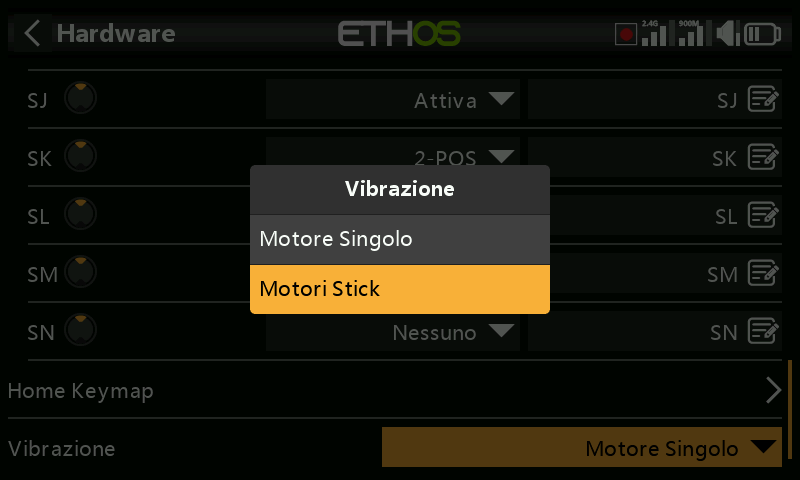

L'X20 Pro AW e X20RS sono dotati di gimbals MC20R con motori a feedback tattile (stick shaker). Se i gimbals MC20R sono stati adattati a X20 Pro o X20R come opzione, è possibile abilitare i motori dei giunti cardanici qui. Fare riferimento alla sezione “[Selezione motori ](https://www.deepl.com/en/translator?utm_term=&utm_campaign=IT%7CSearch%7CC%7CDSA%7CEnglish&utm_source=google&utm_medium=paid&hsa_acc=1083354268&hsa_cam=20627207960&hsa_grp=157168539729&hsa_ad=676252350153&hsa_src=g&hsa_tgt=dsa-437115340933&hsa_kw=&hsa_mt=&hsa_net=adwords&hsa_ver=3&gad_source=1&gclid=CjwKCAiAtYy9BhBcEiwANWQQL3EXIE2Cf7NSZZ0OYMKRgJCFeuGlPViCbNUpEZbVFRHTE1YdWYCrcBoCvrYQAvD_BwE#Select%20haptic%20motors)” per i dettagli sulla loro configurazione.

## Opzione encoder (X20 Pro AW e X20R/RS)

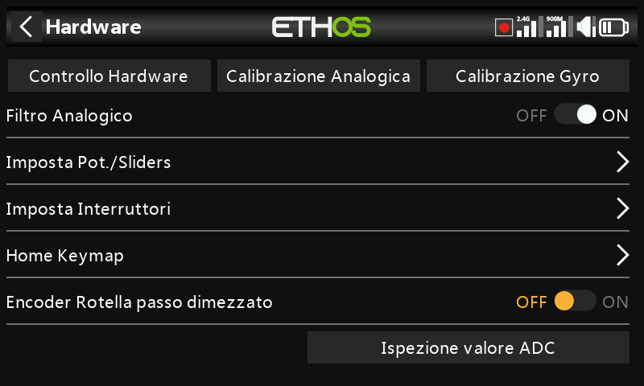

I modelli X20 Pro AW e X20R/RS hanno un encoder rotativo migliorato e più sensibile. L'opzione "mezzi passi" può essere attivata per ridurre la sensibilità.

## Ispettore del valore ADC

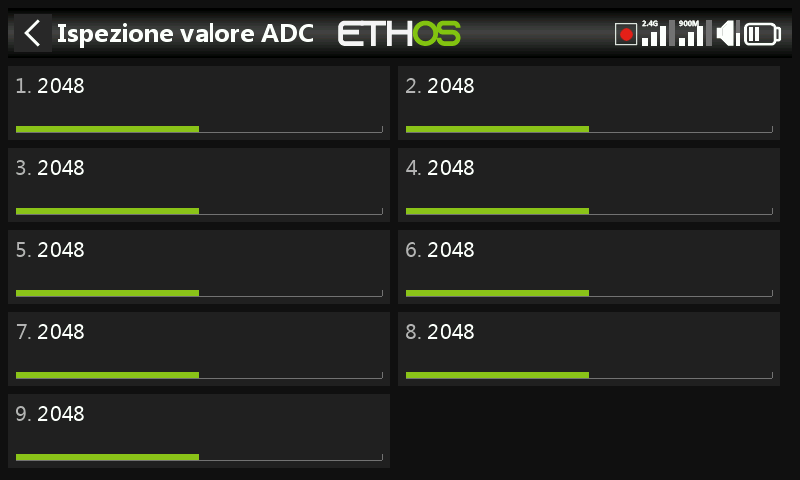

Mostra i valori di conversione analogico-digitale (ADC) degli ingressi analogici letti dalla CPU.

- Stick sinistro orizzontale
- Stick sinistro verticale
- Stick destro verticale
- Stick destro orizzontale
- Potenziometro 1
- Potenziometro 2
- Cursore centrale
- Cursore sinistro
- Cursore destro

X20 Pro

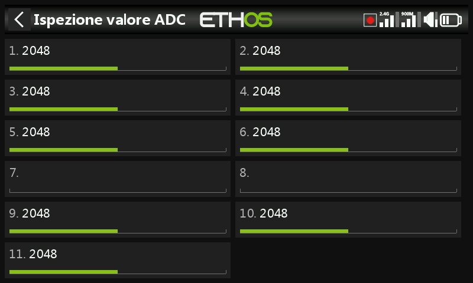

L'indice (ADC) per l'X20 Pro è:

- Stick sinistro orizzontale
- Stick sinistro verticale
- Stick destro verticale
- Stick destro orizzontale
- Potenziometro 1
- Potenziometro 2
- Ext1 (potenziometro esterno, ad esempio montato su stick)
- Ext1 (potenziometro esterno, ad esempio montato su stick)
- Cursore centrale
- Cursore sinistro 
- Cursore destro
