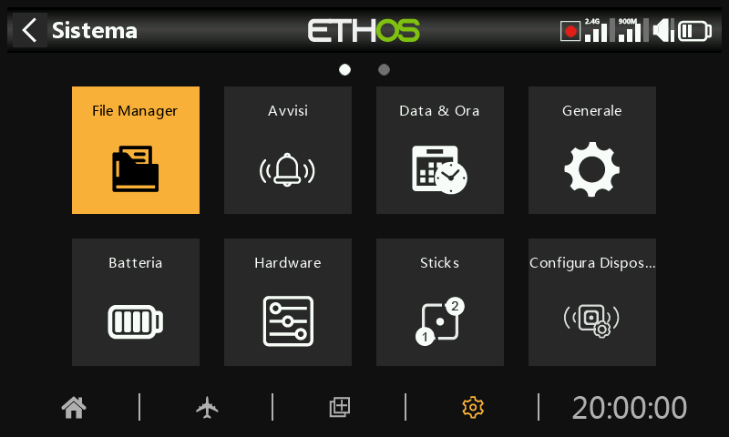

# Panoramica

All'interno di System Setup, tocca un riquadro per configurare la sezione selezionata oppure usa il selettore rotante per spostare l'evidenziazione sul riquadro desiderato, quindi premi Invio. Puoi scorrere il dito verso sinistra per accedere alla seconda pagina di funzioni o utilizzare il selettore rotante per spostare l'evidenziazione sulla seconda pagina. In alternativa, puoi usare il tasto Pagina per passare da una pagina all'altra.

## Gestore di file

Il file manager serve a gestire i file e ad accedere al firmware flash del modulo RF interno, della porta S.Port esterna, dei moduli OTA (Over The Air) ed esterni.

## Avvisi

Configurazione della modalità silenziosa, delle tensioni delle batterie della radio e dell'RTC, dei conflitti tra sensori e degli avvisi di inattività.

## Data e ora

Configurazione dell'orologio di sistema e delle opzioni di visualizzazione dell'ora.

## Generale

Per configurare lo stile del menu, la lingua del sistema e gli attributi del display LCD come la luminosità e la retroilluminazione, nonché le modalità e le impostazioni audio, vario e aptico. Inoltre, è possibile configurare le opzioni della barra degli strumenti superiore, la selezione del modello all'accensione e la preselezione della modalità USB.

## Batteria

Configurazione delle impostazioni di gestione della batteria.

## Hardware

Questa sezione permette di controllare i dispositivi di input fisici hardware, la calibrazione degli analogici e del giroscopio. Permette inoltre di modificare la definizione del tipo di interruttore e di definire la mappa del "tasto home".

## Stick

Configurazione della modalità stick e dell'ordine predefinito dei canali. I 4 comandi degli stick possono anche essere rinominati.

## Configurazione del dispositivo

Strumenti per la configurazione di dispositivi come sensori, ricevitori, la suite di gas, servocomandi e trasmettitori video.

## Info

Informazioni sul sistema: versione del firmware, tipi di gimbal e moduli RF.
