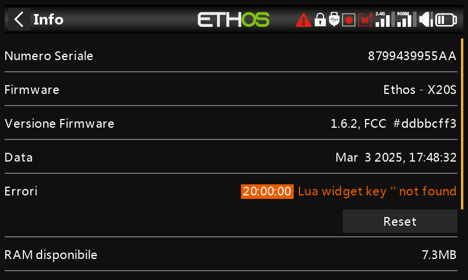

# Informazioni

Dettagli sul firmware di sistema, tipo di gimbal, informazioni sui moduli RF interno/esterno,
informazioni sul ricevitore associato, tempo di utilizzo della radio, registri degli errori e reset di fabbrica.

## Informazioni sulla radio

- **Serial number** — il numero di serie della radio.
- **Firmware** — versione di Ethos e tipo di radio (ad es. X20).
- **Firmware Version** — variante di build, ad es. FCC, LBT o Flex.
- **Date** — data/ora di compilazione del firmware.
- **RAM available** — RAM di sistema libera, utile per individuare uno
  script Lua che si comporta in modo anomalo; è disponibile anche come [sorgente](../getting-started/user-interface-and-navigation.md#choosing-a-source) di sistema,
  così da poter essere visualizzata in un widget.
- **Sticks** — versione del sensore Hall dei gimbal installati (oppure "ADC" per gimbal
  analogici).
- **Internal Module** — versioni hardware e firmware del modulo RF
  interno.
- **Receiver** — i dettagli del ricevitore attualmente associato, mostrati dopo il
  modulo interno. Se un ricevitore ridondante condivide lo stesso slot di
  quello principale, i due si alternano sul display (ad es. un Archer SR10 Pro
  mostrato insieme al suo ridondante R9MM-OTA sotto "Receiver1").
- **External Module** — dettagli hardware/firmware di un modulo RF esterno
  FrSky installato che utilizza il protocollo ACCESS. I moduli Multi-protocol
  non vengono mostrati qui.

## Tempo di utilizzo della radio

Tiene traccia del tempo totale di utilizzo della trasmittente; **Reset** lo azzera.

## Errori

Un triangolo rosso nella barra superiore della vista principale indica che Ethos ha registrato un errore,
mostrato qui in dettaglio. Le cause possono essere:

- **Errori negli script Lua** — un problema in uno script Lua in esecuzione.
- **RAM backup error** — un modello troppo grande per la RAM di backup dei modelli. Ethos
  l'ha ampliata da 4K a 32K, quindi ora è improbabile che si verifichi, ma se accade
  si tratta di un errore significativo: il modello viene caricato più lentamente dalla SD card
  anziché dalla RAM di backup se viene attivata la [Modalità di
  emergenza](../getting-started/emergency-mode.md).
- **Utilizzo di una build nightly del firmware** — un promemoria che le build nightly
  non sono destinate al volo.

**Reset** cancella gli errori registrati — utile durante una sessione di debug degli script Lua.

## Reset di fabbrica

Ripristina la radio alle impostazioni di fabbrica interamente sul dispositivo — non è necessaria
alcuna connessione al PC.

!!! danger
    La conferma cancella **tutti** i modelli, i log, gli screenshot, i documenti,
    gli script, le bitmap e le impostazioni della radio. Una barra di avanzamento mostra la cancellazione,
    al termine della quale tutte le unità vengono smontate e la radio si riavvia.

La pagina Info delle X20 Pro/R/RS mostra le informazioni equivalenti per quella
famiglia di radio.
