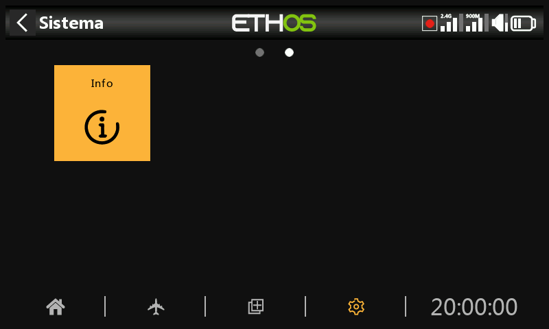
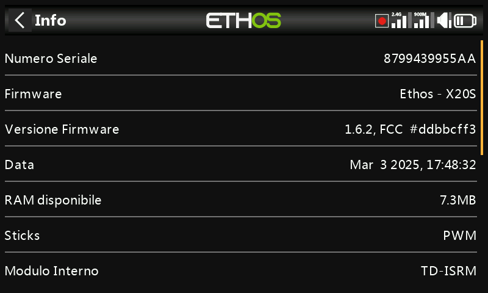
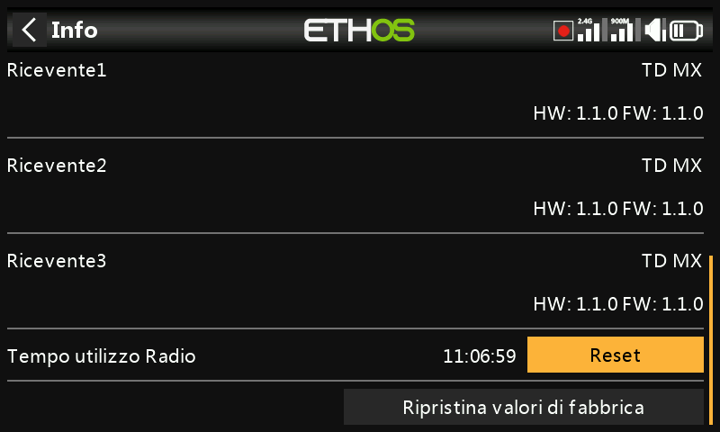
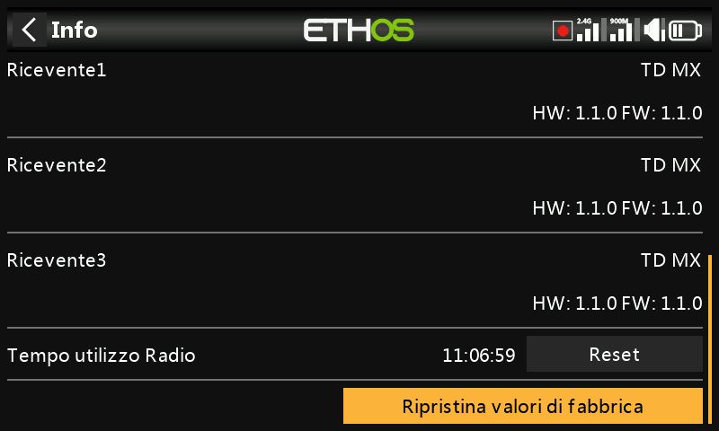
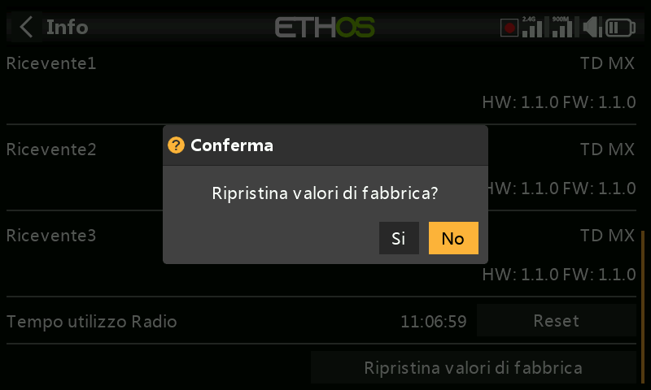
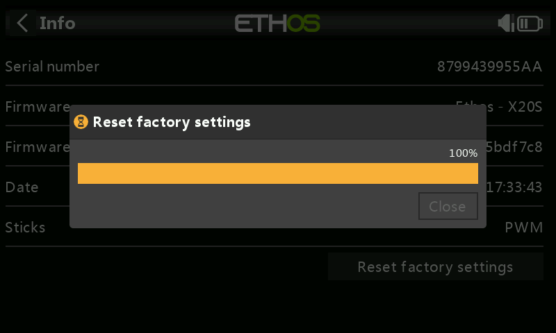
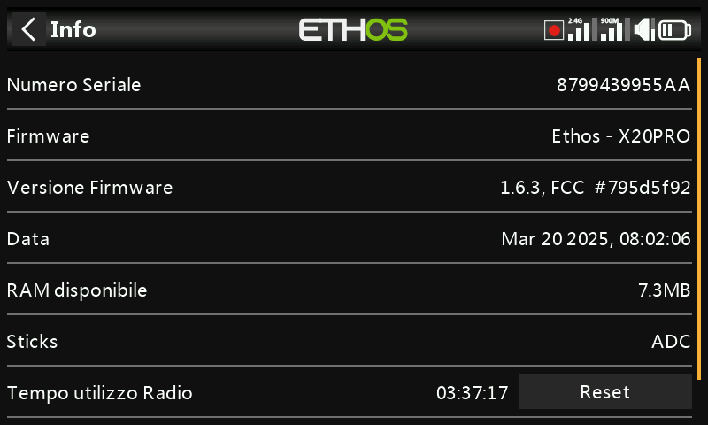

# Info

La pagina Info mostra le informazioni sul firmware del sistema, il tipo di gimbal, la versione del firmware del modulo interno, il firmware del ricevitore ACCESS, TD o TW e le informazioni sul modulo esterno.

X18 e X20

Numero di serie

Numero di serie della radio.

Firmware

Firmware Ethos e tipo di radio (ad esempio X20).

Versione del firmware

Versione attuale del firmware e tipo, ad esempio FCC, LBT o Flex.

Data

La data e l'ora della versione del firmware.

RAM disponibile

Mostra la RAM di sistema disponibile. È utile per verificare se gli script Lua si comportano male. Questo valore è disponibile anche come valore di sistema e può essere visualizzato, ad esempio, in un widget.

Stick

La versione del sensore Hall cardanico è installata. ADC è per l'analogico.

Modulo interno

Dettagli del modulo RF interno, comprese le versioni hardware e firmware.

Ricevitore

I dettagli del ricevitore collegato sono visualizzati dopo il modulo interno. Se un ricevitore ridondante è collegato allo stesso slot del ricevitore principale, i dettagli del ricevitore saranno visualizzati alternativamente sul display. L'esempio qui sopra mostra un Archer SR10 Pro e il suo R9MM-OTA ridondante mostrato con i dettagli del Ricevitore1.

Tempo di esecuzione della radio

Il timer del tempo di funzionamento della radio tiene traccia dell'utilizzo totale del trasmettitore. Un pulsante di reset permette di azzerarlo.

Errori

Quando ETHOS rileva un errore, nella barra superiore della vista principale viene visualizzata un'icona di avvertimento con un triangolo rosso. Il pannello Errori visualizza gli errori.

Gli errori possono essere dovuti a:

Errori dello script Lua

I problemi relativi agli script Lua comporteranno dei messaggi di errore.

Errore di backup della RAM

Un modello potrebbe essere così grande da superare la RAM di backup. ETHOS ha ampliato lo spazio della RAM per il backup dei modelli da 4k a 32k, quindi è improbabile che venga superato. Si tratta di un errore grave che renderà più lento il caricamento del modello in modalità di emergenza dalla SD anziché dalla RAM di backup.

Scrivi Log Errori

Viene generato un avviso di errore nella scrittura dei log se la funzione speciale “Scrivi log” riscontra dei problemi, probabilmente a causa di errori della scheda SD.

Esecuzione di una build notturna del firmware

Se è stata caricata una build notturna del firmware, l'icona di avviso serve a ricordare all'utente che le build notturne non sono adatte al volo.

Il pulsante Reset permette di cancellare gli errori, ad esempio durante le sessioni di debug di Lua.

Modulo esterno

Dettagli di qualsiasi modulo RF FrSky esterno (se montato), comprese le versioni hardware e firmware se il protocollo ACCESS.

I multimoduli non sono mostrati.

Ripristino delle impostazioni di fabbrica

Permette di riportare la radio alle impostazioni di fabbrica. Non è necessaria una connessione USB al PC, tutto avviene sulla radio.

Quando confermi di voler ripristinare le impostazioni di fabbrica, la radio cancella tutti i modelli, i file di log, le schermate, i documenti, gli script, le bitmap e le impostazioni della radio.

Durante il processo di cancellazione viene visualizzata una barra di avanzamento. A questo punto smonterà tutte le unità e riavvierà la radio.

## X20 Pro/R/RS

Informazioni simili per la X20 Pro/R/RS.
