# Esempio di **aereo** ad ala volante di base (Elevon)

Questo semplice esempio di ala volante riguarda la configurazione di un modello con 2 servi per gli elevoni. Utilizzeremo i rates, gli expo e i rapporti di Mix raccomandati da Dreamflight Weasel.

## Passo 1. Conferma le impostazioni del sistema

Inizia seguendo l'esempio di "Configurazione iniziale della radio", che serve a configurare le parti dell'hardware del sistema radio comuni a tutti i modelli. Per questo esempio utilizzeremo l'ordine dei canali AETR (Alettoni, Elevatore, Motore, Timone) predefinito. Assicurati che l'impostazione "Primi quattro canali fissi" sia disattivata.

Usa la funzione [RF System ](../model-setup/rf-system.md)per registrare (se il tuo ricevitore è ACCESS) e collegare il tuo ricevitore in preparazione alla configurazione del modello.

## Passo 2. Identificare i servi/canali necessari

La funzione Mix costituisce il cuore della radio. Per un modello di elevone, i mix vengono utilizzati per combinare i comandi dell'alettone e dell'elevatore in modo che agiscano entrambi sulle superfici dell'elevone.

Il nostro esempio di elevone ha i seguenti servi/canali:

2 canali che combinano gli ingressi di alettoni ed elevatori

## Passo 3. Crea un nuovo modello.

Consulta la sezione Impostazione del modello / [Selezione del modello ](../model-setup/model-select.md)per creare il tuo nuovo modello. Consulta anche la sezione Navigazione dei menu per familiarizzare con l'interfaccia utente della radio, in modo da trovare facilmente le funzioni di cui hai bisogno.

Tocca la scheda Modello (icona dell'aereo) e seleziona la funzione Seleziona modello. Poi tocca il simbolo '+', che ti presenterà una scelta di procedure guidate per la creazione del modello.

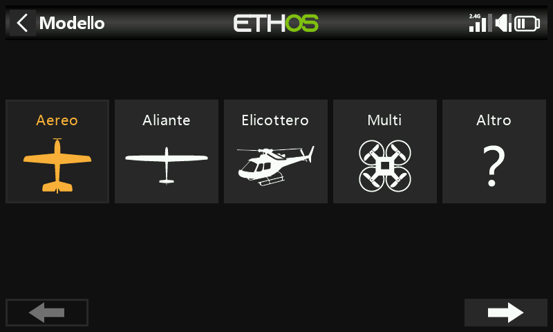

Nel nostro esempio, tocca l'icona dell'aereo per avviare la creazione guidata del modello.

La procedura guidata prevede l'impostazione di mix preimpostati per i ricevitori stabilizzati FrSky. Per questo esempio, sceglieremo l'opzione "Ricevitore non stabilizzato".

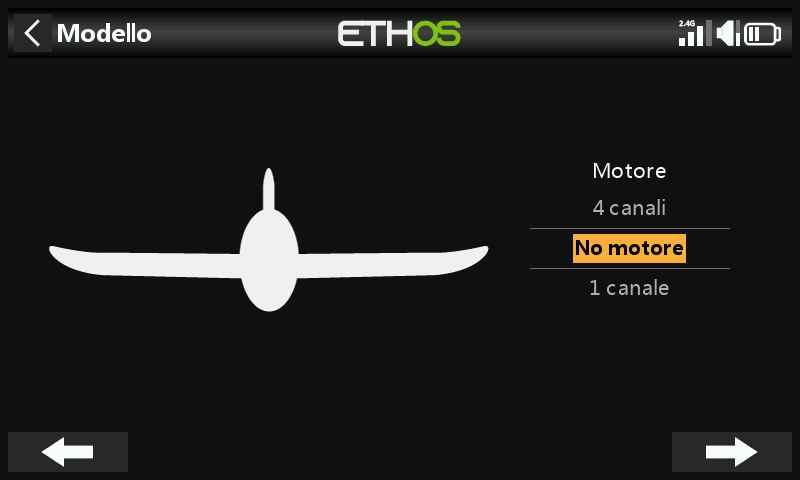

Seleziona "Nessun motore" per il motore.

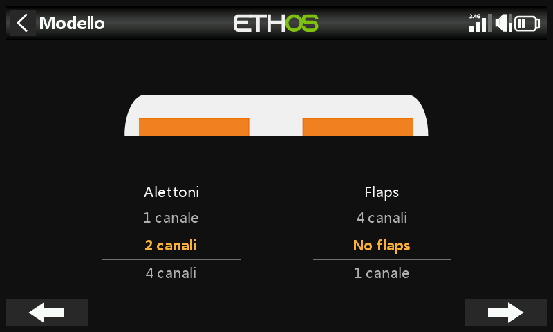

Accetta i 2 canali predefiniti per gli alettoni e seleziona "Nessun flap".

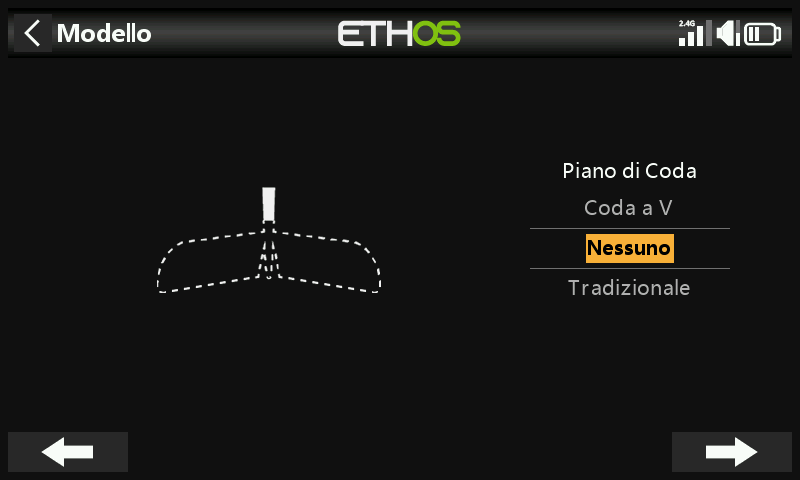

Seleziona "Nessuno" per la coda. In questo modo si creerà un mix di elevoni utilizzando gli ingressi degli alettoni e dell'elevatore.

Chiameremo il modello 'Weasel', selezioneremo un'immagine bitmap e seguiremo la procedura guidata fino alla fine che porterà alla creazione del modello 'Weasel' nel gruppo Airplane. Sarà anche il modello attivo e potremo continuare a configurare le sue caratteristiche.

## Passo 4. Rivedere e configurare i ***mix***

Tocca l'icona Mix per rivedere i mix creati dalla procedura guidata dell'aereo.

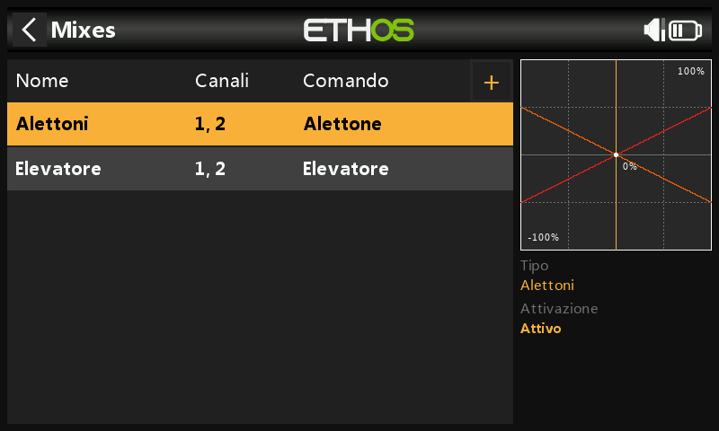

La procedura guidata ha creato un mix di Alettoni sui canali 1 e 2, seguito da un mix di Elevatori anch'esso sui canali 1 e 2. Ciò significa che entrambi i controlli di ingresso agiranno sui due canali degli elevoni.

Alettoni

Per rivedere il mix degli alettoni, tocca la riga Alettoni e seleziona Modifica dal menu a comparsa.

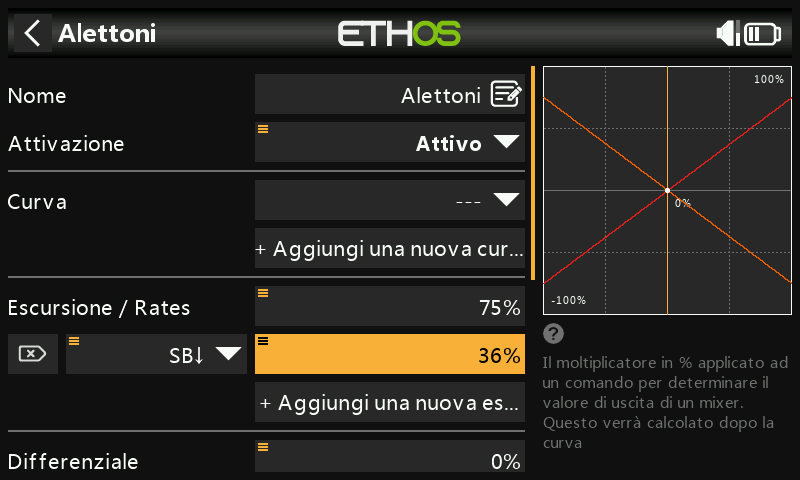

escursione/rates

Facendo riferimento al manuale Weasel, le deflessioni consigliate per gli alettoni sono circa 3 volte superiori a quelle dell'elevatore. Vogliamo escursioni combinati del 100%, quindi il escursione degli alettoni dovrebbe essere del 75% e quello dell'elevatore del 25%.

Secondo il manuale Weasel, le velocità basse dovrebbero essere circa il 50% di quelle alte. Pertanto utilizzeremo il 36% per le velocità basse degli alettoni e il 12% per le velocità basse dell'elevatore.

Expo

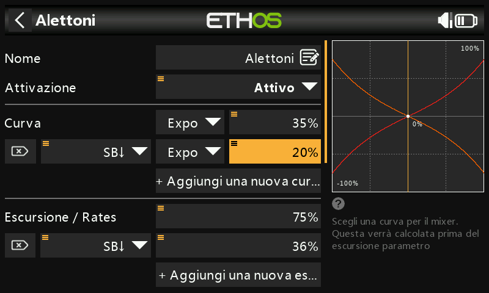

Negli esempi di Rates qui sopra puoi vedere che la risposta in uscita è lineare. Per evitare che la risposta sia troppo nervosa al centro dello stick, puoi utilizzare una curva Expo per ridurre il movimento della superficie di controllo al centro dello stick e aumentarlo quando lo stick si allontana dal centro. I valori Expo raccomandati da Weasel sono il 35% per gli alti e il 20% per i bassi, quindi aggiungeremo una curva che sarà attiva nella posizione di abbassamento dell'interruttore SB. Il grafico ora mostra una risposta curva che è più piatta al centro dello stick.

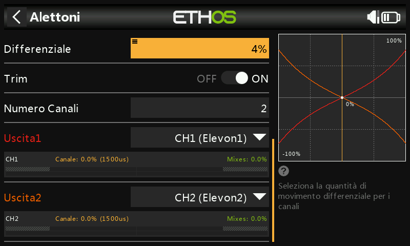

Per gli alettoni esiste un'altra impostazione speciale chiamata Differenziale. Se gli alettoni destro e sinistro si muovono verso l'alto o verso il basso della stessa quantità, l'alettone che si muove verso il basso causerà una resistenza maggiore rispetto a quello che si muove verso l'alto, causando l'imbardata dell'ala nella direzione opposta alla virata. Questo fenomeno è noto come imbardata avversa. Per ridurre questo fenomeno, un valore positivo nell'impostazione del differenziale porterà a un minore movimento degli alettoni verso il basso, riducendo l'imbardata avversa e migliorando le caratteristiche di virata/maneggevolezza. Il differenziale consigliato da Weasel è piuttosto piccolo e corrisponde a circa il 4%.

elevatore

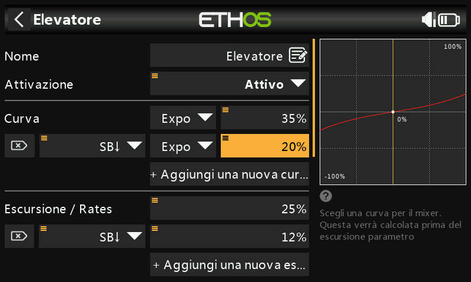

In modo simile agli alettoni, possiamo impostare i rates e l'expo per l'elevatore. Utilizzeremo rates e escursioni dell'elevatore del 25% e del 12%. Utilizzeremo gli stessi valori di Expo degli alettoni.

Timone

Il Weasel non ha un timone e non ne ha bisogno. Altri modelli con elevoni potrebbero aver bisogno di un timone, in questo caso è necessario utilizzare un mix libero per aggiungere un timone sul canale 3.

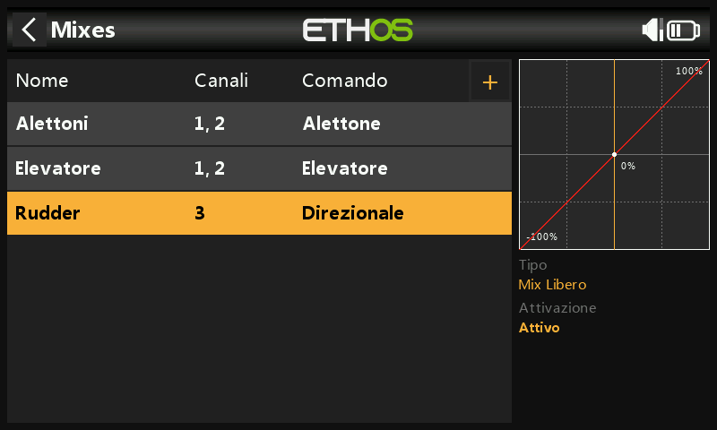

## Passo 5. ***Bind /collegamento il ricevitore***

Utilizza la funzione [RF System ](../model-setup/rf-system.md)per registrare (se il ricevitore è ACCESS) e collegare il ricevitore in preparazione alla configurazione delle uscite.

Prima di procedere, leggi le due sezioni successive sulla revisione dei mix e sulla configurazione delle uscite. Per evitare danni dovuti al sovraccarico dei servi, è consigliabile scollegare i leveraggi dei servi o ridurne la corsa fino a quando non sarai pronto a configurare i limiti min/max dei servi.

## Passo 6. Esamina i mix

Puoi utilizzare la schermata Uscite per rivedere i mix. I canali di uscita 1 e 2 possono essere rinominati in Elevon1 e Elevon2.

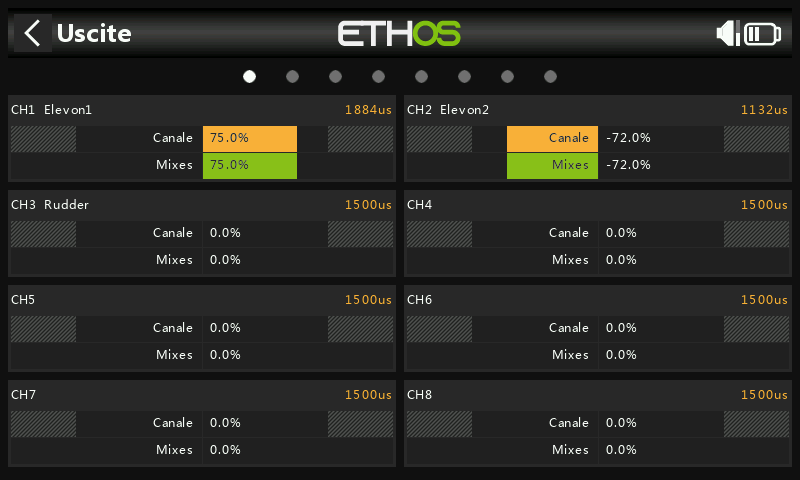

L'esempio precedente mostra che è stato applicato tutto l'alettone destro, quindi il canale 1 è al 75%, mentre l'alettone sinistro in discesa è al 72% a causa del differenziale degli alettoni.

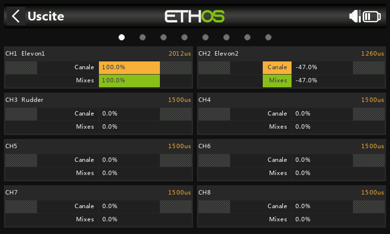

Questo esempio mostra che è stato applicato tutto l'alettone destro e tutto l'elevatore in discesa, quindi il canale 1 è al 75+25 = 100%, mentre l'alettone sinistro in discesa è al 72-25 = 47% a causa del differenziale degli alettoni.

## Passo 7. Configura l’escursione massima del servo

Inizia a regolare i punti centrali del servo utilizzando la regolazione PPM Center.

Infine, l’escursione massima dei servi devono essere configurati per impostare le deflessioni consigliate ed evitare di superare i limiti dei servi meccanici. L’escursione massima consigliati da Weasel sono 25 mm (alettoni) + 10 mm (elevatore) = 35 mm. Applica gli aiuti completi e gli input opposti di alettoni ed elevatore, quindi imposta le deflessioni massime della superficie assicurandoti che non vengano superati i limiti del servo o del leveraggio.

Min/Max

Le impostazioni min e max del Canale sono limiti "rigidi", cioè non potranno mai essere superati. Devono essere impostati in modo da evitare un vincolo meccanico. Si noti che servono come impostazioni di guadagno o "punto finale", quindi la riduzione di questi limiti ridurrà la gittata piuttosto che indurre il clipping (ritaglio). I limiti sono predefiniti a +/- 100,0%, ma possono essere aumentati fino a +/- 150,0% se necessario.

Curva

Le curve sono un modo più veloce e flessibile per configurare il centro e i limiti min/max delle uscite, oltre ad avere un bel grafico. Usa una curva a 3 punti per la maggior parte delle uscite, ma usa una curva a 5 punti per elementi come il secondo elevone, in modo da sincronizzare la corsa su 5 punti. Quando si utilizza una curva, è buona norma lasciare Min, Max e Subtrim ai valori "passanti" di -100, 100 e 0 rispettivamente (o -150, 150 e 0 se si utilizzano limiti estesi).
