# Esempio base di aereo ad ala fissa

Una guida completa per un aereo con motore + 2 alettoni + 2 flap +
elevatore + timone, un servo per ogni superficie, realizzato dall'inizio
alla fine con la procedura guidata. Completa prima la
[Configurazione iniziale della radio](initial-radio-setup.md).

## Passo 1. Conferma le impostazioni del sistema

Questo esempio utilizza l'ordine dei canali **AETR** predefinito.

## Passo 2. Identificare i servi/canali necessari

La funzione [Mix](../model-setup/mixes.md) costituisce il cuore della
radio — fino a 100 canali di mix, normalmente con i numeri più bassi
assegnati ai servi (poiché i numeri dei canali corrispondono direttamente
ai canali del ricevitore; il modulo RF interno dell'X20 supporta fino a 24
canali di uscita). I canali più alti restano liberi per canali virtuali o
per canali reali aggiuntivi tramite più moduli RF e SBUS. Il nostro
modello:

| Funzione | Canali |
|---|---|
| Motore | 1 |
| Alettoni | 2 |
| Flap | 2 |
| Elevatore | 1 |
| Timone | 1 |

(I retrattili vengono aggiunti più avanti, al
[Passo 10](#step-10-add-a-mix-for-retracts).)

## Passo 3. Crea un nuovo modello

Da [Selezione del modello](../model-setup/model-select.md) scegli una
categoria, tocca il simbolo **+** e avvia la procedura guidata **Aereo**.
Per questo esempio scegli l'opzione **Ricevitore non stabilizzato**.

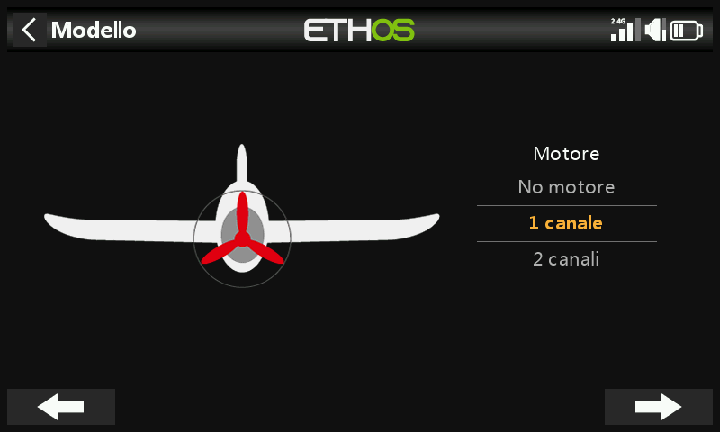
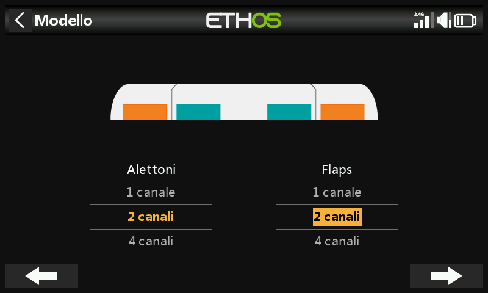

Accetta 1 canale per il motore, quindi 2 canali per gli alettoni e
seleziona 2 canali per i flap.

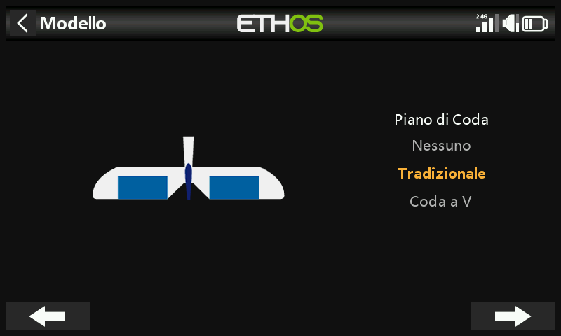
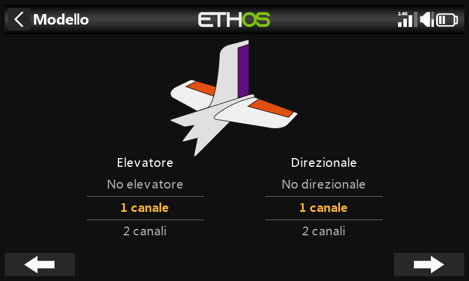

Accetta il piano di coda **Tradizionale** predefinito, con 1 canale per
l'elevatore e 1 per il timone.

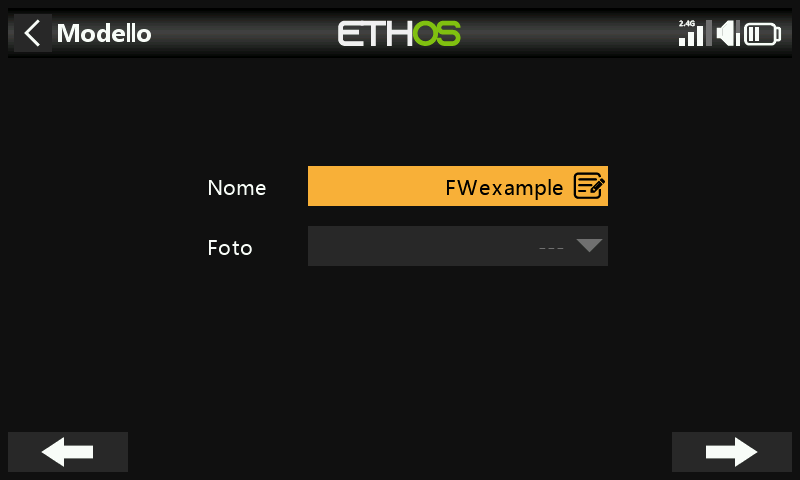
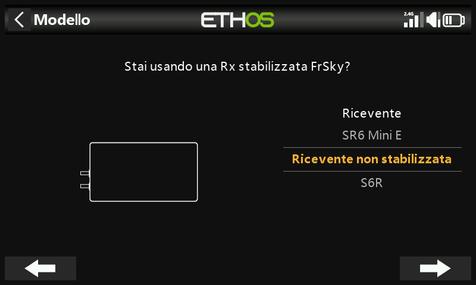

Assegna un nome (ad esempio "FWexample" — fino a 15 caratteri) e segui la
procedura guidata fino alla fine: il modello viene creato nel gruppo
Airplane e diventa il modello attivo.

## Passo 4. Rivedere e configurare i mix

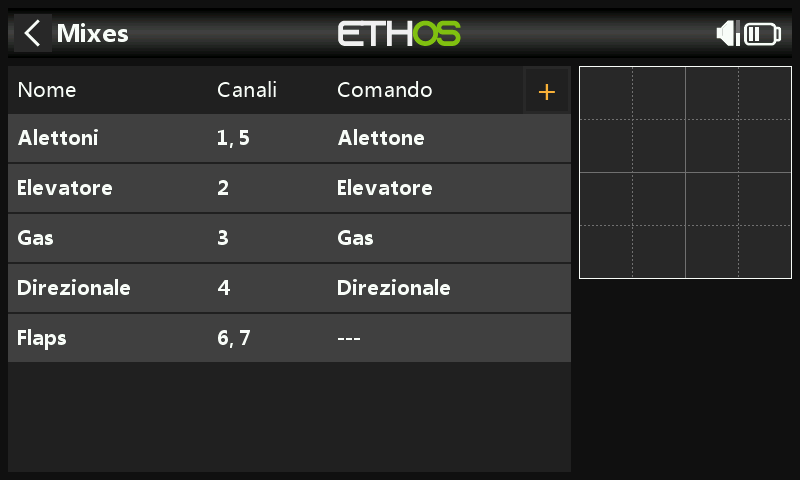

La procedura guidata ha già creato i mix di alettoni (canali 1 e 5),
elevatore, gas, timone e flap (i flap mostrano `---`, cioè nessuna sorgente
ancora assegnata).

### Alettoni {: #ailerons }

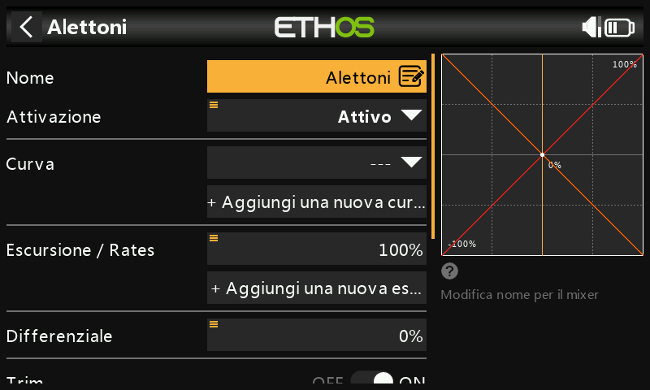
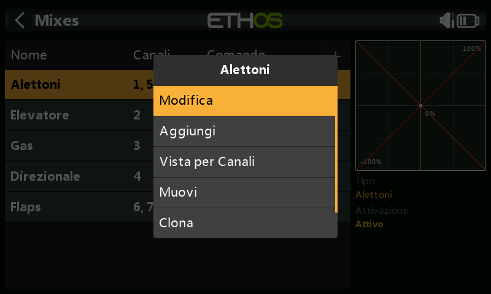

**Escursione / Rates** — imposta le escursioni prima di far volare qualsiasi
modello nuovo: una corsa contenuta (ad esempio il 30%) è adatta al volo
sportivo, il 100% pieno al 3D. Aggiungi un'escursione del 60% per la
posizione centrale dell'interruttore SB e una del 30% per SB in basso — il
valore predefinito (SB in alto) resta al 100%:

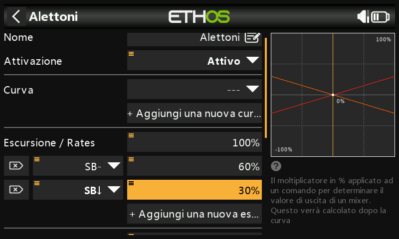

**Expo** — una risposta lineare può risultare troppo nervosa al centro dello
stick; aggiungi delle curve Expo (ad esempio 60%/40%/20% sulle stesse
posizioni di SB) per appiattire la risposta vicino al centro senza ridurre
la deflessione massima:

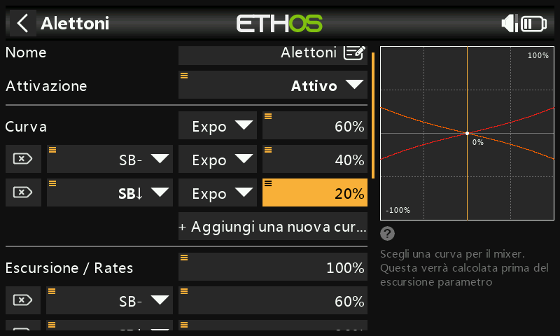

**Differenziale** — se gli alettoni destro e sinistro si muovono verso
l'alto o verso il basso della stessa quantità, l'alettone che si muove verso
il basso causerà una resistenza maggiore rispetto a quello che si muove
verso l'alto, causando l'imbardata del modello nella direzione opposta alla
virata ("imbardata avversa"). Un valore positivo di differenziale (il 50% è
un valore comune) riduce il movimento verso il basso rispetto a quello verso
l'alto, contrastando questo fenomeno:

Per mettere a punto il differenziale in volo, premi a lungo `ENT` sul valore,
seleziona **Usa una sorgente** e scegli Pot1:

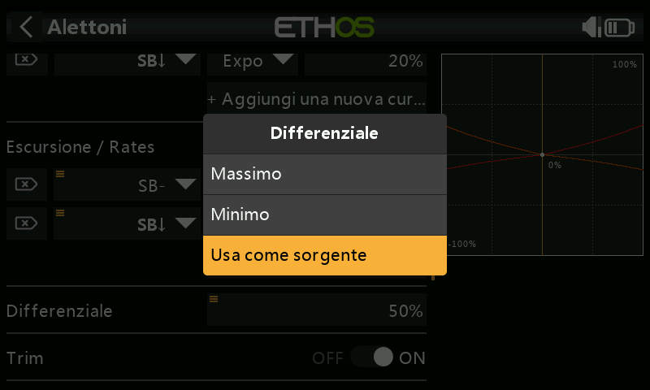
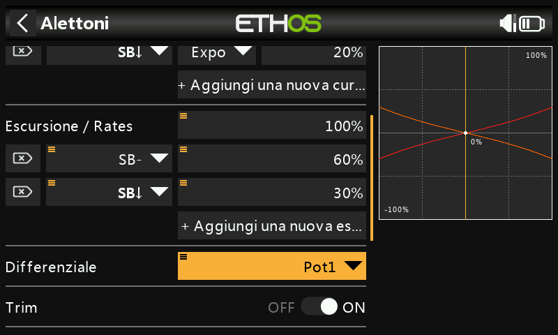

Una volta soddisfatto del valore trovato in volo, premi di nuovo a lungo e
seleziona **Converti in valore** per fissarlo definitivamente:

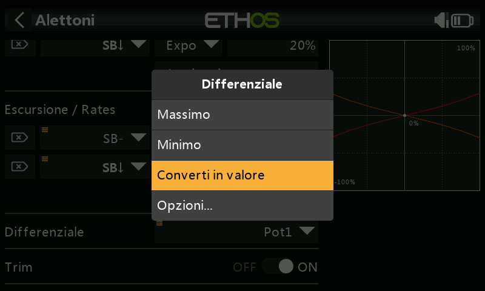

**Trim** — puoi scollegare questo mix dal trim associato senza disattivare il
trim stesso, rendendolo così disponibile per un altro scopo:

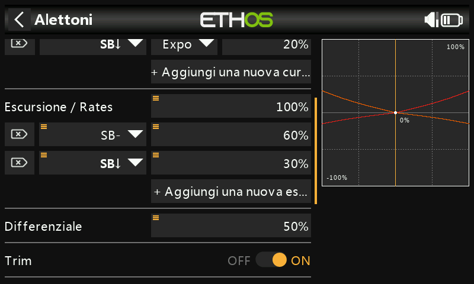

### Elevatore e timone

Lo stesso schema con tre escursioni + Expo, qui sull'interruttore SC:

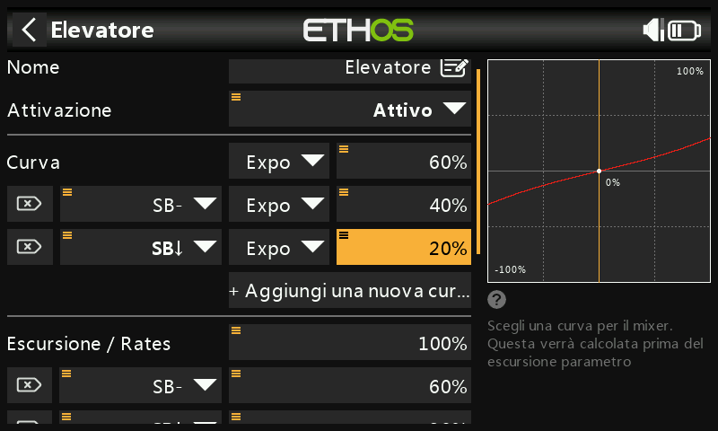

### Gas

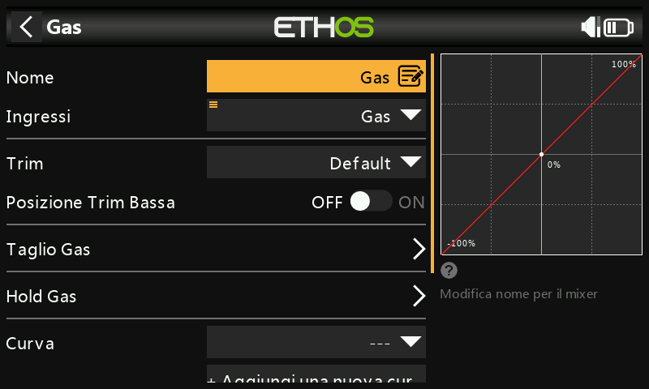

Lascia l'ingresso sullo stick del Gas - Throttle — non servono escursioni né
Expo — ma un interruttore di sicurezza è indispensabile: l'avviamento
imprevisto di un motore a scoppio o elettrico può provocare lesioni gravi.

**Posizione Trim Bassa** (motori glow/a scoppio) — regola il regime di minimo
indipendentemente dal gas massimo:

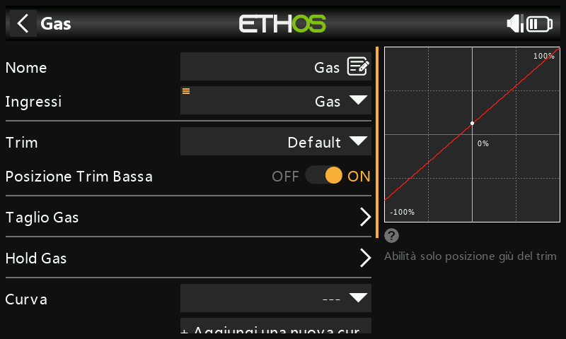

Con questa opzione attiva, il canale del gas si trova a −75% con lo stick al
minimo; la leva del trim del gas regola quindi il minimo tra −100% e −50%.

**Taglio Gas** — un blocco di sicurezza. Con l'interruttore SA in basso come
condizione attiva (mostrata in grassetto quando è attiva), l'uscita del gas
si mantiene a −100% non appena lo stick scende sotto −85%:

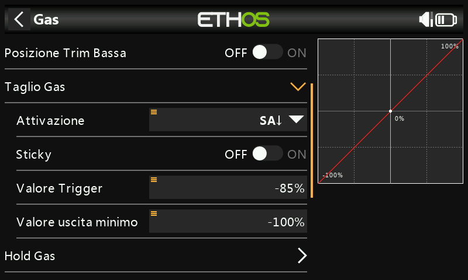

Con l'impostazione **Sticky** attiva, invece, il gas viene tagliato
**nell'istante** in cui SA va in basso, indipendentemente dalla posizione
dello stick:

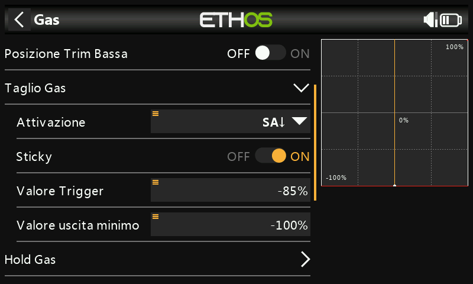

In entrambi i casi, una volta che la condizione attiva cessa, lo stick deve
essere riportato sotto −85% prima che il gas possa aumentare di nuovo: si
evita così che il motore salti a un'elevata apertura del gas nel momento in
cui l'interruttore di taglio viene rilasciato.

**Hold Gas** — un taglio di emergenza da *qualsiasi* posizione dello stick,
che porta l'uscita direttamente a −100% (o a un valore configurato)
nell'istante in cui la sua condizione è soddisfatta:

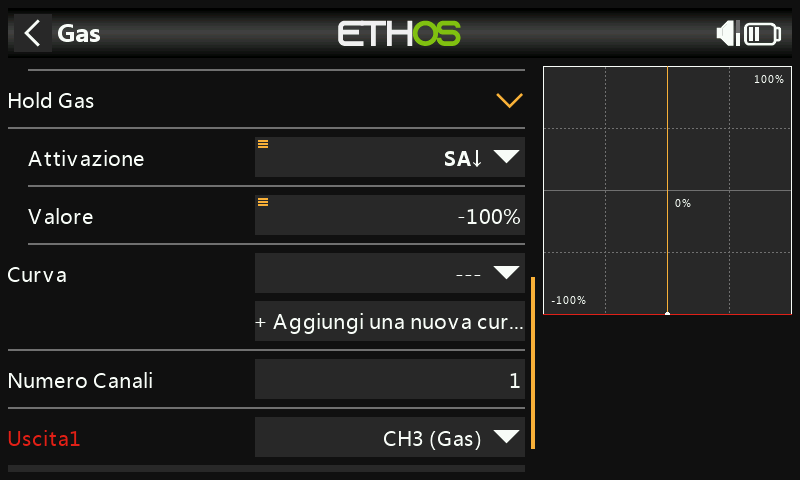

### Flap

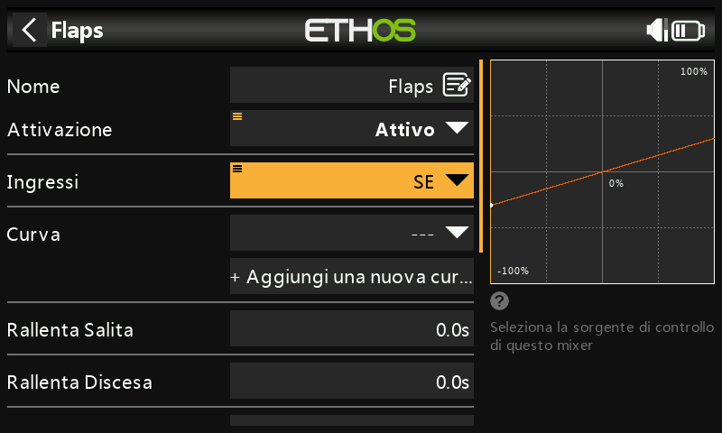

Assegna i flap all'interruttore SE e imposta al 100% l'escursione di entrambi
i canali di uscita:

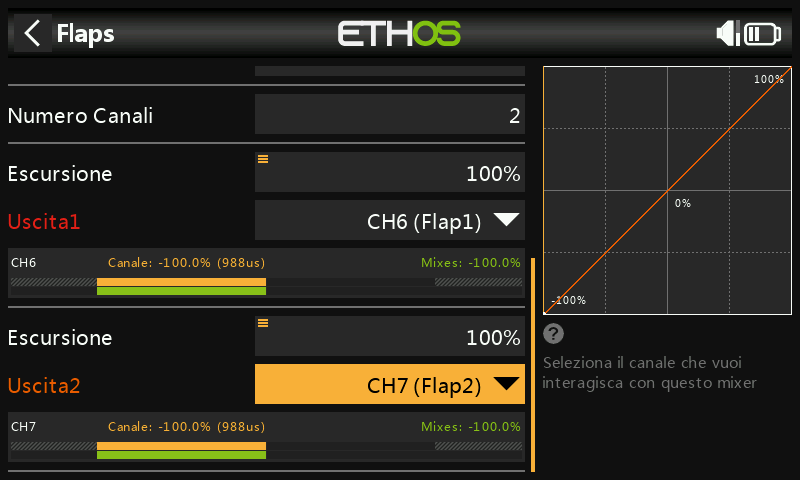

## Passo 5. Bind /collegamento il ricevitore

Utilizza la funzione [RF System](../model-setup/rf-system.md) per registrare
(se il ricevitore è ACCESS) e collegare il ricevitore. Prima di procedere
con le Uscite, è consigliabile scollegare i leveraggi dei servi o ridurne
temporaneamente la corsa, per evitare danni dovuti al sovraccarico durante
l'impostazione dei limiti Min/Max.

## Passo 6. Configura le uscite

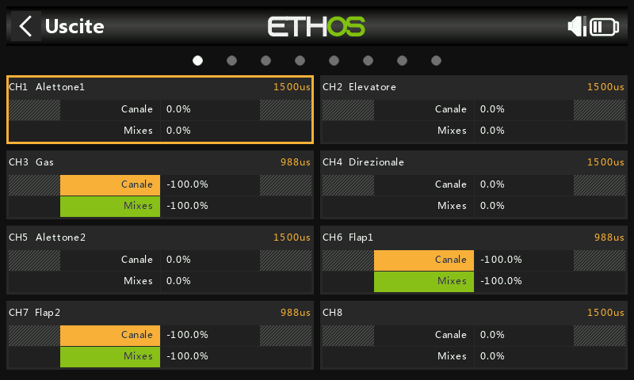

Le [Uscite](../model-setup/outputs.md) adattano la logica del mixer alla
meccanica reale del modello.

**Alettone1** — inizia a regolare il punto centrale del servo utilizzando la
regolazione **Centro PWM**, dopo aver ottimizzato i collegamenti meccanici,
quindi configura i limiti con le impostazioni **Min** e **Max**. Per
semplificare le cose, puoi assegnare temporaneamente un potenziometro a Min
e poi a Max, come mostrato sopra nell'esempio del differenziale
dell'alettone:

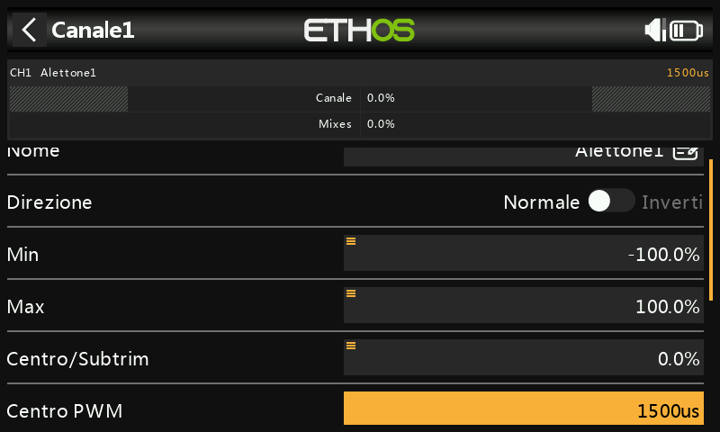

**Flap** — i flap normalmente richiedono una grande deflessione verso il
basso per una frenata efficace; per ottenerla puoi sacrificare una parte
della deflessione verso l'alto quando realizzi i leveraggi, per cui i flap
saranno in posizione semi-abbassata al centro del servo, e usare quindi Min
e Max per ottenere le posizioni desiderate di flap alzati e flap pieni. Una
curva a 5 punti è il modo consueto per correggere eventuali disallineamenti
tra flap e alettoni. Infine, utilizza il **[Bilanciamento dei
canali](../model-setup/outputs.md#balance-channels)** per sincronizzare il
movimento delle superfici di destra e sinistra, come gli alettoni e i flap.

## Passo 7. Introduzione alle modalità di volo

Le [modalità di volo](../model-setup/flight-modes.md) permettono a un modello
di avere impostazioni diverse per ogni compito: l'interruttore della modalità
di volo diventa un po' come cambiare le marce in un'automobile. Delle 20
disponibili, questo esempio ne usa tre: **Default**, **Flaps Half**
(interruttore SE-mid) e **Flaps Full** (interruttore SE-Up). La prima
modalità di volo che ha la condizione attiva su ON è quella attiva; la
modalità **Default** non ha alcuna condizione ed è attiva quando nessuna
altra lo è — questo spiega perché non ha un'opzione di selezione degli
interruttori. Tempi di dissolvenza in entrata e in uscita di 1 secondo
rendono più graduale la transizione all'estensione dei flap.

## Passo 8. Configurare i Trims

Due modi per gestire il trim dell'elevatore che varia con la posizione dei
flap:

**Trim indipendenti per modalità di volo** — l'opzione più semplice: il trim
dell'elevatore diventa completamente indipendente per ogni modalità di volo e
commuta automaticamente quando azioni i flap sull'interruttore SE. Poiché in
ogni modalità devi regolare l'elevatore "da zero", la funzione [Instant
trim](../model-setup/trims.md#instant-trim) è di aiuto: regola prima per il
volo normale, poi atterra e usa quel valore come punto di partenza per le
modalità con i flap.

**Trim base con offset** — si esegue il trim una sola volta in Default, e la
compensazione dell'elevatore di ciascuna modalità flap viene aggiunta come
offset:

1. Imposta lo **Step** del trim su Medio (per raggiungere più rapidamente il
   trim desiderato; potrai ridurlo in seguito per una regolazione più
   precisa), il **Modo** su Personalizzata e aggiungi un nuovo
   comportamento.
2. Come **Condizione attiva** seleziona `FM1(Flaps Half)` e come modo
   **Offset + Default**: nella modalità Flaps Half il valore di trim sarà la
   somma del trim base o predefinito più il trim di offset risultante dalle
   regolazioni effettuate mentre quella modalità è attiva:

   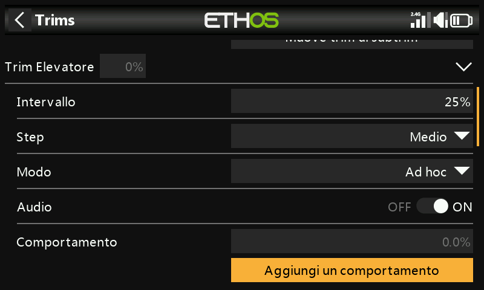
   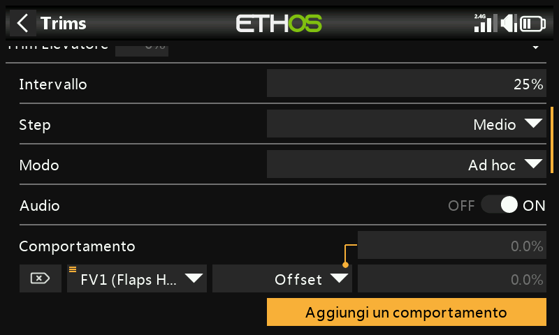

3. Ripeti per `FM2(Flaps Full)`:

   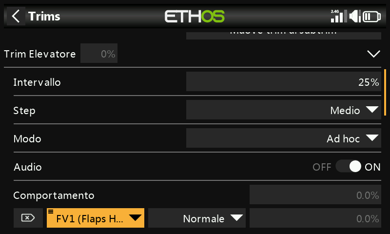
   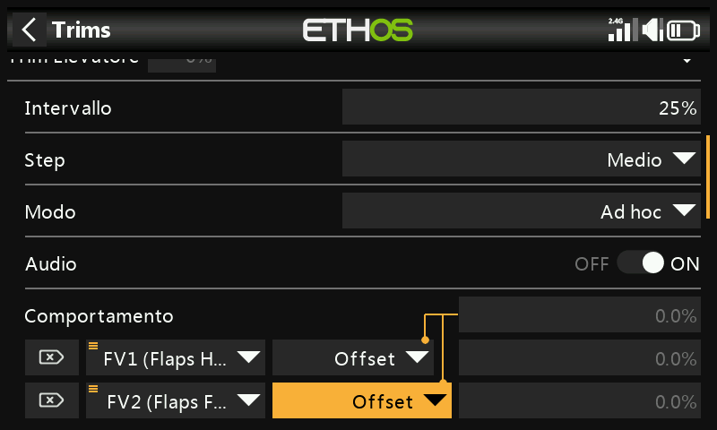

Ogni modalità flap può ora essere regolata in modo indipendente; tuttavia, se
in seguito regoli il trim di base utilizzato nella modalità Default (ad
esempio a causa della deriva termica del servo), anche i due trim delle
modalità flap verranno modificati automaticamente della stessa quantità.

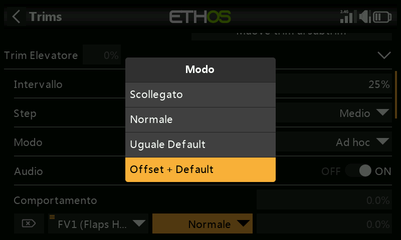

## Passo 9. Imposta un timer per le batterie di volo

Nella sezione [Timer](../model-setup/timers.md) modifica il Timer 1:
modalità **Tim.Giu**, valore iniziale di 5 minuti, in funzione ogni volta che
**Gas attivo** è vero (a condizione che non sia in fase di reset).
Facoltativamente puoi assegnare una sorgente di temporizzazione
proporzionale (ad esempio lo stick del gas), così al massimo
dell'accelerazione il timer conterà in tempo reale, ma rallenterà man mano
che il gas viene ridotto.

## Passo 10. Aggiungi una Mix per i retrattili {: #step-10-add-a-mix-for-retracts }

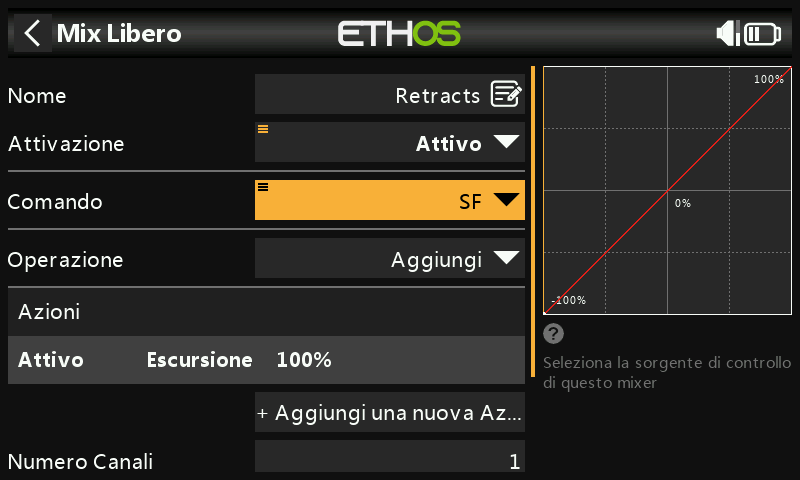

Tocca un mix, seleziona **Aggiungi mix** → **Mix libero**, chiamalo
"Retracts", imposta l'attivazione su Attivo e la sorgente sull'interruttore
SF. L'azione di miscelazione predefinita di escursione = 100% va bene:
questo assegna, ad esempio, il canale 8 ai retrattili:

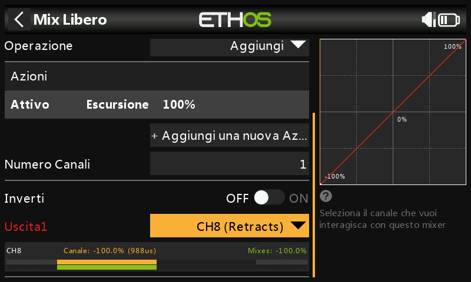
