# Esempio base di elicottero flybarless

Una configurazione base di elicottero flybarless (FBL), prendendo come
esempio un controller quale lo Spirit. A differenza di un modello ad ala
fissa, un elicottero è intrinsecamente instabile: il controller FBL
utilizza giroscopi (velocità di rotazione) e accelerometri
(movimento/orientamento) per calcolare le correzioni di
imbardata/beccheggio/rollio tramite un anello di controllo PID
(Proporzionale-Integrale-Derivativo) opportunamente tarato, bilanciando
stabilità, reattività e sovraelongazione in base alle caratteristiche
fisiche ed elettriche del singolo elicottero.

Questo tutorial tratta esclusivamente l'aspetto della **programmazione
della radio**: per il resto fare riferimento alla documentazione della
propria unità FBL, avendo già una solida conoscenza generale degli
elicotteri.

!!! danger
    Per sicurezza, rimuovere le pale del rotore prima di iniziare.

## Passo 1. Verificare le impostazioni di sistema

Ordine dei canali **AETR**, **[Primi quattro canali
fissi](../system-setup/controls.md#first-four-channels-fixed)** **OFF**:
le unità FBL Spirit si aspettano i canali SBUS esattamente in questo
ordine (pur utilizzando internamente TAER nella propria configurazione).
Registrare (se ACCESS) e connettere il ricevitore tramite [RF
System](../model-setup/rf-system.md).

## Passo 2. Individuare i servi/canali necessari

| Funzione | Canale |
|---|---|
| Rollio (alettoni) | — |
| Beccheggio (profondità) | — |
| Gas | — |
| Imbardata (timone) | — |
| Guadagno giroscopio | 5 |
| Passo collettivo | 6 |
| Banco impostazioni | 7 |
| Rescue | 8 |

## Passo 3. Creare un nuovo modello

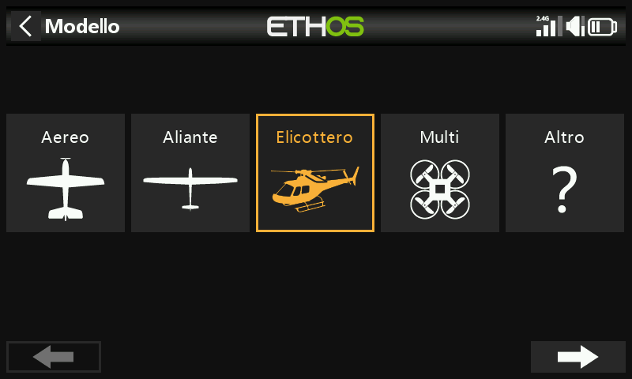

Da [Selezione modello](../model-setup/model-select.md), creare/selezionare
una categoria Heli, avviare la procedura guidata e scegliere
**Flybarless**:

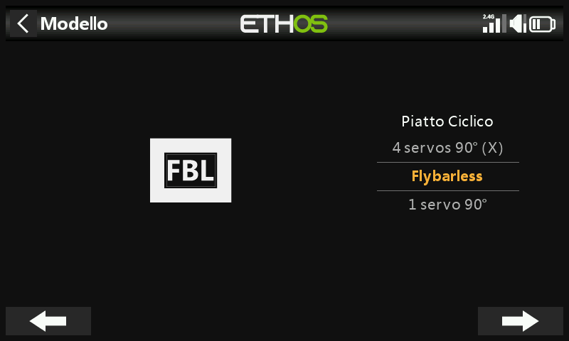
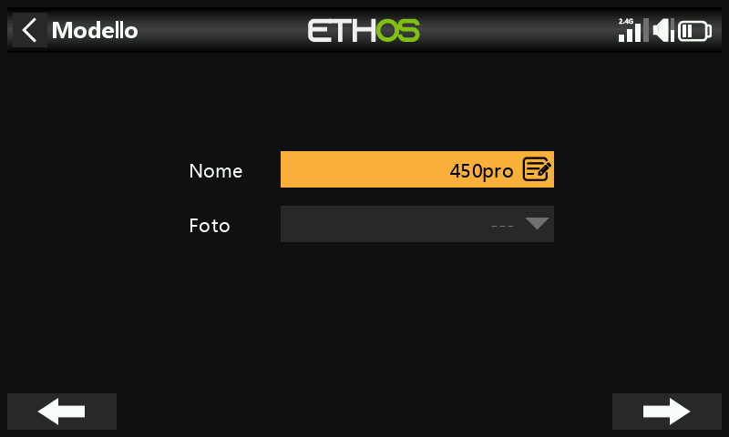

Assegnare un nome e scegliere un'immagine.

## Passo 4. Rivedere e configurare i mix

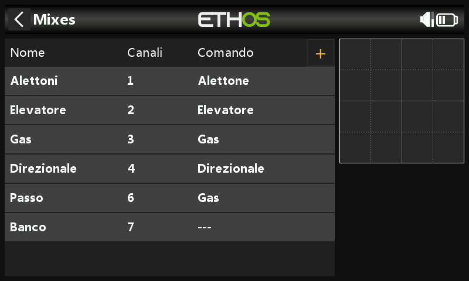

La procedura guidata crea Alettoni/Profondità/Gas/Timone nell'ordine
AETR, il Passo sul canale 6 e il FBL Bank sul canale 7:

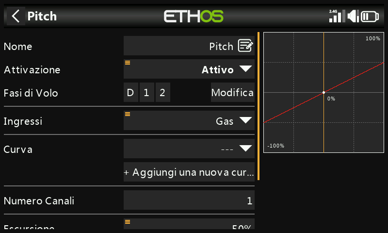

Verificare che il canale 6 sia il Passo collettivo. Occorre aggiungere
manualmente altri due canali come [Mix
liberi](../model-setup/mixes.md#mix-libraries): **Guadagno giroscopio**
(canale 5) e **Rescue/Stabi** (canale 8).

**Alettoni/Profondità/Timone**: nulla da aggiungere; rate ed Expo sono
compito dell'unità FBL, quindi la radio si limita a trasmettere un
segnale lineare pulito.

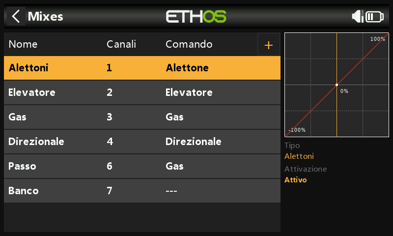

**Passo collettivo**: una curva lineare; basta verificare il canale di
uscita (normalmente il 6). Come sopra, rate ed Expo sono gestiti
dall'unità FBL e non qui.

**FBL Bank**: i tre banchi di impostazioni dello Spirit (stili di volo
differenti, guadagni dei sensori a regimi diversi, oppure
Principiante/Acro/3D — o semplicemente preset di taratura) assegnati a un
interruttore a 3 posizioni, ad esempio SE:

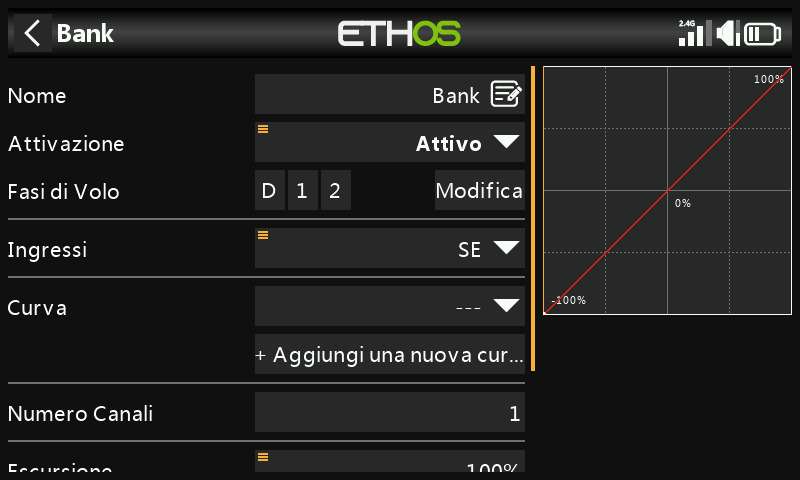

**Guadagno giroscopio**: aggiungerlo come Mix libero dopo l'ultimo
canale. Il guadagno è tipicamente un valore fisso: impostare **Sorgente**
su Valore speciale 0, regolare il guadagno tramite **Offset**
(perfezionandolo in volo successivamente) e portare l'uscita sul canale 5:

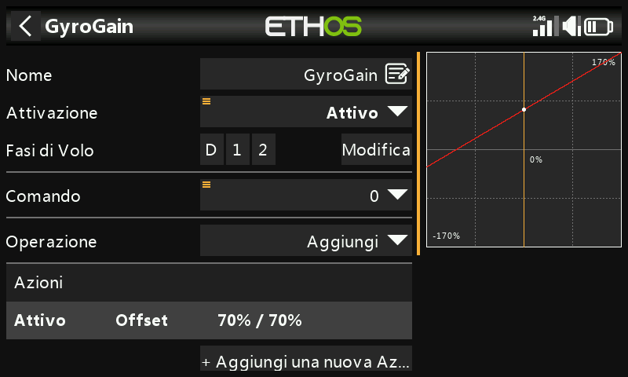

### Configurare le fasi di volo

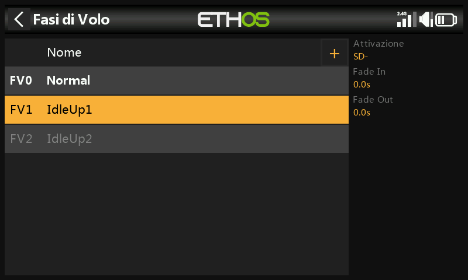

Tre [fasi di volo](../model-setup/flight-modes.md): rinominare quella
predefinita in **Normal** e aggiungere **Idle Up 1**/**Idle Up 2**
sull'interruttore SD.

### Configurare il mix del gas

Tre curve del gas, una per ciascuna fase di volo, ognuna una [curva
personalizzata](../model-setup/curves.md):

- **Normal**: avviamento/decollo, parte da −100% (motore spento) e sale
  in modo graduale. Una curva a 7 punti con **Smooth** attivo funziona
  bene; i valori esatti richiedono una taratura in volo.

  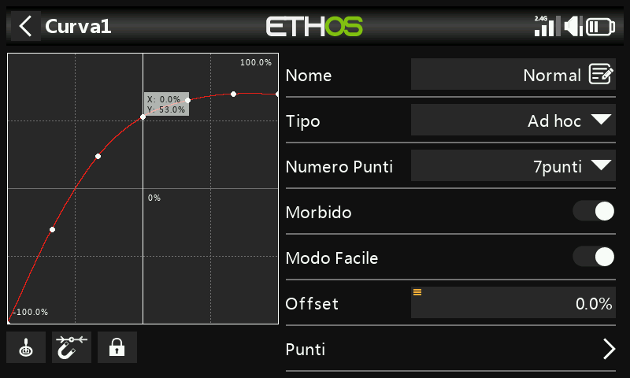

- **Idle Up 1**: volo generico, una curva rettilinea corrispondente a un
  valore di gas costante che mantiene stabile la velocità del rotore, con
  il movimento affidato invece a Passo collettivo, Alettoni (rollio) e
  Profondità (beccheggio). Mantenere fluida la transizione da Normal,
  senza salti bruschi. (La maggior parte delle unità FBL offre anche una
  funzione **Governor** per mantenere costante la velocità del rotore
  durante le manovre più aggressive: consultare il manuale dell'unità
  FBL.)

  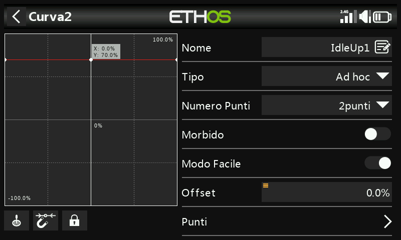

- **Idle Up 2**: volo aggressivo (acrobazia, 3D); anche in questo caso da
  tarare in volo.

  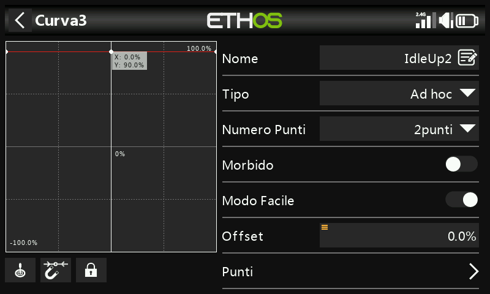

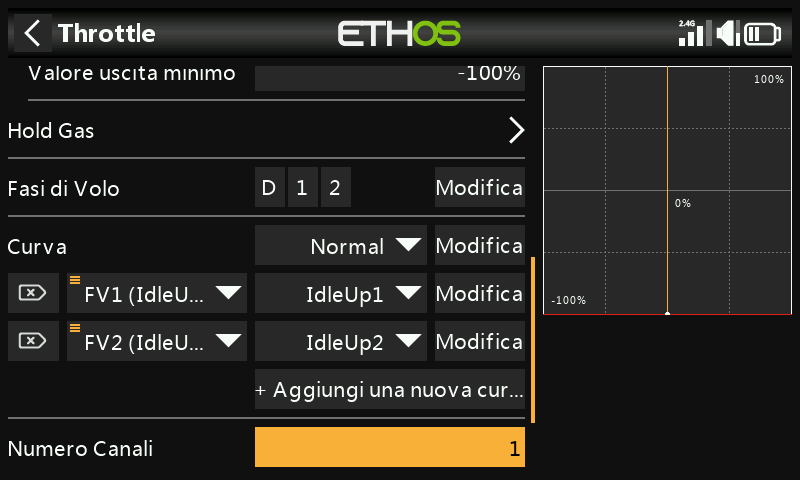

**Taglio gas**: assegnare ad esempio l'interruttore SG in alto con
**Sticky** attivo: portando SG in alto il gas viene tagliato
istantaneamente e, grazie a Sticky, può essere riarmato solo dopo aver
riportato lo stick del gas al minimo.

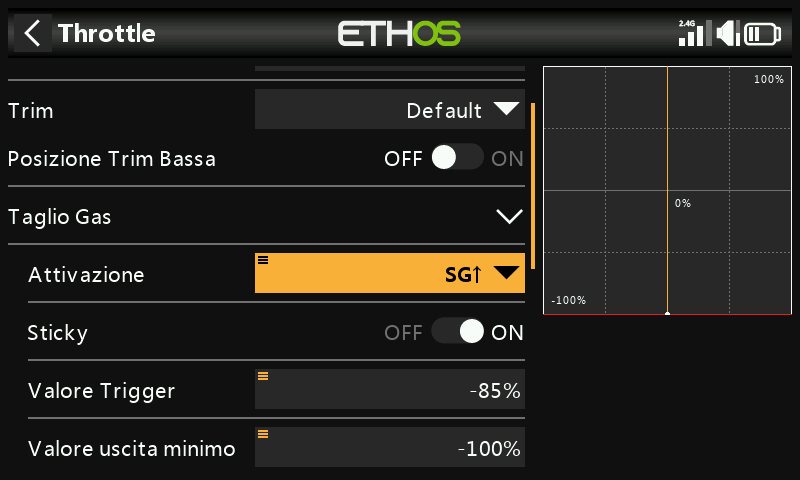

**Rescue/Stabi**: assegnarlo in modo analogo, ad esempio
all'interruttore SA sul canale 8.

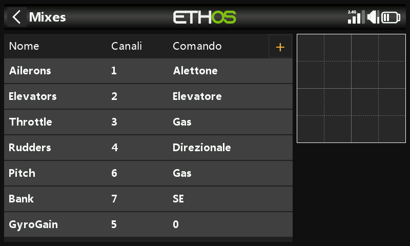

## Passo 5. Configurazione dell'unità FBL

1. **Installare il software di configurazione FBL**, ad esempio Spirit
   Settings, su un PC.
2. **Collegare il ricevitore all'unità FBL** secondo il relativo schema
   di cablaggio: tipicamente l'uscita SBUS Out del ricevitore alla porta
   RUD dell'unità FBL (alcuni modelli Spirit richiedono un adattatore
   SBUS), oppure tramite F.Port1/FBUS.
3. **Collegare l'unità FBL al PC**, via cavo o Bluetooth, secondo il
   relativo manuale.

   !!! danger
       Non collegare ancora alcun servo.

4. **Aggiornare il firmware FBL** se necessario, dalla scheda Update del
   software.
5. **Configurazione generale** (scheda General di Spirit Settings):
   - Tipo di ricevitore: **Futaba SBUS** oppure **FrSky F.Port** a
     seconda dei casi, quindi riavviare.
   - Mappatura dei canali (con AETR impostato dalla procedura guidata):

     | Funzione | Canale |
     |---|---|
     | Gas | 1 |
     | Alettoni | 2 |
     | Profondità | 3 |
     | Timone | 4 |
     | Giroscopio | 5 |
     | Passo | 6 |
     | Bank | 7 |
     | Rescue/Stabi | 8 |

     (Questa mappatura deriva dal modo in cui l'unità Spirit interpreta
     le posizioni all'interno del flusso dati SBUS.)

6. **Limiti dei canali** (scheda Diagnostic): l'unità FBL necessita di
   limiti dei canali della radio calibrati e di centri verificati.

   - Azzerare innanzitutto tutti i subtrim e i trim sulla radio.
   - Centrare lo stick del Passo collettivo in modo che indichi
     esattamente 1500µs in [Uscite](../model-setup/outputs.md).
   - Accendere l'unità FBL e verificare che alettoni/profondità/passo/
     timone indichino tutti 0% nella scheda Diagnostic (l'unità FBL
     rileva automaticamente il neutro a ogni inizializzazione).
   - Portare ciascun comando ai propri estremi e regolare i
     corrispondenti valori **Min**/**Max** in Uscite finché la scheda
     Diagnostic non indica esattamente +100%/−100%, verificando anche che
     la direzione della barra corrisponda a quella dello stick.

   !!! warning
       Non utilizzare mai subtrim o trim su questi canali: l'unità FBL
       Spirit li interpreta come comandi di ingresso, non come
       calibrazione.

7. Regolare l'**Offset** del mix del Guadagno giroscopio per ottenere
   l'Heading Lock.

Fatto questo, il lato trasmittente è completamente configurato:
proseguire con il resto della configurazione secondo il manuale
dell'unità FBL.
