# Sezione "Come fare

## 1. Come impostare l'avviso di bassa tensione della batteria

Nell'era della telemetria, un approccio migliore per la gestione della batteria consiste nel monitorare la tensione della batteria sotto carico e lanciare un allarme quando la tensione scende al di sotto della soglia scelta.

A tal fine è possibile utilizzare un sensore di tensione della batteria come FrSky FLVSS.

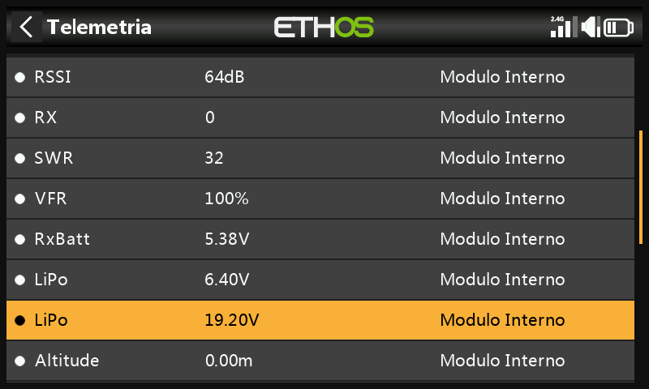

Nelle Opzioni del ricevitore imposta la Porta di telemetria sull'opzione Porta S. Collega l'FLVSS al ricevitore tramite un cavo S.Port e attiva l'opzione "Scopri nuovi sensori" in Modello / Telemetria. Il sensore LiPo aggiuntivo è mostrato nell'esempio precedente.

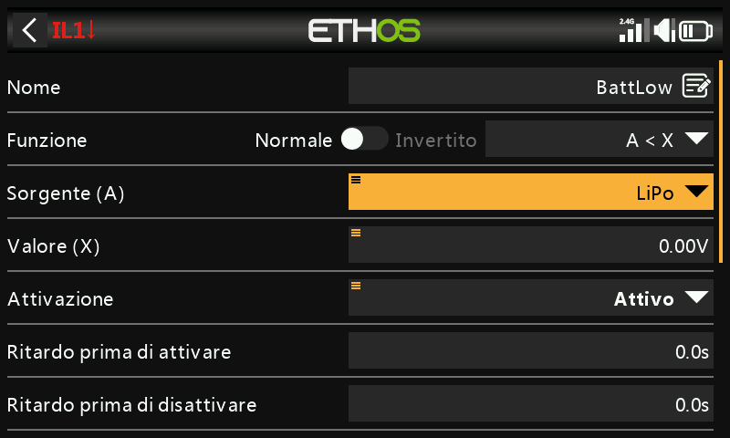

Aggiungi un nuovo interruttore logico e seleziona il sensore Lipo come sorgente.

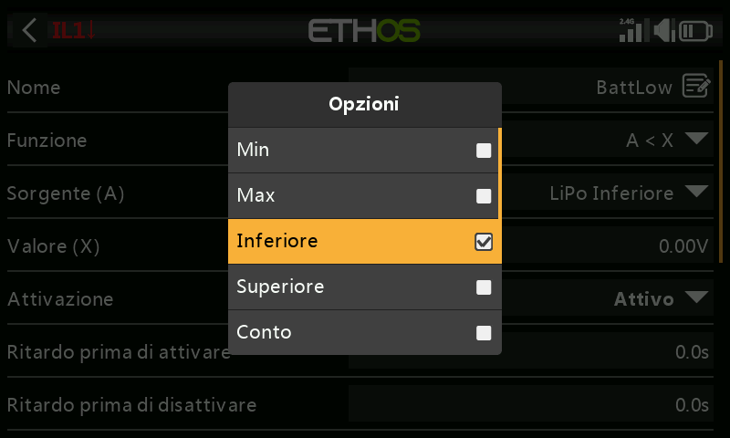

Con il sensore Lipo evidenziato, premi a lungo il tasto \[ENT\] per visualizzare la finestra di dialogo delle opzioni. Seleziona il valore più basso dall'elenco delle opzioni del sensore Lipo, che includono la tensione minima del pacco, la tensione massima del pacco, la tensione minima delle celle, la tensione massima delle celle, il conteggio delle celle e le tensioni delle singole celle.

Nota: le singole celle sono selezionabili come sorgenti solo quando il FLVSS/MLVSS è collegato a un ricevitore collegato e ha una lipo collegata!

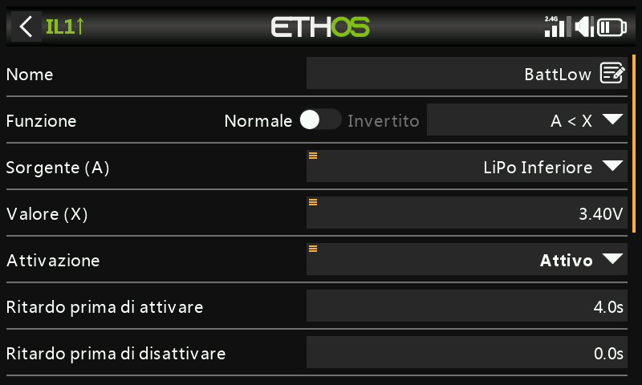

Imposta il valore a qualcosa come 3,4V e "Ritardo prima dell'attivazione" a 4 secondi. L'interruttore logico diventerà vero/attivo quando la tensione più bassa della cella rimarrà al di sotto di 3,4 per cella per almeno 4 secondi. Una soglia di 3,4V sotto carico recupererà circa 3,7V quando non sarà più sotto carico.

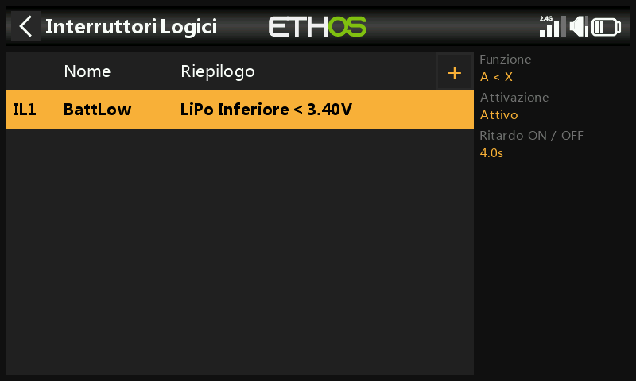

L'interruttore logico completato per la batteria scarica è mostrato qui sopra.

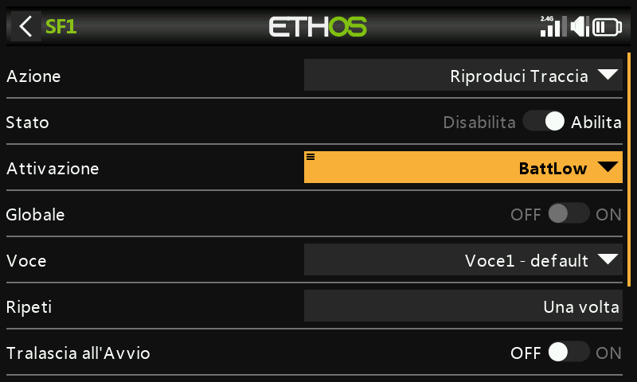

Aggiungi una funzione speciale per parlare del valore della tensione totale della LiPo quando l'interruttore logico BattLow diventa True.

Imposta la condizione attiva sull'interruttore logico BattLow. Seleziona la voce che desideri utilizzare.

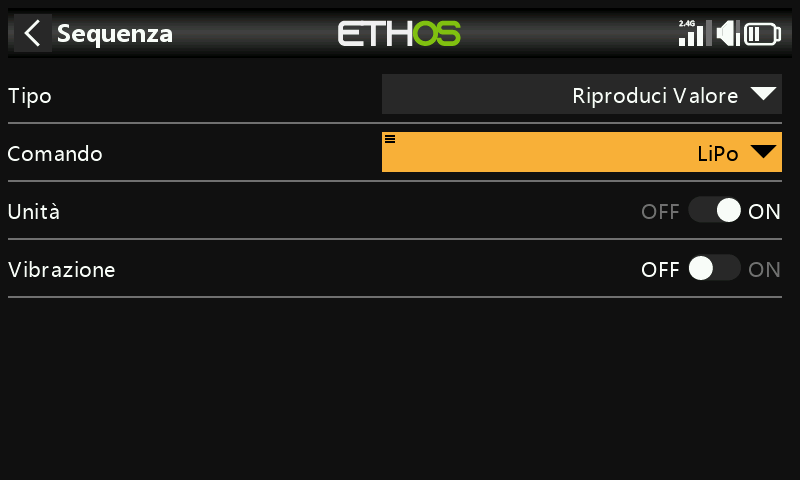

In "Sequenza" aggiungi un comando "Valore di riproduzione" per parlare della tensione della Lipo.

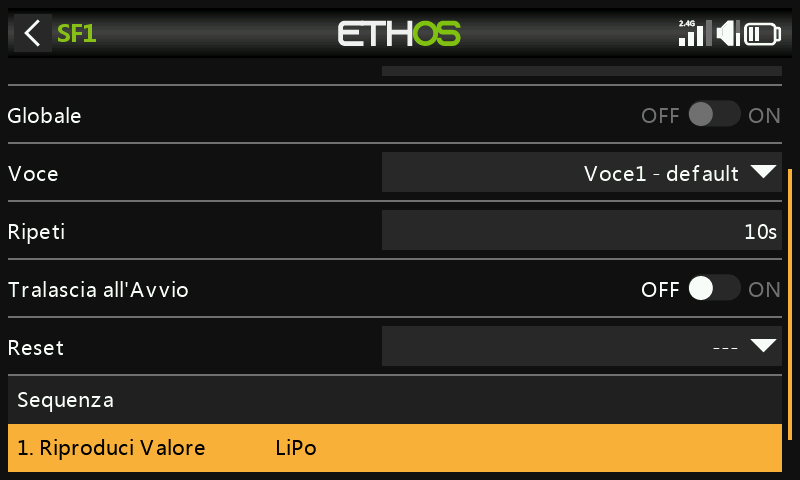

La tensione della Lipo verrà riprodotta ogni 10 secondi quando il suo valore scende sotto la soglia di 3,4 V per cella per 4 secondi, come impostato nell'interruttore logico di cui sopra.

## 2. Come ***impostare*** l'avviso di capacità della batteria con un ESC Neuron

Il metodo migliore per monitorare l'utilizzo della batteria è quello di misurare l'energia o i mAh consumati, in modo da poter calcolare la capacità residua della batteria. La serie di ESC FrSky Neuron offre questa possibilità. Se il tuo ESC non dispone di questa funzionalità, è possibile utilizzare un sensore di corrente con un sensore di consumo calcolato; fai riferimento all'esempio successivo.

Nelle Opzioni del ricevitore imposta la Porta di telemetria sull'opzione S.Port. Collega la porta telemetrica del Neuron ESC al ricevitore tramite un cavo S.Port e attiva l'opzione "Scopri nuovi sensori" in Modello / Telemetria. I sensori aggiuntivi sono mostrati nell'esempio precedente. Il sensore di interesse è "Consumo ESC".

Aggiungere un nuovo interruttore logico per monitorare il "consumo dell'ESC" e diventare vero/attivo quando il consumo supera, ad esempio, i 900 mAh, ovvero circa il 60% della capacità della batteria, consentendo una capacità sufficiente per atterrare e avere ancora circa il 30%.

Aggiungi una funzione speciale per parlare del valore di 'ESC Consumption' quando l'interruttore logico BattCons diventa True.

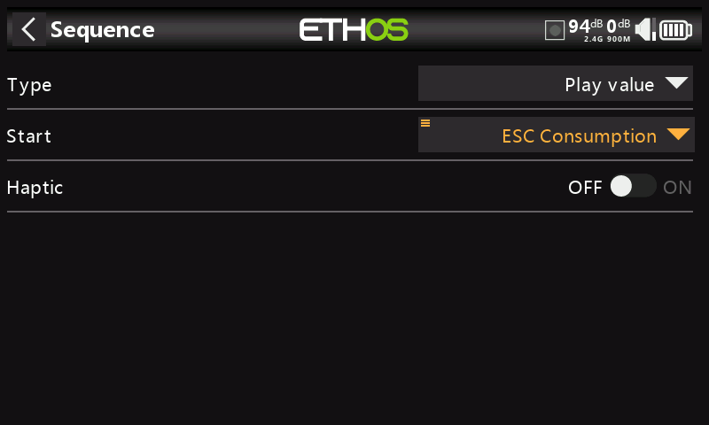

In "Sequenza" aggiungi un comando "Riproduci valore" per pronunciare il valore del sensore di telemetria dell'ESC Consumption.

Come ulteriore salvaguardia, possiamo anche impostare un allarme per la tensione della batteria utilizzando il sensore Neuron "Tensione ESC".

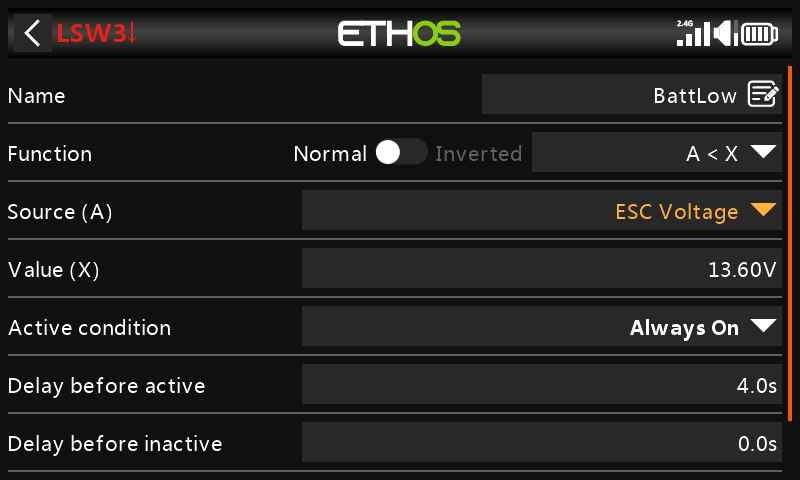

Aggiungi un nuovo interruttore logico per monitorare la "Tensione ESC" e che diventi vero/attivo quando la tensione "Tensione ESC" rimane al di sotto di 3,4 per cella per 4 secondi. Nell'esempio viene monitorata una LiPo 4S, quindi la soglia è impostata a 3,4×4 = 13,6V. Una soglia di 3,4V sotto carico recupererà circa 3,7V quando non sarà più sotto carico.

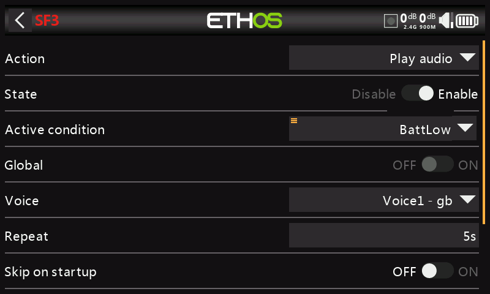

Ora aggiungi una funzione speciale per parlare del valore di 'Tensione ESC' ogni 5 secondi quando l'interruttore logico BattLow diventa vero.

In "Sequenza" aggiungi un comando "Riproduci valore" per pronunciare il valore del sensore di telemetria dell'ESC.

## 3. Come ***impostare*** un avviso sulla capacità della batteria usando un ***sensore calcolato***

Questo è un altro esempio di monitoraggio dell'utilizzo della batteria misurando l'energia o i mAh consumati, in modo da poter calcolare la capacità residua della batteria. Se il tuo ESC non dispone di questa funzionalità, è possibile utilizzare un sensore di corrente come la serie FrSky FASxxx insieme a un sensore di consumo calcolato.

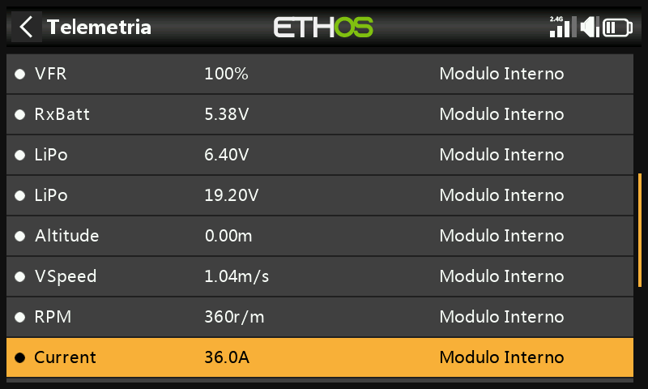

Collega la porta telemetrica del sensore di corrente FASxxx al ricevitore tramite un cavo S.Port e attiva l'opzione "Scopri nuovi sensori" in Modello / Telemetria. I sensori aggiuntivi includono "Corrente" come mostrato nell'esempio precedente.

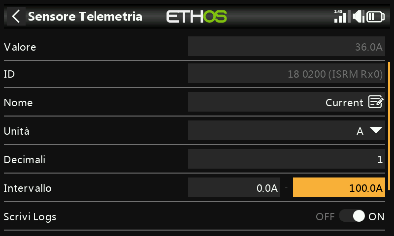

In questo esempio è stato utilizzato un FAS100, quindi l'intervallo è impostato su 0-100A.

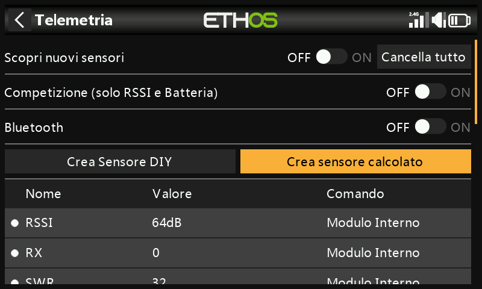

In Telemetria clicca su "Crea sensore calcolato".

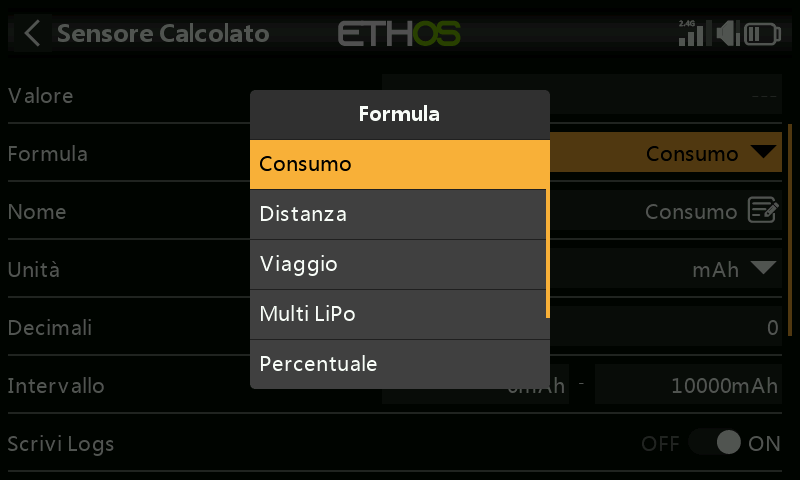

E seleziona "Consumo" dalla finestra di dialogo a comparsa.

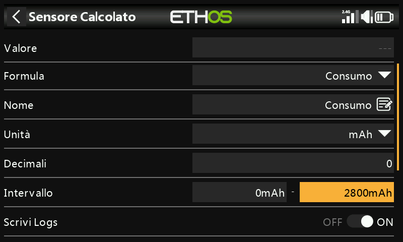

Configura il sensore di consumo in modo che utilizzi unità di misura "mAh" e imposta l'intervallo in base alla tua lipo, ad esempio 2800 mAh.

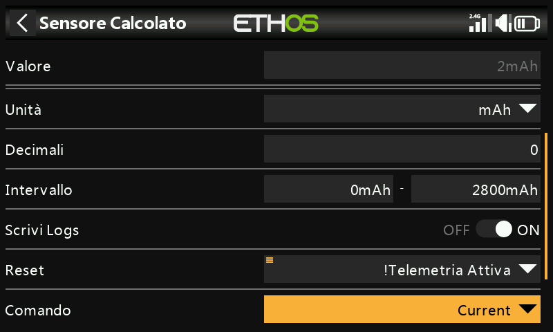

Seleziona una condizione di reset adeguata, ad esempio l'evento di sistema '!Telemetria attiva'. Seleziona prima 'Telemetria attiva', poi premi a lungo il tasto Invio per visualizzare il menu delle opzioni e seleziona 'Inverti'. Il sensore verrà resettato quando la telemetria viene persa quando il modello è spento.

Seleziona la sorgente come "Corrente".

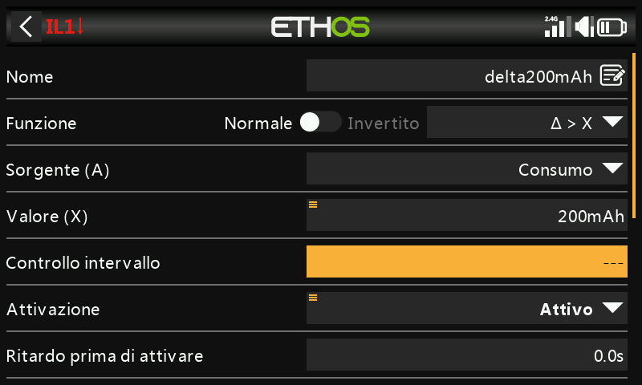

Aggiungi un nuovo interruttore logico utilizzando la funzione Delta (∆ >X) per monitorare il sensore di consumo e diventare Vero/Attivo ogni volta che il consumo raggiunge, ad esempio, 200 mAh, o una frazione conveniente della capacità della batteria.

Tieni presente che per il calcolo del consumo vuoi che la funzione continui a misurare fino a quando non viene raggiunta la tua soglia, quindi l'Intervallo di controllo deve essere impostato su Infinito (cioè '---').

Inoltre, la Durata minima può essere impostata su un valore superiore a 0, in modo da poter vedere l'attivazione durante il debug. A 0,0 avviene troppo velocemente per poterlo vedere.

Aggiungi una funzione speciale "Riproduci audio" che richiami il nostro interruttore logico "delta200mAh" per pronunciare il valore di Consumo ogni volta che l'interruttore logico diventa Vero.

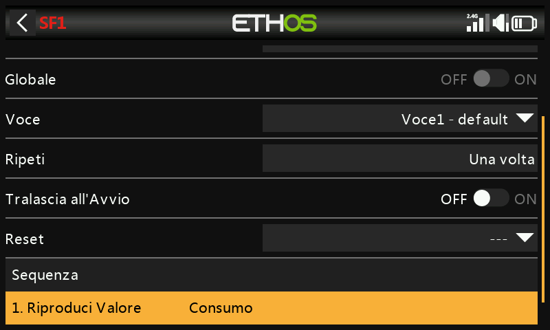

Aggiungi un'azione audio per riprodurre il valore del sensore 'Consumo'".

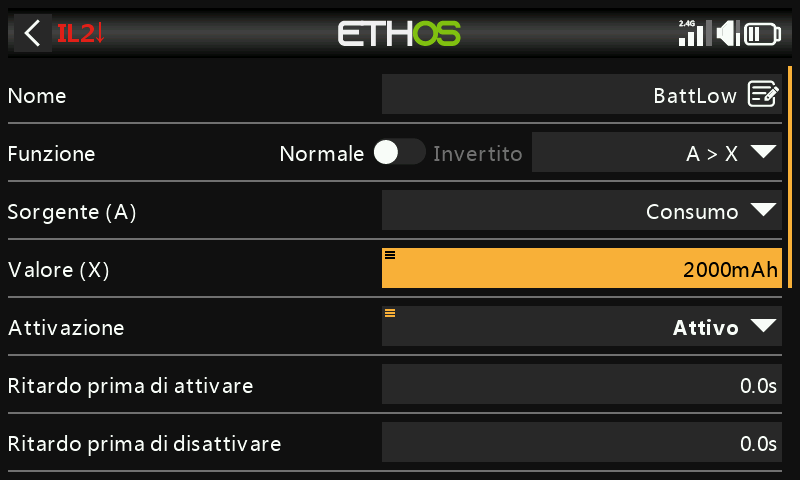

Inoltre, puoi impostare un altro interruttore logico per attivare una chiamata di consumo ogni 10 secondi una volta raggiunta una soglia, ad esempio il limite inferiore. Nel nostro esempio, è stata impostata una soglia di 2000mAh per una LiPo da 2800mAh.

Imposta una funzione speciale per riprodurre il valore del consumo quando l’interruttore logico BattLow si attiva al raggiungimento della soglia di 2000mAh.

Seleziona la voce che desideri utilizzare.

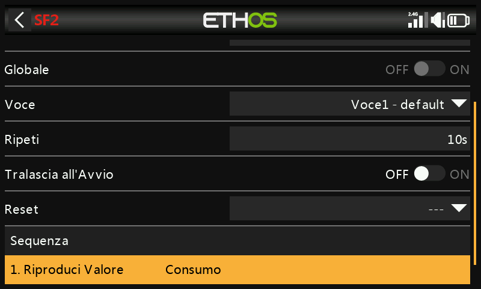

Configura la funzione speciale in modo che si ripeta ogni 10 secondi.

Configura l'azione audio per riprodurre il valore del sensore "Consumo".

## 4. Come creare un modello utilizzando una Ricevente Stabilizzata

Per iniziare, ti invitiamo a prendere familiarità con la sezione Sistema / Configurazione dispositivo / Ricevitore.  
  
Le procedure guidate per la creazione dei modelli utilizzano l'ordine dei canali definito in Sistema / Comandi; per impostazione predefinita è AETR, il che indica che i canali da 1 a 4 sono nell'ordine: alettoni, elevatore, acceleratore, timone. Tuttavia, per i modelli con più di una superficie per alettoni, elevatore, timone, flap ecc., la procedura guidata raggrupperà normalmente queste superfici, quindi, ad esempio, si otterrebbe AAETR se si utilizzassero 2 canali alettoni.  
  
I ricevitori stabilizzati FrSky prevedono un ordine dei canali AETRA, quindi è necessario indicare alla procedura guidata (in Sistema / Stick) di mantenere “fissi i primi quattro canali”:

Passo 1. Conferma l'ordine dei canali predefinito

In Sistema / Stick, conferma che l'ordine di canale predefinito è AETR.

Passo 2. ***Abilita ‘******Primi quattro canali fissi’******.***

In Sistema / Stick, attiva l'impostazione "Primi quattro canali fissi". In questo modo la procedura guidata non raggrupperà canali simili (tra i primi quattro) e manterrà ad esempio entrambi i canali degli alettoni insieme.

Passo 3. Crea il modello con la procedura guidata

Esegui la procedura guidata per la creazione di un nuovo modello cliccando sul \[+\] in Modello / Seleziona modello e indica alla procedura guidata tutti i canali che stai utilizzando. I primi 5 canali saranno AETRA. Sono inoltre preconfigurati i canali necessari per il controllo del guadagno del giroscopio e della modalità di stabilizzazione. Per ulteriori dettagli, consultare la sezione “Aggiunta di un nuovo modello”.

Passo 4. Configura stabilizazione

Per ulteriori dettagli sulla configurazione della stabilizzazione, comprese le indicazioni su come scegliere lo strumento di stabilizzazione Lua più adatto al proprio ricevitore, si prega di consultare la sezione dedicata alla configurazione dello stabilizzatore. La sezione include anche dei link a un documento di configurazione molto dettagliato e a un video.

Note

Si prega di notare che l'autocontrollo per i ricevitori Archer viene ora eseguito tramite lo strumento Sistema / Configurazione dispositivo / SxR. Il firmware del ricevitore Archer deve essere la versione v2.1.10 o superiore.  
  
Si noti che il canale dell'acceleratore 3 deve essere impostato su -100, altrimenti l'autocontrollo non verrà avviato. Tuttavia, a partire dalla versione del firmware v3.0.0, l'impostazione del canale dell'acceleratore su -100% non è più necessaria.  
  
Inoltre, non è più presente la modalità di emergenza sul canale 12.

5. Come riordinare i canali, ad esempio per SR8/SR10

Potresti voler convertire un modello esistente per utilizzarlo con un ricevitore stabilizzato FrSky. Questo potrebbe comportare un riordino dei canali.

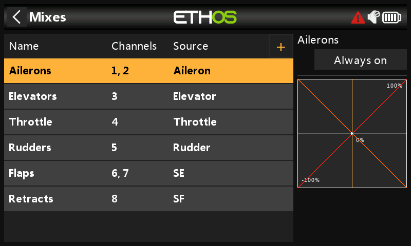

Il tuo modello attuale potrebbe avere un ordine di canale di AAETRFF.

CH1	Alettone1 (destro)

CH2	Alettone2 (sinistro)

CH3	elevatore

CH4	Gas - Throttle

CH5	Timone

CH6	Flap1 (destra)

CH7	Flap2 (sinistra)

CH8	Retrattili.

I ricevitori stabilizzati FrSky hanno un ordine di canale AETRAE definito come segue:

CH1 Alettone1 (destro)

elevatore CH2

Gas - Throttle CH3

CH4 Timone

CH5 Alettone2 (sinistro) o AUX1

CH6 Elevatore2 o AUX2

allora

Guadagno CH9

CH10 e CH11 Fasi di volo

CH12 Autocontrollo sui ricevitori SxR più vecchi

Passo 1. Cambia il CH2 (alettone1) in CH9

Per prima cosa spostiamo il CH2 (alettone2).

a) Vai su Modello / Uscite e tocca CH2 (Aileron2) per evidenziarlo.

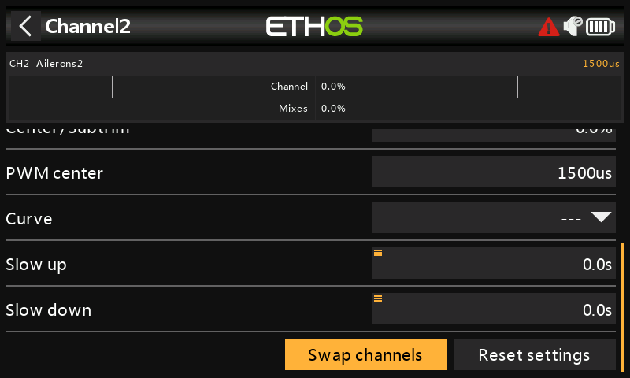

b) Tocca di nuovo e seleziona Scambia canali dalla finestra di dialogo a comparsa.

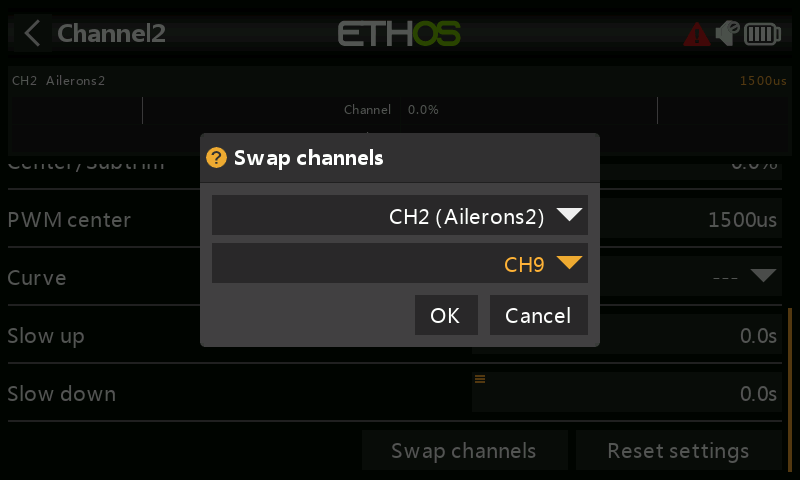

c) La finestra di scambio si apre con il primo canale (CH2 Aileron2) già compilato. Seleziona CH9 come canale da scambiare.

d) Clicca su "OK" per scambiare le impostazioni dei canali CH2 e CH9. Nota che lo scambio avviene immediatamente. Tutti i mix ecc. saranno regolati di conseguenza.

e) Ora avrai l'alettone2 sul CH9.

Passo 2. Scambia CH3 (elevatore) e CH2

a) Ripeti i passaggi precedenti per spostare il CH3 (elevatore) al CH2.

Passo 3. Cambia CH4 (***Gas - Throttle***) ***in*** CH3

a) Ripeti i passaggi precedenti per spostare il CH4 (Gas - Throttle) sul CH3.

Passo 4. Scambia CH5 (***timoni***) e CH4

a) Ripeti i passaggi precedenti per spostare CH5 (Timoni) su CH4.

Passo 5. Scambia CH9 (alettone2) con CH5

a) Ripeti i passaggi precedenti per spostare il CH9 (alettone2) sul CH5.

Passo 6. Conferma il nuovo ordine dei canali

Come si può vedere nell'esempio precedente, i canali sono ora nell'ordine corretto per i ricevitori stabilizzati FrSky:

CH1	Alettone1 (destro)

CH2	elevatore

CH3	Gas - Throttle

CH4	Timone

CH5	Alettone2 (sinistro)

CH6	Flap1 (destra)

CH7	Flap2 (sinistra)

CH8	Retrattili.

## 6. Come configurare un mix Butterfly (alias crow)

La frenata a Butterfly o a crow è utilizzata per controllare la velocità di discesa di un aereo, più comunemente usata sugli alianti. Gli alettoni sono impostati in modo da salire di poco, ad esempio del 20%, mentre i flap scendono di molto. Questa combinazione crea una forte resistenza aerodinamica, è molto efficace per frenare e quindi è ideale per controllare l'approccio all'atterraggio.

Per questo esempio si suppone che una Mix Butterfly debba essere aggiunta a un aliante che ha già i canali Flap creati dalla procedura guidata di creazione del modello. Gli alianti in genere usano lo stick del throttle per frenare. Configureremo la Mix in modo che non venga aggiunto alcun butterfly con lo stick del Gas - Throttle alzato e che il butterfly aumenti progressivamente quando lo stick viene spostato verso il basso.

La compensazione è necessaria anche sull'elevatore per evitare che l'aliante si alzi quando si applica la folla. Utilizzeremo una curva perché la risposta non è lineare.

Passo 1. Disabilita il mix di flap predefinito

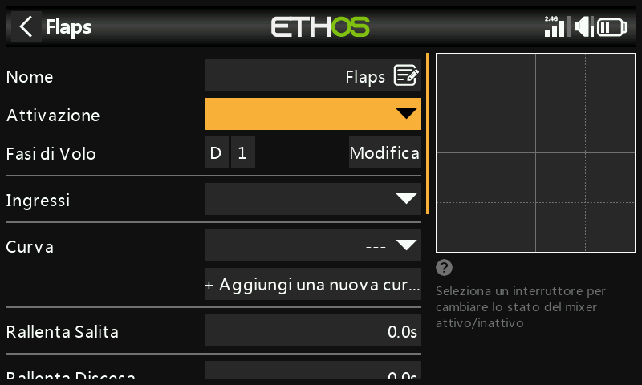

Non useremo il mix Flaps di default, quindi se non è già stato disabilitato, lo disabiliteremo impostando la condizione attiva nel mix Flaps su '---'.

Passo 2. Crea la Mix Butterfly.

Tocca una qualsiasi linea del mixer e seleziona "Aggiungi mix" dalla finestra di dialogo. Seleziona Butterfly dalla libreria dei mixer, quindi aggiungilo nel punto desiderato dell'elenco dei mixer, normalmente dopo il mix Flaps.

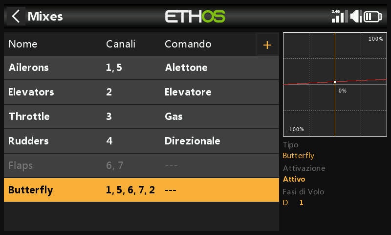

Passo 3. Configura l'ingresso al mix Butterfly

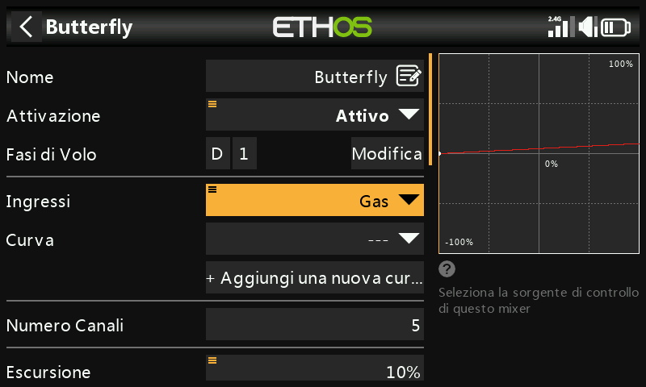

Utilizzeremo lo stick Throttle come controllo di ingresso, quindi possiamo impostare l'Input su 'Throttle'.

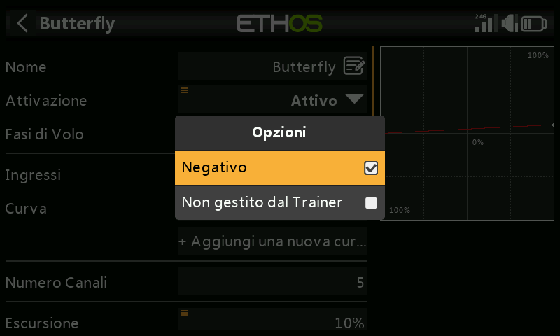

Per impostazione predefinita, l'ingresso Throttle è al massimo quando lo stick è completamente alzato. Per il mix Butterfly vogliamo che sia 0 quando lo stick è completamente alzato, quindi invertiremo l'input. Premi a lungo su 'Throttle' per visualizzare la finestra di dialogo Inverti.

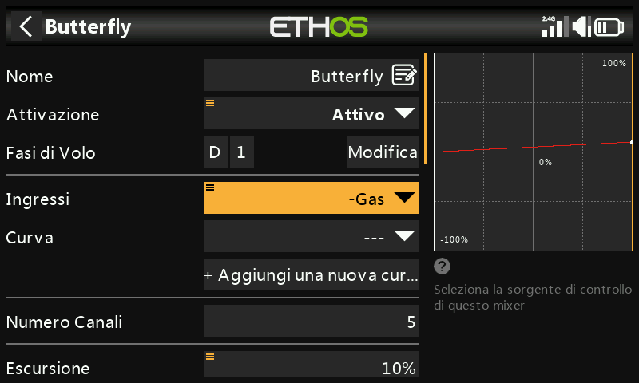

Con lo stick del Gas - Throttle completamente alzato, l'ingresso è ora a 0 (vedi sopra). Il parametro Input ora dice "-Throttle" per indicare che è stato invertito.

Se non vuoi che il mix Butterfly sia sempre attivo, la "Condizione attiva" può essere impostata su una Fase di volo come quella di atterraggio o su un altro controllo a piacere.

Passo 4. Aggiungi una curva di deadband (zona inutilizzata)

In generale, è una buona idea avere un po' di banda morta per lo stick dei flap all'estremità dello zero per evitare un'apertura accidentale se lo stick si sposta un po' dal fine corsa.

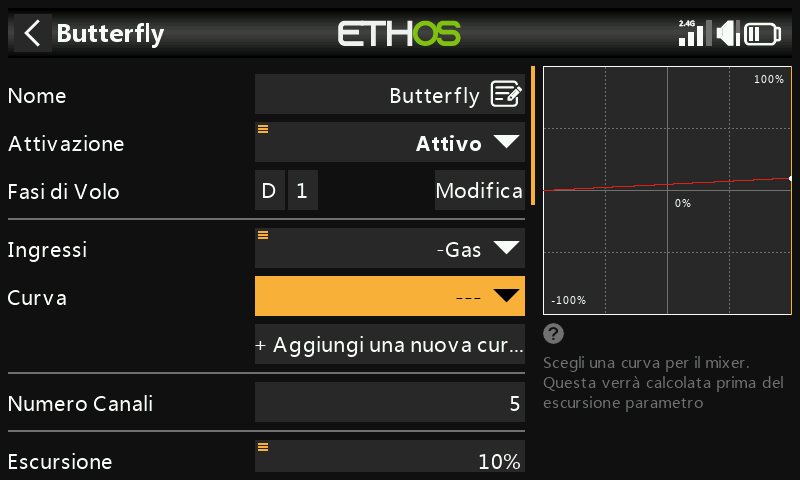

Tocca "Aggiungi una nuova curva".

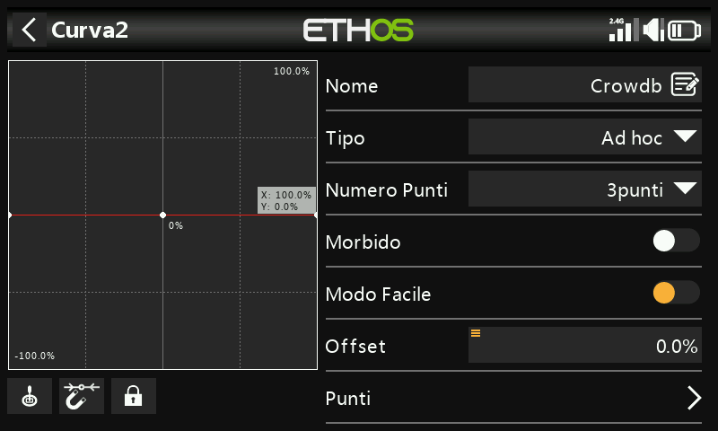

Diamo alla curva un nome come "Crowdb", rendiamola una curva personalizzata con 3 punti e disattiviamo la "modalità facile" in modo da poter spostare il punto X.

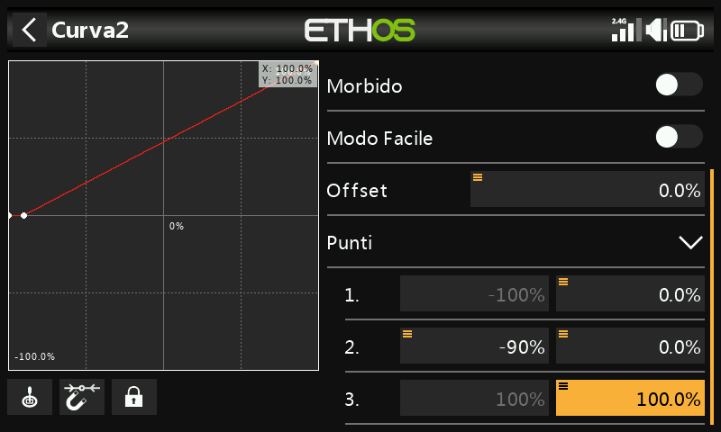

Non appena aggiungi la tua curva al mix Butterfly, l'offset interno che fa funzionare il controllo sorgente da 0 a 100 viene rimosso. Questo significa che anche la nostra curva deve trasformare il controllo della sorgente per andare da 0 a 100.

Come puoi vedere sopra, la curva emetterà lo 0% fino a quando lo stick del Gas - Throttle non raggiungerà il -90%, per poi aumentare linearmente fino al 100%.

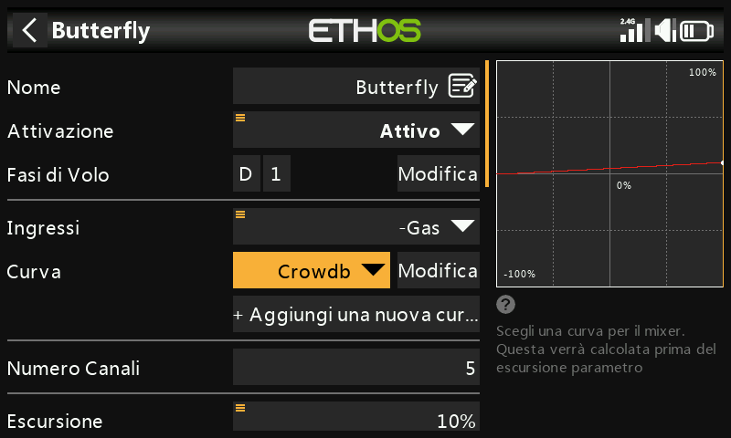

L'ingresso del Gas - Throttle ha ora una banda morta applicata.

Passo 5. ***Configurare*** gli alettoni e i flap

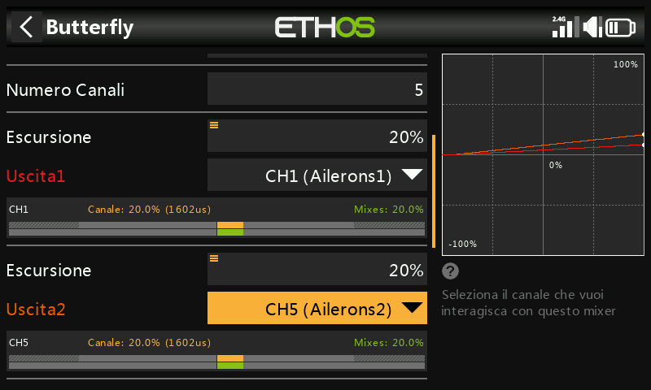

Normalmente per la frenata a Butterfly o a crow, gli alettoni sono impostati per salire di una quantità modesta, ad esempio il 20%, mentre i flap scendono di una quantità elevata. Questa combinazione crea una forte resistenza aerodinamica ed è molto efficace per la frenata. (Nell'esempio precedente, la linea superiore del grafico è al 20% per gli alettoni, mentre gli altri canali sono ancora al 10%). La linea gialla verticale indica che lo stick del Gas - Throttle è completamente abbassato, cioè in posizione Butterfly, quindi le uscite degli alettoni sono al 20%.

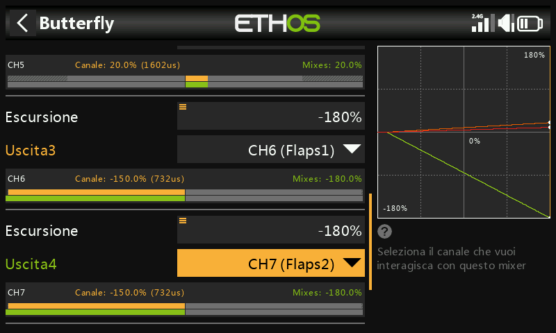

I flap sono insoliti in quanto è necessaria una grande deflessione verso il basso, con un movimento verso l'alto minimo o nullo. Questo può essere ottenuto sacrificando un po' di corsa verso l'alto a favore di quella verso il basso. In pratica, le corna del servo dei flap possono essere sfalsate dal punto neutro di 20 o 30 gradi.

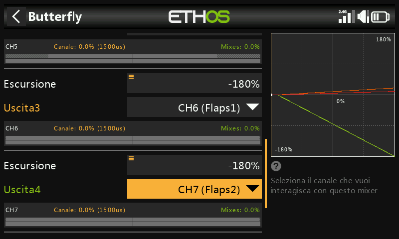

In questa situazione i flap saranno semi-abbassati al punto di neutralizzazione del servo, il che significa che sarà necessaria una Mix di offset per portare i flap in posizione neutra per il volo normale (vedi punto 4 sotto).

Abbiamo impostato le escursioni dei flap a -180% per ottenere la massima corsa. La corsa effettiva può essere configurata nelle uscite. (Per evitare di sovraccaricare i servi, i limiti iniziali di min/max dovrebbero essere impostati a qualcosa come +/- 30% nelle uscite e poi aumentati durante la configurazione finale, facendo attenzione a non sovraccaricare i servi. Per maggiore chiarezza, in questo esempio non è stato fatto, ma sono stati impostati a -180%). L'esempio precedente mostra i flap in posizione completamente abbassata.

Passo 6. Aggiungi una Mix di offset 'Flaps Neutro'.

Se hai sfalsato le squadrette del servo dei flap per ottenere una corsa sufficiente verso il basso, i flap saranno probabilmente deviati verso il basso di circa il 20-30% a servo neutro. Dobbiamo aggiungere un offset utilizzando un Offset Mix per portare i flap nella posizione neutra dell'ala per il volo normale.

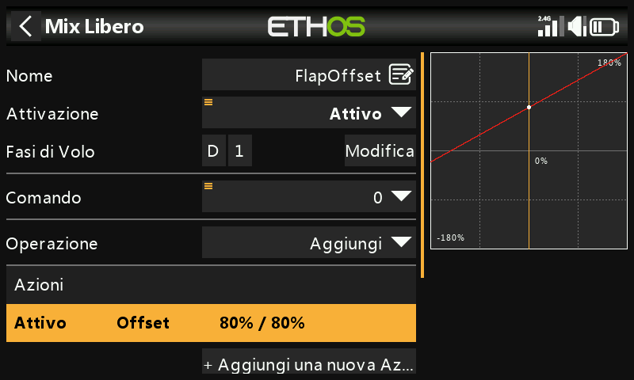

Aggiungi una Mix di offset. Inizieremo con un offset dell'80%, che dovrà essere modificato per ottenere una situazione di "neutralità dei flap".

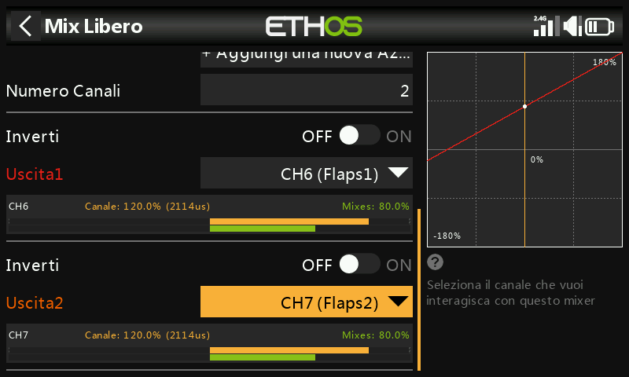

Muovi lo stick del Gas - Throttle completamente verso l'alto per assicurarti che la Mix Butterfly sia disattivata e non contribuisca ai canali dei flap.

Imposta il "Conteggio canali" su 2 e le uscite sui canali dei flap. In questo esempio i flap sono sui canali 6 e 7 e i valori del mixer sono all'80% come da Offset appena impostato. (Nota che le barre arancioni che mostrano le uscite sono più alte dei valori del mixer perché i limiti Min/Max per i flap sono stati impostati a +/- 150% nelle uscite).

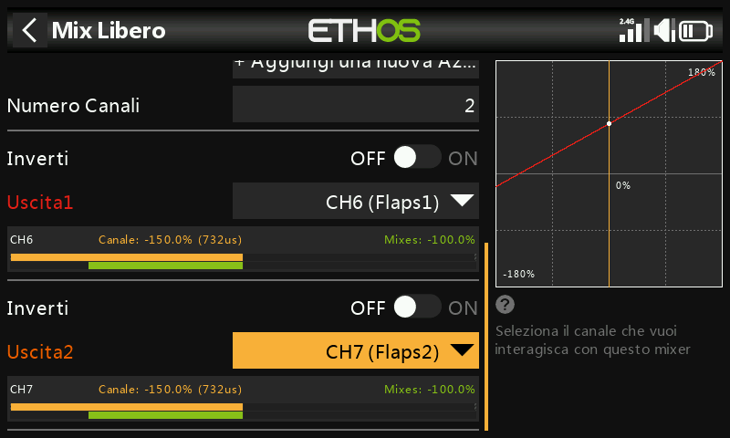

Porta lo stick dell'Flap nella posizione di massima apertura. La schermata qui sopra mostra che le uscite del mixer si sono spostate del 180% (cioè l'impostazione del escursione) da +80% a -100%.

I limiti di corsa effettivi del servo flap devono essere configurati nelle Uscite, utilizzando le impostazioni Min e Max, oppure utilizzando una curva.

Passo 7. Aggiungi la curva di compensazione dell'elevatore e mix

La compensazione è necessaria sull'elevatore per evitare che l'aliante si alzi quando si applica la folla. Utilizzeremo una curva perché la risposta non è lineare.

Per aggiungere la compensazione non lineare dell'elevatore al mix di farfalle, il parametro escursione dell'elevatore deve essere modificato in un mix che a sua volta richiama una curva di compensazione.

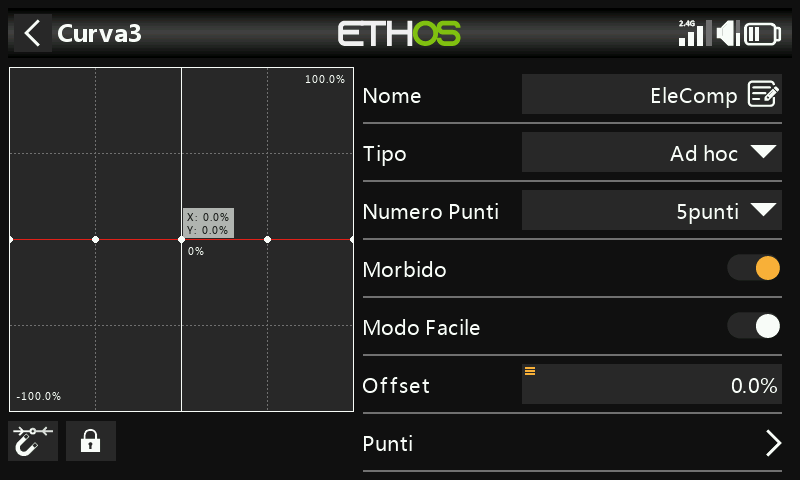

Definisci una curva EleComp come una curva personalizzata a 5 punti.

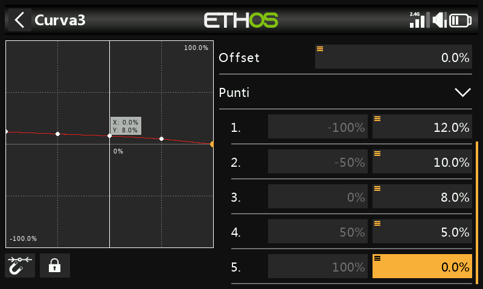

In questo esempio EleComp ha valori iniziali di 12%, 10%, 8%, 5% e 0%. Se il tuo aereo non ha una curva di compensazione dell'elevatore specificata, questi punti dovranno essere determinati empiricamente.

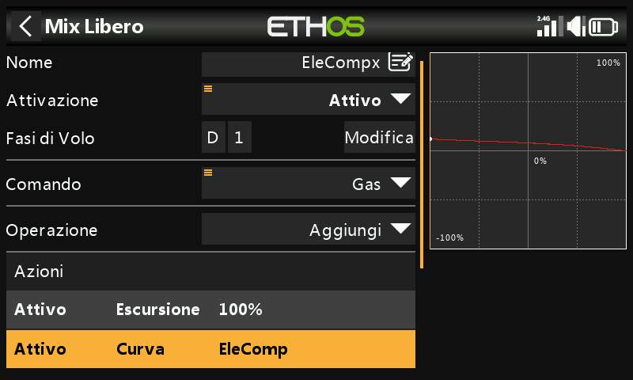

Quindi definiamo un mix alto che convertirà la nostra curva di compensazione in un valore variabile adatto come escursione nel mix Butterfly. Utilizziamo un Mix libero, con il Gas - Throttle come sorgente e colleghiamo la curva EleComp. Chiamiamola EleCompx.

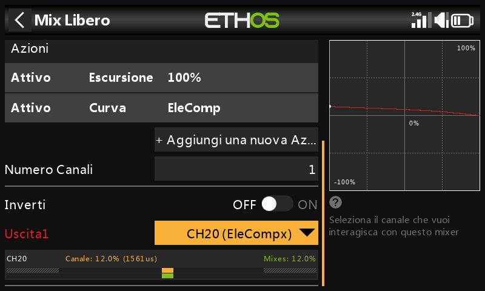

Infine, assegna l'uscita del mix EleCompx a un canale alto, come CH20.

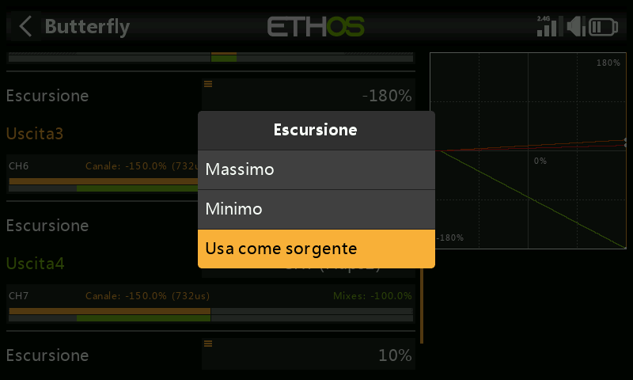

Ora torna al mix Butterfly, scorri verso il basso e premi a lungo \[ENT\] sul escursione dell'uscita Elevator, quindi seleziona "Usa una sorgente".

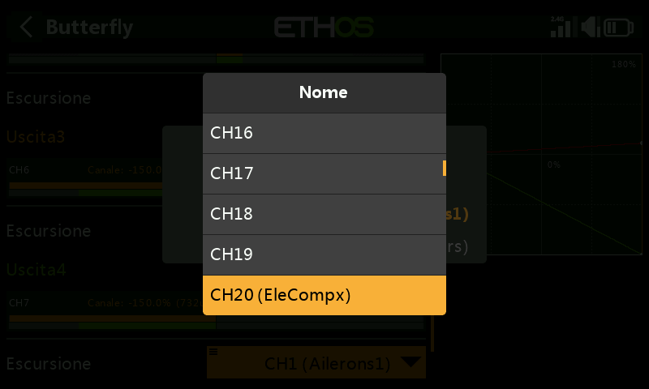

Toccalo di nuovo, poi scegli la categoria Canali e naviga fino a CH20 (EleCompx) e selezionalo.

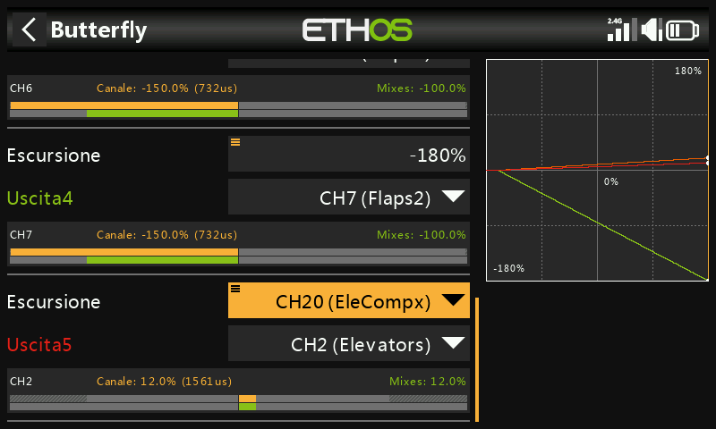

Il mix Butterfly è ora configurato.

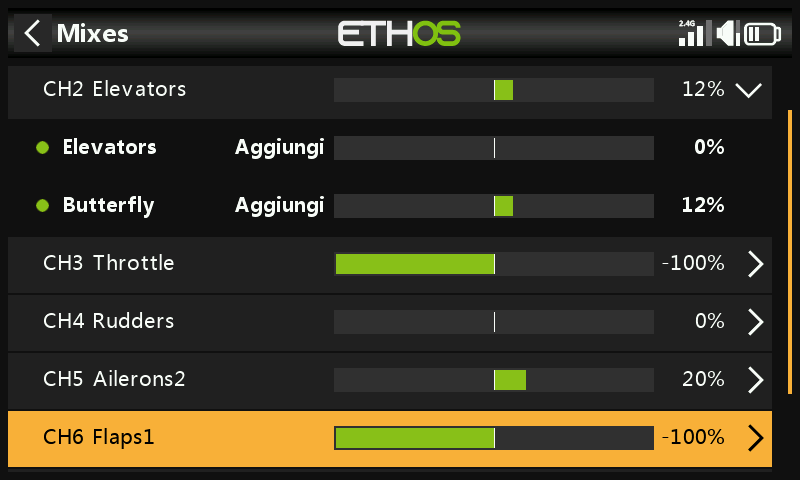

Passando alla vista "Visualizza per canale" puoi vedere l'effetto dello spostamento dello stick del throttle su tutti gli altri canali, il che è molto più facile per il debug ecc.

## 7. Come configurare un sistema FBUS

Il protocollo FBUS (precedentemente F.Port 2.0) è il protocollo aggiornato che integra SBUS per il controllo e S.Port per la telemetria in un'unica linea. Questo nuovo protocollo consente a un dispositivo Host di comunicare su una linea con diversi accessori Slave. Ad esempio, i servi FBUS sono controllati su una connessione a margherita e inviano la telemetria dei loro servi al ricevitore sulla stessa connessione. Tutti i dispositivi FBUS collegati a un ricevitore (Host) possono essere configurati in modalità wireless dalla radio con questo protocollo.

In questo esempio configureremo 2 servi Xact per farli funzionare con il nostro esempio di aereo ad ala fissa di base nelle esercitazioni precedenti sui canali 1 e 5 degli alettoni.

Passo 1: Scaricare l'ultimo firmware

FBUS richiede l'utilizzo del firmware più recente per ricevitori e dispositivi. Per esempio, il firmware dei servi Xact deve essere almeno v2.0.1.

Vai alla sezione Download del sito web di FrSky [https://www.frsky-rc.com/download/ ](https://www.frsky-rc.com/download/)e scarica gli aggiornamenti del ricevitore e del dispositivo FBUS (come il servo Xact).

Passo 2: Flash del firmware

Copia i file del firmware scaricati nella cartella Firmware della scheda SD o eMMC.

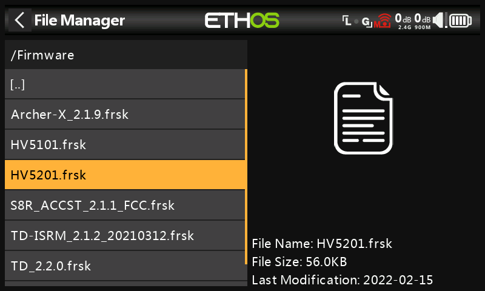

Vai su System / File Manager e scorri fino al file del firmware in questione. Nell'esempio precedente abbiamo scelto il file di aggiornamento per il servo Xact HV5201. La data del file è 2022-02-15, ovvero per la versione v2.0.1.

Inserisci il cavo del servo nella connessione S.Port nella parte superiore della radio. Il cavo bianco o giallo va sul lato con una tacca. Tocca il nome del file evidenziato e seleziona "Flash External Device". Il flash inizierà con un grafico a barre che mostrerà il progresso.

Step 3: Configura ID Fisico

Successivamente dobbiamo configurare gli ID fisici e gli ID applicazione per i due servocomandi Xact. Si noti che devono essere univoci per evitare conflitti sull'FBUS.

Step 3a: Configura ID Fisico e ID Applicazione per servo 1

Collegare il primo servo al connettore S.Port nella parte superiore della radio. Il cavo bianco o giallo va sul lato con una tacca.

Vai a  Sistema / Configura Dispositivo / XAct.

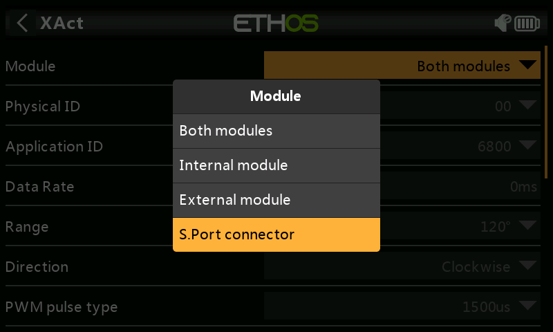

Quando si apre la pagina di configurazione, fare clic su Modulo e selezionare Connettore S.Port.

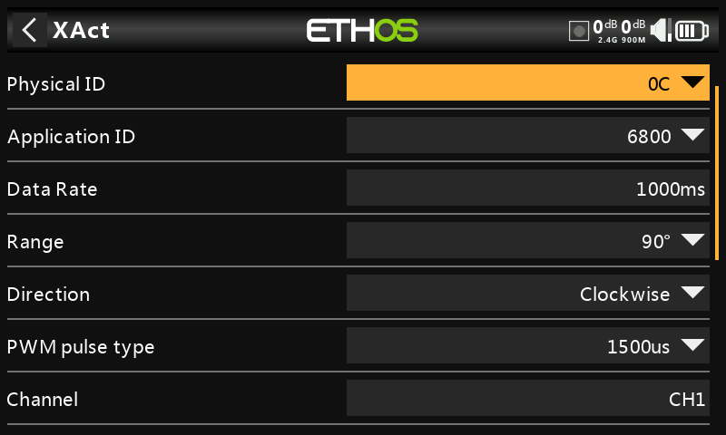

Confermare che l'ID fisico predefinito è 0C hex e l'ID applicazione è 6800 hex. Per il primo servo possiamo lasciare l'ID fisico e l'ID applicazione ai valori predefiniti.

Possiamo lasciare questo servo al numero di canale predefinito a cui risponderà. Scorri verso il basso e conferma che il canale è impostato su CH1.

Se hai apportato modifiche, scorri ulteriormente verso il basso e tocca il pulsante “Salva su flash”.

Step 3b: Configura ID Fisico e ID Applicazione per servo 2

Per il secondo servo dobbiamo cambiare l'ID fisico predefinito di 0C in uno slot non utilizzato, fare riferimento alla tabella ID fisico nella sezione Telemetria. Per questo esempio sceglieremo 0D hex.

Verificare che l'ID fisico sia 0D hex e l'ID applicazione sia 6801 hex.

Tocca l'ID fisico e seleziona 0D hex. Tocca l'ID applicazione e seleziona 6801 hex.

Dobbiamo anche assegnare il numero di canale a cui vogliamo che questo servo risponda, in questo esempio CH5. Scorri verso il basso e cambia il canale in CH5.

Quindi scorri ulteriormente verso il basso e tocca il pulsante “Salva su flash”

Passo 4: Configurare ***il*** ricevitore per FBUS

4a: Configurare ***un*** ricevitore ***SR10 Pro*** per FBUS

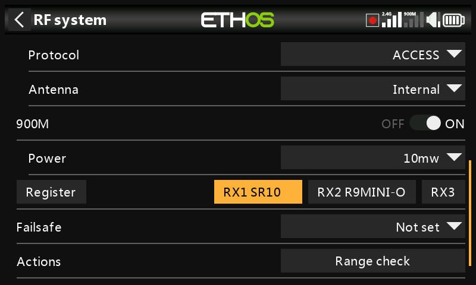

Con un SR10 Pro registrato e collegato, vai su RF System e tocca il pulsante "SR10".

Tocca il ricevitore "Opzioni".

Scorri fino al parametro "Porta telemetrica" e seleziona FBUS. La porta di telemetria del ricevitore funzionerà ora con il protocollo FBUS. I servi Xact possono ora essere collegati in cascata a questa porta FBUS. Poiché i servi hanno un solo connettore, è possibile utilizzare gli estensori multicanale F.Port 2.0 come FP2CH4, FP2CH6 o FP2CH8 per estendere il cablaggio FBUS.

4b. Configurare un ricevitore tandem TD-R18 per FBUS

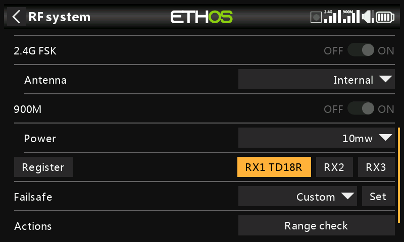

Con un ricevitore Tandem TD-R18 registrato e collegato, vai su RF System e tocca il pulsante "TD18R".

Tocca il ricevitore "Opzioni".

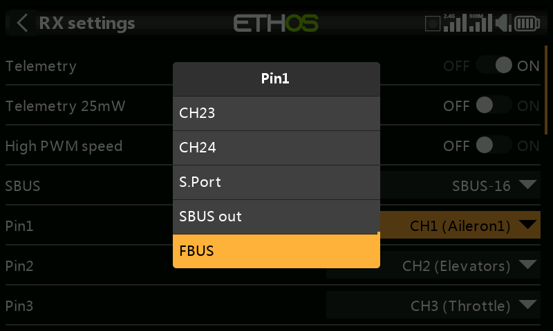

Scorri verso il basso e tocca il parametro Pin1 e seleziona FBUS come opzione per Pin1, per cambiare la connessione PWM predefinita con il protocollo FBUS.

Ripeti l'operazione per il pin5, per modificare la connessione PWM predefinita al protocollo FBUS.

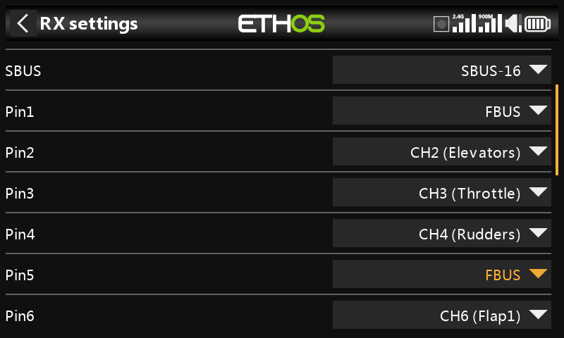

Il ricevitore R18 è ora pronto a far funzionare due servi Xact collegati al Pin1 e al Pin5 tramite il protocollo FBUS. Puoi riassegnare a FBUS tutte le porte che desideri, evitando così di dover utilizzare estensori multicanale.

Passo 5: Configurazione degli ID fisici

Successivamente dobbiamo configurare gli ID fisici per i due servi Xact. Nota che devono essere unici per evitare conflitti sull'FBUS.

Passo 5a: Configura l'ID fisico per il servo 1

Con solo il primo servo collegato al Pin18,vai in Sistema/Config. dispositivo/ Xact.

Clicca su Modulo e seleziona “Modulo Interno”

Conferma che l'ID fisico predefinito è 0C hex e l'ID applicazione è 6800 hex. Per il primo servo possiamo lasciare l'ID fisico e l'ID applicazione ai valori predefiniti.

Possiamo lasciare questo servo al numero di canale predefinito a cui risponderà. Scorri verso il basso e conferma che il canale è impostato su CH1.

Quindi scorri ulteriormente verso il basso e tocca il pulsante “Salva su flash”.

Passo 5b: Configurare l'ID fisico del servo 2

Per il secondo servo dobbiamo cambiare l'ID fisico predefinito di 0C in uno slot non utilizzato; consulta la [tabella degli ID fisici ](../model-setup/telemetry.md)nella sezione Telemetria. In questo esempio sceglieremo 0D hex.

Device Config può connettersi solo a un servo alla volta. Quindi, con il secondo servo collegato al pin 17, vai a Device Config / Xact e verifica che l'ID fisico sia 0C hex e l'ID applicazione 6800 hex.

Tocca l'ID fisico e seleziona 0D hex. Tocca l'ID applicazione e seleziona 6801 hex.

Dobbiamo anche assegnare il numero di canale a cui vogliamo che il servo risponda, in questo caso CH5. Scorri verso il basso e cambia il canale in CH5.

Poi scorri più in basso e tocca il pulsante "Salva su flash".

Esci dalla schermata, seleziona nuovamente Device Config / Xact e verifica che l'ID fisico sia stato modificato in 0D hex, l'ID applicazione in 6801 hex e il canale in CH5.

Passo 6: Controllare il ***controllo*** FBUS ***dei servi***

I servi sono ora pronti per essere utilizzati. Collega il servo 1 alla posizione Pin1 del TD-R18 e il servo 2 alla posizione Pin5, che sono i canali degli alettoni del nostro esempio di aereo ad ala fissa di base riportato nelle esercitazioni precedenti. Nota che tutti i pin del ricevitore programmati come FBUS trasportano esattamente lo stesso segnale FBUS; questo è solo un metodo conveniente per cablare il sistema in modo che ogni servo e dispositivo FBUS abbia un posto dove essere collegato.

Alimenta la radio e il ricevitore e verifica che i canali 1 e 5 facciano funzionare i servi come previsto.

Passo 7: Controllare la telemetria FBUS.

Infine, possiamo configurare la telemetria. Con entrambi i servi collegati, vai su Telemetria e cancella tutti i sensori, quindi scopri nuovamente tutti i sensori.

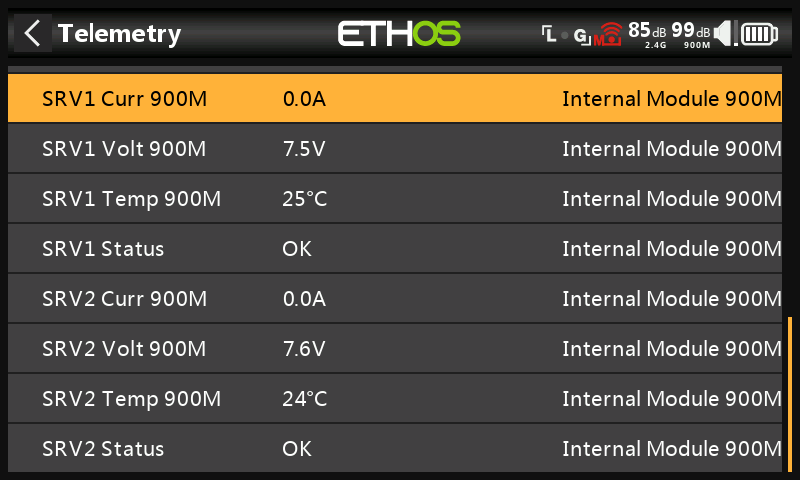

Ora dovresti vedere quattro sensori per ogni servo come mostrato sopra: corrente del servo, tensione del servo, temperatura del servo e stato del servo. Lo stato mostra OK e tutto è normale.

Step 8: Apportare modifiche alla configurazione

In un modello configurato non è pratico isolare i servocomandi XAct per apportare modifiche alla configurazione tramite Device Config.

Invece, vai su Telemetria, scorri verso il basso fino ai sensori XAct ed evidenzia un sensore appartenente al servocomando che desideri riconfigurare, ad esempio “SRV1 curr”.

Seleziona ‘Configura’.

Si aprirà la schermata di configurazione del servo selezionato. Dopo aver apportato le modifiche, ricordarsi di scorrere verso il basso e toccare il pulsante “Salva su flash”. Fare attenzione a non modificare gli ID fisici e gli ID applicativi.

## 8. Come testare la configurazione di un ricevitore ridondante

È importante testare a fondo il modello prima di volare, anche per quanto riguarda la ridondanza.

Questo test presuppone che tu abbia configurato un ricevitore ridondante. Consulta anche la sezione [Aggiungere un ricevitore ridondante ](../model-setup/rf-system.md)nella sezione Sistema RF.

A. ***Test*** nel mondo reale

Supponendo che il tuo ricevitore principale sia su 2.4G e il ricevitore ridondante su 900M, puoi attivare il Range Test e semplicemente camminare fino a quando il 2.4G smette di funzionare (cioè dopo l'avviso RSSI Critical). A questo punto il ricevitore ridondante dovrebbe aver preso il controllo.

B. Test al banco

Passo 1: Confermare la normale configurazione

• Verificare che SBUS Out sul ricevitore ridondante sia collegato a SBUS In sul ricevitore principale.  
  
• Supponendo che il ricevitore principale sia impostato su 2,4 GHz e il ricevitore ridondante su 900 MHz, verificare che entrambi i ricevitori siano collegati e che i LED verdi siano accesi. Verificare che i comandi funzionino correttamente.

Fase 2: Collegare il ricevitore principale a un altro Model ID

• Crea una copia clone del tuo modello con un ID modello diverso.  
  
• Per evitare confusione, rinomina il clone, magari aggiungendo un suffisso.  
  
• Collega il ricevitore principale al modello clonato. L'uso di un clone garantisce che le uscite funzionino normalmente, poiché tutte le tue miscele e programmazioni rimarranno invariate.  
        
    • Torna al modello in fase di test. Il LED sul ricevitore principale dovrebbe ora lampeggiare in rosso, poiché è collegato al modello clonato. Il LED sul ricevitore ridondante dovrebbe essere verde. I comandi dovrebbero funzionare, dimostrando che il ricevitore ridondante è operativo.  
  
• Se disponi di sensori di telemetria esterni collegati in cascata tramite S.Port a entrambi i ricevitori, dovresti continuare a ricevere i dati di telemetria.

Fase 3: Effettua il re-bind del ricevitore principale al suo normale Model ID.

Una volta completato il test di ridondanza,  
  
• Ricollegare il ricevitore principale al suo normale ID modello.  
  
• Verificare che i LED verdi su entrambi i ricevitori siano nuovamente accesi e controllare che i comandi funzionino normalmente.  
  
• Eliminare il modello di prova clonato.

## 9. Come impostare una lista di controllo con testo definito dall'utente

La funzione Checklist all'avvio può anche visualizzare un testo definito dall'utente. Il testo può essere un testo normale o un testo avanzato. Una volta installato il file di testo per un determinato modello e avviata la radio con quel modello selezionato, la radio visualizzerà sempre la Checklist per quel modello all'avvio.

Passo 1. Crea il testo della Checklist definito dall'utente.

Opzione A - Testo normale

Scrivi la tua lista di controllo utilizzando un editor di codice come Notepad++, oppure puoi semplicemente utilizzare MS Word e salvare il file con il nome del modello e l'estensione .txt.

Opzione B - Testo potenziato

Per migliorare il testo Ethos supporta la sinrates Markdown, che consente di aggiungere facilmente la formattazione.

Ad esempio, per indicare un titolo, aggiungi due caratteri "#" prima di esso. Oppure per rendere una frase in grassetto, aggiungi due asterischi prima e dopo (ad esempio, \*\*questo testo è in grassetto\*\*).

Puoi comunque utilizzare un editor di testo per creare la tua lista di controllo, inserendo i caratteri di formattazione come necessario. Tuttavia, il file deve essere salvato con il nome del modello e l'estensione .md. In alternativa puoi utilizzare un editor Markdown come Nextpad o Marktext.

Esempi di elementi di formattazione:
