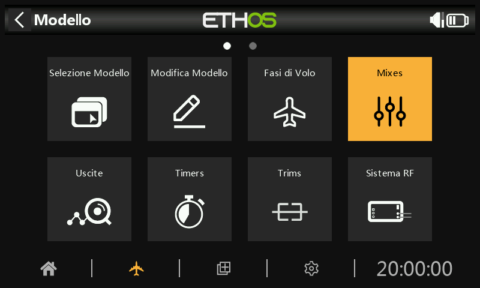
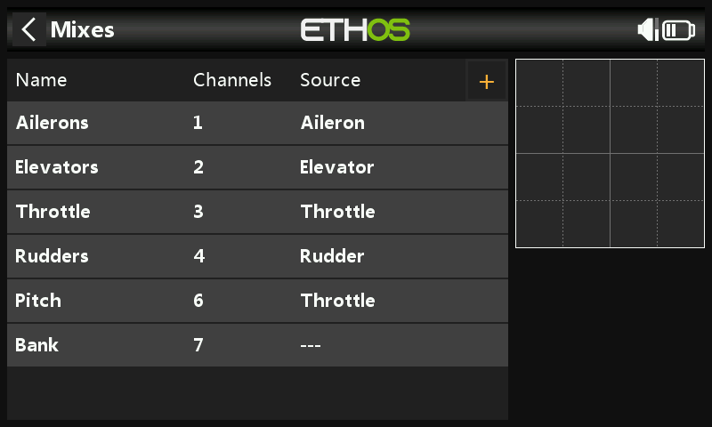
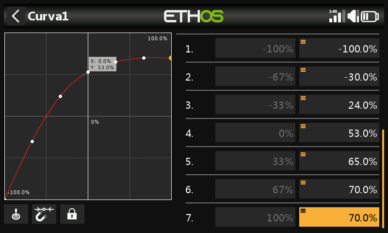
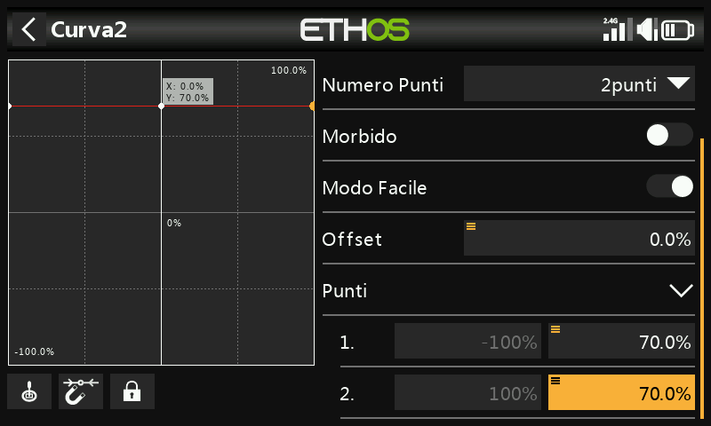
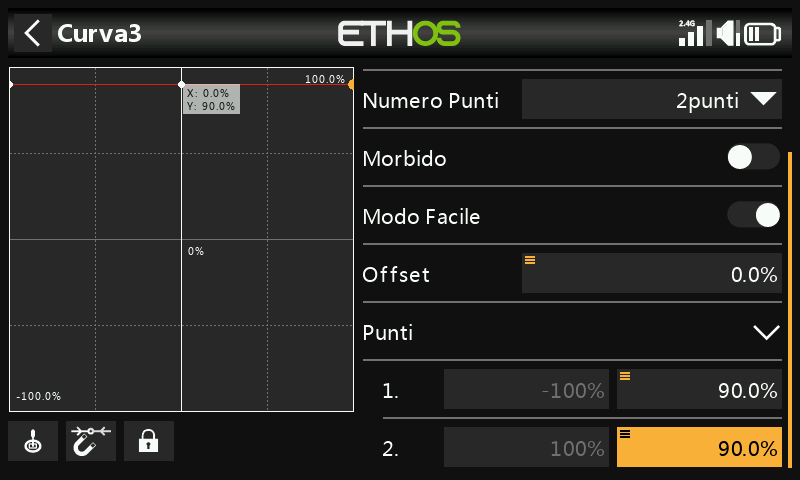

# Esempio di elicottero Flybarless di base

Questo esempio di elicottero flybarless di base copre la configurazione di un elicottero di base che utilizza un controller FBL come lo Spirit.

A differenza degli aerei ad ala fissa con diedro, gli elicotteri sono intrinsecamente instabili e si affidano a un controller di volo che utilizza giroscopi e accelerometri per ottenere un volo stabile.

I giroscopi, che misurano il tasso di rotazione attorno a un asse, e gli accelerometri, che rilevano il movimento e la velocità per tenere traccia del movimento e dell'orientamento, sono i principali responsabili della determinazione dell'imbardata, del beccheggio e del rollio per i calcoli di volo necessari per un volo stabile. La stabilità è ottenuta grazie all'uso di un algoritmo software chiamato anello di controllo PID (Proportional Integral Derivative). L'anello PID deve essere regolato per ottenere un volo stabile, mantenendo la reattività e riducendo al minimo l'overshoot. I parametri di regolazione sono funzione delle caratteristiche fisiche ed elettriche dell'elicottero.

In questo esempio ci occuperemo solo della programmazione radio della configurazione dell'elicottero. Per il resto della configurazione, consulta la documentazione dell'applicazione di configurazione FBL. Si presuppone una buona conoscenza della tecnologia e del funzionamento degli elicotteri.

**Attenzione!** Prima di iniziare, per evitare lesioni, assicurati che le pale del rotore siano state rimosse in modo da poter eseguire l'installazione in sicurezza.

## Passo 1. Conferma le impostazioni del sistema

Inizia seguendo l'esempio di "Configurazione iniziale della radio", che serve a configurare le parti dell'hardware del sistema radio comuni a tutti i modelli. In questo esempio utilizzeremo l'ordine dei canali AETR (Alettoni, Elevatore, Motore, Timone) e l'impostazione "Primi quattro canali fissi" dovrà essere "OFF".

Usa la funzione [RF System ](../model-setup/rf-system.md)per registrare (se il tuo ricevitore è ACCESS) e collegare il tuo ricevitore in preparazione alla configurazione del modello.

## Passo 2. Identificare i servi/canali necessari

La funzione Mixer costituisce il cuore della radio. Permette di combinare una qualsiasi delle numerose sorgenti di ingresso e di mapparle su uno qualsiasi dei canali di uscita.

Il nostro esempio di elicottero ha i seguenti servi/canali:

1 x rollio (alettone)

1 x passo (elevatore)

1 x Gas - Throttle

1 x imbardata (timone)

1 x guadagno del giroscopio

1 x passo collettivo

1 x banco di impostazioni

1 x salvataggio (rescue)

## Passo 3. Crea un nuovo modello.

Consulta la sezione Impostazione del modello / [Selezione del modello ](../model-setup/model-select.md)per creare il tuo nuovo modello. Consulta anche la sezione Navigazione dei menu per familiarizzare con l'interfaccia utente della radio, in modo da trovare facilmente le funzioni di cui hai bisogno.

Consulta la sezione Sistema / [Stick ](../system-setup/controls.md)e verifica che l'ordine dei canali sia AETR e imposta l'opzione "Primi quattro canali fissi" su "OFF" per assicurarti che l'ordine dei canali creato dalla procedura guidata sia adatto all'unità FBL. Le unità Spirit FBL si aspettano che i canali SBUS siano in questo ordine, nonostante l'unità utilizzi il TAER nella sua configurazione.

Tocca la scheda Modello (icona dell'aereo) e seleziona la funzione Seleziona modello. Crea una categoria Heli se non è ancora presente e selezionala. Tocca il simbolo '+', che ti presenterà una scelta di procedure guidate per la creazione del modello: Aereo, Aliante, Elicottero, Multirotore o Altro. La procedura guidata prende in considerazione le tue selezioni e crea le linee del Mixer necessarie per implementare le funzionalità richieste.

Nel nostro esempio, tocca l'icona Heli per avviare la creazione guidata del modello.

Seleziona Flybarless.

Definisci un nome e un'immagine per il tuo modello.

## Passo 4. Rivedere e configurare i ***mix***

Tocca l'icona Mixer per rivedere i mix creati dalla procedura guidata di Heli.

La procedura guidata ha creato Alettoni, Elevatori, Motore e Timone nella sequenza AETR, come previsto, e ha creato il Pitch sul canale 6 e il Bank FBL sul canale 7.

L'intonazione collettiva è normalmente sul canale 6. Verifica che l'intonazione sia sul canale 6:

| ch6 | Pitch collettivo |
| --- | --- |
| ch7 | Banca FBL |

Dovremo inoltre aggiungere altri mix per Gyro Gain e Rescue/Stabi. TTocca il simbolo “+” accanto alle intestazioni delle colonne. Seleziona "Aggiungi mix" per aggiungere i canali extra necessari utilizzando i Free Mix:

| ch5 | Guadagno del giroscopio |
| --- | --- |
| ch8 | Soccorso / Stabi |

Recensione Alettone / Elevatore / Timone

Non è necessario aggiungere nulla a questi canali. Tieni presente che le impostazioni come i rates e l'expo sono gestite dall'unità FBL, quindi la radio passa semplicemente gli ingressi di controllo lineare all'unità FBL.

Configurare l'intonazione collettiva

Il Pitch Collettivo è solo una curva lineare, quindi è sufficiente confermare il canale di uscita (normalmente il canale 6). Tieni presente che le funzioni come i rates e l'expo sono gestite dall'unità FBL, quindi il trasmettitore invia solo ingressi "puliti".

Configurare il mix di banchi FBL

L'unità Spirit FBL ha tre banchi di impostazioni che possono essere utilizzati per impostare diverse configurazioni. La commutazione dei banchi è ideale per passare da uno stile di volo all'altro, per ottenere un diverso guadagno del sensore a bassi o alti regimi, o per principianti, acro o 3D. In alternativa, può essere utilizzato solo per mettere a punto le impostazioni.

Assegneremo il mix all'interruttore a 3 posizioni SE.

Configurare il guadagno del giroscopio

Tocca una linea del mixer e seleziona "Aggiungi Mix" per aggiungere il canale extra necessario utilizzando un Free Mix. Aggiungilo dopo l'ultimo canale.

Il guadagno del giroscopio è in genere un valore fisso, quindi impostiamo la sorgente su Valore speciale - 0 e poi componiamo il valore di guadagno richiesto utilizzando l'offset. Il valore finale del guadagno può essere determinato in volo. Scorri più in basso e assegna il canale di uscita a 5 (il guadagno è normalmente sul canale 5).

Configurare le Fasi di volo

Utilizzeremo le Fasi di volo per configurare le tre Fasi di volo necessarie per Normal, Idle Up 1 e Idle Up 2. Per il nostro esempio abbiamo rinominato la "Fase di volo predefinita" in "Normale" e abbiamo aggiunto altre due Fasi di volo per Idle Up 1 e 2 sull'interruttore SD.

Configurare il mix di accelerazione

Il canale Throttle sarà controllato da tre curve di throttle per le tre Fase di volo, cioè Normal, Idle Up 1 e Idle Up 2.

Curva di modalità normale

La modalità normale viene utilizzata per lo spool up e il decollo, quindi la curva inizia a -100% (motore spento) e poi aumenta dolcemente per il decollo. I valori finali della curva possono essere determinati in volo.

In questo esempio abbiamo utilizzato una curva a 7 punti con Smooth On per ottenere una curva liscia.

Curva del minimo su 1

Il minimo su 1 viene utilizzato per la maggior parte dei voli. La curva rettilinea significa che avremo un'impostazione costante del throttle per far girare i rotori a una velocità costante. Il valore finale del Gas - Throttle può essere determinato in volo. Il movimento dell'elicottero sarà controllato dai comandi del passo collettivo e degli alettoni (rollio) e dell'elevatore (beccheggio).

Nota che non ci deve essere un grande salto tra Normal e Idle Up 1, in modo che la transizione avvenga senza problemi.

Si noti inoltre che la maggior parte delle unità FBL offre una funzione di governor, che assicura che la velocità del rotore sia mantenuta costante anche durante le manovre di volo aggressive. Per maggiori dettagli, consulta il manuale di Spirit FBL.

Curva del minimo su 2

La funzione Idle Up 2 è utilizzata per voli più aggressivi, ad esempio acrobatici e 3D. Il valore finale del Gas - Throttle può essere determinato in volo.

Configurazione del mix di accelerazione

- Taglio del Gas - Throttle

Se assegniamo l'interruttore SG-up alla funzione di taglio del Gas - Throttle e lo stick è impostato su 'ON', allora il Gas - Throttle verrà tagliato non appena si porta l'interruttore in posizione 'Up'. Tuttavia, a causa dell'impostazione Sticky, il throttle può essere armato solo con lo stick del throttle in posizione bassa (off).

- Curve del Gas - Throttle

Ora possiamo configurare il mix di accelerazione per le tre curve di accelerazione, controllate dalle Fasi di volo.

-

Configurare il mix Rescue / Stabi

In modo analogo, il mix Rescue può essere assegnato, ad esempio, all'interruttore SA del canale 8.

## Passo 5. Impostazione FBL

Installa lo strumento di configurazione ***FBL***

Inizia installando il software Spirit Settings sul tuo PC.

Collega il ricevitore all'***unità FBL***

Collega il ricevitore all'unità FBL seguendo la sezione Cablaggio del manuale FBL. L'"uscita SBUS" del ricevitore deve essere collegata alla porta "RUD" dell'unità FBL (alcuni modelli Spirit richiedono un adattatore SBUS). In alternativa, puoi collegarti utilizzando la porta F.1 o FBUS.

Collega l'***unità FBL al PC***

Collega il PC all'unità FBL come indicato nella sezione Configurazione del manuale di Spirit FBL, utilizzando il cavo in dotazione o via Bluetooth.

Stabilisci una connessione corretta con la tua unità FBL. Ora sei pronto a configurare la parte di programmazione radio del tuo elicottero. Come già detto, per completare la configurazione rimanente, fai riferimento alla documentazione sulla configurazione di Spirit FBL contenuta nel manuale.

**Attenzione!** Non collegare ancora nessun servo!

Controlla la versione del firmware dell'FBL

Se necessario, aggiorna il firmware dell'FBL alla versione più recente (consulta la scheda Update nello strumento Spirit Settings).

Configurazione generale

Consulta la scheda Generale del software Spirit Settings.

- Imposta il tipo di ricevitore su "Futaba SBUS" o "FrSky F.Port" (a seconda dei casi) e riavvia il sistema.

- Clicca sul pulsante "Canali" per accedere alla finestra di mappatura dei canali del ricevitore. Se hai utilizzato l'ordine dei canali AETR nella procedura guidata Heli, potrai assegnare i canali come segue:

| Gas - Throttle | ch1 |
| --- | --- |
| Alettone | ch2 |
| elevatore | ch3 |
| Timone | ch4 |
| Gyro | ch5 |
| Piatto ciclico | ch6 |
| Banca | ch7 |
| Soccorso/Stabi | ch8 |

L'ordine dei canali di cui sopra è dovuto al fatto che l'unità Spirit fa delle ipotesi sulla posizione dei canali nel flusso di dati SBUS.

Limiti del canale

Consulta la scheda Diagnostica del software Spirit Settings.

Per un corretto funzionamento dell'unità FBL, è necessario calibrare i limiti del canale radio e controllare i centri.

Sulla radio, assicurati che tutti i subtrim e i trim siano azzerati. Imposta il Pitch Collettivo sulla posizione centrale dello stick per ottenere un'uscita di 1500uS nella schermata Output. Ora accendi l'unità FBL e controlla che i canali di alettoni, elevatore, passo e timone siano centrati allo 0% nella scheda Diagnostica. L'unità FBL rileva automaticamente la posizione neutra durante ogni inizializzazione.

Sposta i controlli fino ai loro limiti e regola le corrispondenti impostazioni di escursione minimo e massimo nella pagina Uscite per ogni canale per ottenere una lettura di +100% e -100% nella scheda Diagnostica. Anche la direzione del movimento delle barre deve corrispondere a quella degli stick. Non utilizzare le funzioni di subtrim o trim sul trasmettitore per questi canali, poiché l'unità Spirit FBL le considererà come un comando di ingresso.

Regola il valore dell'offset nella Mix del guadagno del giroscopio per garantire il blocco della direzione.

Dopo queste regolazioni, tutto dovrebbe essere configurato per quanto riguarda il trasmettitore. Ora puoi continuare con il resto della configurazione dell'FBL come indicato nel manuale Spirit FBL.
