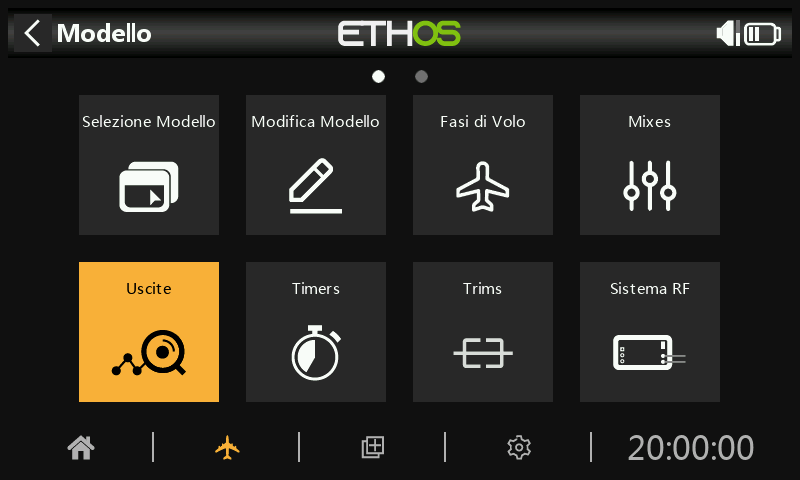
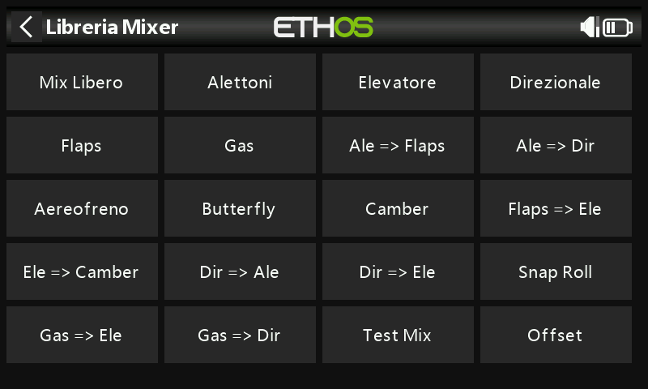

# Esempio di **aereo** ad ala fissa di base

Questo semplice esempio di aeroplano ad ala fissa riguarda la configurazione di un modello con un motore, 2 alettoni (e opzionalmente 2 flap) e un servo per ogni superficie.

## Passo 1. Conferma le impostazioni del sistema

Inizia seguendo l'esempio di "Configurazione iniziale della radio", che serve a configurare le parti dell'hardware del sistema radio comuni a tutti i modelli. Per questo esempio utilizzeremo l'ordine dei canali AETR (alettoni, elevatore, Gas - Throttle, timone) predefinito.

## Passo 2. Identificare i servi/canali necessari

La funzione Mix costituisce il cuore della radio. Permette di combinare a piacimento le numerose sorgenti di ingresso e di mapparle su uno qualsiasi dei canali di uscita. Ethos ha a disposizione 100 canali di mix per la programmazione del tuo modello. Normalmente i canali più bassi vengono assegnati ai servi, perché i numeri dei canali corrispondono direttamente ai canali del ricevitore. Il modulo RF (radiofrequenza) interno dell'X20 ha a disposizione fino a 24 canali di uscita.

I canali di mix superiori possono essere utilizzati come "canali virtuali" nella programmazione più avanzata, oppure come canali reali utilizzando più moduli RF (interno + esterno) e SBus. L'ordine dei canali è una questione di preferenze personali o di convenzioni, oppure può essere dettato dal ricevitore. Nel nostro esempio utilizzeremo AETR.

Il nostro esempio di aereo ha i seguenti servi/canali:

1 motore

2 alettoni

2 Flap

1 elevatore

1 timone

In seguito aggiungeremo anche i retrattili.

## Passo 3. Crea un nuovo modello.

Consulta la sezione Impostazione del modello / [Selezione del modello ](../model-setup/model-select.md)per creare il tuo nuovo modello. Consulta anche la sezione Navigazione dei menu per familiarizzare con l'interfaccia utente della radio, in modo da trovare facilmente le funzioni di cui hai bisogno.

Tocca la scheda Modello (icona dell'aereo) e seleziona la funzione Seleziona modello. Per creare un nuovo modello, seleziona la Categoria di modello in cui desideri creare il modello, quindi tocca l'icona \[+\] per avviare la procedura guidata di creazione del modello. (Potrebbe essere necessario creare prima le Categorie di modelli. Per maggiori dettagli, consulta la sezione [Aggiungere un nuovo modello](../model-setup/model-select.md)).

Nel nostro esempio, tocca l'icona dell'aereo per avviare la creazione guidata del modello.

La procedura guidata prevede l'impostazione di mix preimpostati per i ricevitori stabilizzati FrSky. Per questo esempio, sceglieremo l'opzione "Ricevitore non stabilizzato".

Accetta il valore predefinito di 1 canale per il motore.

Accetta i 2 canali predefiniti per gli Alettoni e seleziona 2 canali per i Flap.

Accetta la coda tradizionale predefinita (che ha l'elevatore e il timone).

Accetta il valore predefinito di 1 canale per l'elevatore e 1 canale per il timone.

Chiameremo il modello "FWexample" e seguiremo la procedura guidata fino alla fine che porterà alla creazione del modello "FWexample" nel gruppo Airplane. Nota che i nomi dei modelli possono essere composti da un massimo di 15 caratteri. Questo modello diventerà anche il modello attivo e potremo continuare a configurarne le caratteristiche.

## Passo 4. Rivedere e configurare i ***mix***

Tocca l'icona Mix per rivedere i mix creati dalla procedura guidata dell'aereo.

La procedura guidata ha creato due alettoni sui canali 1 e 5, seguiti da elevatore, Gas - Throttle, timone e flap. Nota che per i Flap il simbolo "--" indica che non è stata assegnata alcuna sorgente di controllo.

Alettoni

Per rivedere il mix degli alettoni, tocca la riga Alettoni e seleziona Modifica dal menu a comparsa.

escursione/rates

È una buona idea impostare i rates sul tuo modello, soprattutto se non lo hai mai pilotato prima. I rates impostano il rapporto tra il movimento dello stick e il movimento del canale. Ad esempio, per il volo sportivo di solito si desidera una corsa piuttosto modesta delle superfici di controllo, quindi è consigliabile ridurre la corsa a circa il 30%. D'altra parte, per il volo 3D vuoi la massima escursione possibile, cioè il 100%.

Clicca su "Aggiungi un nuovo escursione" e imposta un tasso del 60% per l'interruttore SB in posizione centrale.

Clicca di nuovo su "Aggiungi un nuovo escursione" e imposta un tasso del 30% per l'interruttore SB in posizione abbassata. L'asse verticale del grafico a destra mostra che solo il 60% della gittata è disponibile in questa posizione. Nota che la velocità sarà del 100% con l'interruttore SB in posizione alta.

Expo

Negli esempi di Rates qui sopra puoi vedere che la risposta in uscita è lineare. Per evitare che la risposta sia troppo tesa al centro dello stick, puoi utilizzare una curva Expo per ridurre il movimento della superficie di controllo al centro dello stick e aumentarlo quando lo stick si allontana dal centro. Per questo esempio abbiamo impostato tre rates di Expo al 60%, 40% e 20% sulle corrispondenti posizioni dell'interruttore SB e il grafico ora mostra una risposta curva che è più piatta al centro dello stick

Differenziale

Per gli alettoni esiste un'altra impostazione speciale chiamata Differenziale. Se gli alettoni destro e sinistro si muovono verso l'alto o verso il basso della stessa quantità, l'alettone che si muove verso il basso causerà una resistenza maggiore rispetto a quello che si muove verso l'alto, causando l'imbardata dell'ala nella direzione opposta alla virata. Questo fenomeno è noto come imbardata avversa. Per ridurre questo fenomeno, un valore positivo nell'impostazione del differenziale comporterà un minore movimento dell'alettone verso il basso, come si può vedere nel grafico. In questo modo si ridurrà l'imbardata avversa e si miglioreranno le caratteristiche di virata e maneggevolezza. Un'impostazione comune del differenziale degli alettoni è del 50%.

Tuttavia, puoi assegnare il differenziale a un potenziometro, consentendoti di ottimizzare il valore in volo. Premi a lungo il tasto Invio per visualizzare la finestra di dialogo Opzioni e seleziona "Usa una sorgente".

Scegli Pot1 dall'elenco delle fonti. Puoi vedere l'effetto di Pot S1 nel grafico a destra.

Dopo aver ottimizzato il differenziale degli alettoni in volo, puoi facilmente trasformare il valore del potenziometro in un'impostazione permanente. Premi a lungo Invio per visualizzare la finestra di dialogo Opzioni e seleziona "Converti in valore".

Trim

Offre la possibilità di scollegare il trim associato a un mix senza disabilitarlo, in modo da poterlo utilizzare altrove.

Elevatore e timone

In modo analogo agli Alettoni, possiamo impostare le velocità triple e l'expo per l'Elevatore e il Timone sull'interruttore SC.

Gas - Throttle

Per il Gas - Throttle lasceremo l'Input sullo stick del Gas - Throttle. Non abbiamo bisogno di rates o expo, ma abbiamo bisogno di un interruttore di sicurezza per evitare che il motore si avvii inaspettatamente. Questo è estremamente importante, perché i motori e i modellini possono causare gravi lesioni o morte.

Trim in posizione bassa

Per i motori ad incandescenza e a gas utilizziamo il "trim in posizione bassa" per regolare il regime del minimo. Il regime del minimo può variare a seconda delle condizioni atmosferiche e così via, quindi è importante avere un modo per regolare il regime del minimo senza influenzare la posizione di accelerazione completa.

Se l'opzione "trim in posizione bassa" è abilitata, il canale del Gas - Throttle passa a una posizione di minimo di -75% quando lo stick del Gas - Throttle è in posizione bassa, come mostrato nell'esempio precedente. La leva del trim del Gas - Throttle può essere utilizzata per regolare il minimo tra -100% e -50%. Il Throttle Cut può essere configurato per spegnere il motore con un interruttore.

Taglio del Gas – Throttle cut

Il taglio del Gas - Throttle fornisce un meccanismo di blocco di sicurezza del Gas - Throttle. Una volta soddisfatta la condizione attiva nel nostro esempio con l'interruttore SA in posizione abbassata (l'interruttore SA abbassato è indicato in grassetto per indicare che è attivo), l'uscita del Gas - Throttle sarà mantenuta a -100% quando il valore del Gas - Throttle scende sotto il -85%. (Confronta il primo grafico con il secondo).

Tuttavia, se l'opzione "Sticky" è abilitata, il Gas - Throttle verrà tagliato nell'istante in cui l'interruttore SA si abbassa, come mostrato nell'esempio precedente.

Una volta rimossa la condizione attiva (cioè l'interruttore SA non è in posizione abbassata), lo stick o il comando del Gas - Throttle deve essere portato sotto il -85% prima di poterlo aumentare. In questo modo si evita che il motore si avvii inaspettatamente con una posizione di accelerazione elevata quando si rilascia il taglio del Gas - Throttle sull'interruttore SA.

Mantenimento del Gas - Throttle

Il blocco del Gas - Throttle viene utilizzato per interrompere il motore in caso di emergenza da qualsiasi posizione del Gas - Throttle. Quando si verifica la condizione attiva di throttle hold, l'uscita del motore viene istantaneamente ridotta a -100% (o al valore inserito). Come si può vedere nel grafico qui sopra, l'uscita del throttle è stata ridotta a -100% anche se lo stick del throttle si trova sopra la metà della corsa).

Flap

In questo esempio assegniamo i flap all'interruttore SE.

Aumenta anche il escursione di entrambi i canali di uscita al 100%.

## Passo 5. ***Bind /collegamento ricevitore***

Utilizza la funzione [RF System ](../model-setup/rf-system.md)per registrare (se il ricevitore è ACCESS) e collegare il ricevitore in preparazione alla configurazione delle uscite.

Prima di procedere, leggi la sezione successiva sulla configurazione delle uscite. Per evitare danni dovuti al sovraccarico dei servi, è consigliabile scollegare i leveraggi dei servi o ridurre la loro corsa fino a quando non sarai pronto a configurare i limiti min/max dei servi.

## Passo 6. Configurare le uscite

La sezione Uscite è l'interfaccia tra la "logica" di configurazione e il mondo reale con i servi, i collegamenti, le superfici di controllo e i motori. Finora abbiamo impostato la logica di funzionamento di ciascun controllo. Ora possiamo adattarla alle caratteristiche meccaniche del modello. I vari canali sono uscite, ad esempio CH1 corrisponde al connettore del servo numero 1 del ricevitore.

Tocca l'icona Uscite per configurare le uscite.

Tocca un canale di uscita per configurarlo.

Esempio 1: Alettone1

Iniziare a regolare i punti centrali del servo utilizzando la regolazione PPM Center, dopo aver ottimizzato i collegamenti meccanici.

I limiti del servo o del canale devono essere configurati con le impostazioni Min e Max. Per semplificare le cose, puoi assegnare temporaneamente un potenziometro a Min e poi a Max. Premi a lungo sul valore e poi seleziona "Usa una sorgente" come mostrato nell'esempio del differenziale dell'alettone.

Flap

Nota che i flap normalmente richiedono una grande deflessione verso il basso per una frenata efficace. Per ottenere questa grande deflessione verso il basso, puoi sacrificare una parte della deflessione verso l'alto quando realizzi i leveraggi. Ciò significa che i Flap saranno in posizione semi-abbassata al centro del servo. I valori Min e Max vengono regolati per ottenere le posizioni desiderate di flap alzati e flap pieni.

Le curve possono anche essere utilizzate per correggere eventuali problemi di risposta nel mondo reale, ad esempio per garantire che gli alettoni e i flap si seguano a vicenda in modo corretto. Di solito si utilizza una curva a 5 punti su un lato, in modo da far coincidere la corsa delle superfici in 5 punti.

Bilanciamento dei canali

Infine, puoi utilizzare la funzione di bilanciamento dei canali nelle uscite per sincronizzare il movimento delle superfici di destra e sinistra, come gli alettoni e i flap. Consulta la sezione [Bilanciamento dei canali](../model-setup/outputs.md).

## Passo 7. Introduzione alle Fasi di volo

Le Fasi di volo sono un ottimo modo per configurare un modello per compiti diversi. Ad esempio, un aliante può avere Fasi di volo per compiti quali Crociera, Velocità, Termica, decollo e Atterraggio. Ogni Fase di volo può ricordare le proprie impostazioni di trim, quindi una volta che hai regolato l'aliante per volare bene in ogni modalità, non dovrai più cambiare i trim durante il volo quando cambierai attività. L'interruttore della Fase di volo diventa un po' come cambiare le marce in un'automobile. Le Fasi di volo sono talvolta chiamate "condizioni" in altri firmware.

Per semplicità, questo esempio mostra solo l'impostazione delle Fasi di volo Normal, Flaps Half e Flaps Full.

Sono disponibili 20 Fasi di volo, compresa quella predefinita. La prima Fase di volo che ha la condizione attiva su ON è quella attiva. Quando nessuna ha la condizione attiva su ON, è attiva la modalità predefinita. Questo spiega perché la modalità predefinita non ha un'opzione di selezione degli interruttori.

Per il nostro esempio abbiamo configurato la Fase di volo predefinita come Normal e abbiamo aggiunto altre due Fasi di volo denominate Flaps Half (interruttore SE-mid) e Flaps Full (interruttore SE-Up).

Per i flap potresti voler rallentare la transizione tra le Fasi di volo. L'esempio precedente mostra tempi di dissolvenza in entrata e in uscita di 1 secondo.

##     Passo 8. Configurare i Trims

Opzione – Trim Indipendenti

Passiamo quindi alla sezione Trims e modifichiamo lo stick dell'elevatore in "Trims indipendenti per Fase di volo". Questo ti permette di avere una compensazione dell'elevatore indipendente per le due impostazioni di apertura dei flap. L'interruttore del trim dell'elevatore passerà automaticamente da un'impostazione all'altra quando azionerai i flap sull'interruttore SE.

Poiché i trim sono completamente indipendenti, devi regolare l'elevatore in ogni Fase di volo “da zero”, per così dire. Potresti voler utilizzare la funzione “Instant trim” per aiutarti nella prima regolazione per il volo normale, e poi regolare per ogni posizione dei flap. Potresti anche atterrare dopo aver regolato per il volo normale per trasferire il suo valore di trim ai trim della modalità flap come valore di trim iniziale per quelle modalità.

Opzione – Trim Base con Offset

Un'altra opzione è configurare le due modalità flap per utilizzare un trim di base con un offset per ogni posizione dei flap. In questo modo si esegue il trim per il volo normale in Fase di volo “FM0 Default”, e quando si passa alle posizioni dei flap questo trim di base viene utilizzato di nuovo, ma ora eventuali regolazioni del trim di compensazione dell'elevatore vengono aggiunte come offset al trim di base.

Iniziamo impostando la Dimensione del passo su Media, in modo che sia più facile raggiungere rapidamente l'assetto desiderato. La Dimensione del passo può poi essere ridotta per una regolazione più precisa.

Successivamente impostare la Modalità su Personalizzata e fare clic su “Aggiungi un nuovo comportamento”.

Come “Condizione attiva” seleziona modo volo ‘FM1 Flaps Half’.

Poi seleziona ‘Offset + Default’ per il modo.

Il primo comportamento è stato configurato. Nella Fase di volo 1 “FM1 Flaps Half” il valore di trim sarà la somma del trim base o predefinito più il trim Offset risultante dalle regolazioni del trim effettuate mentre si è in Fase di volo 1 “FM1 Flaps Half”.

Ripeti per il modo di volo 2  ‘FM2 Flaps Full’.

La compensazione dell'elevatore può ora essere regolata indipendentemente sia per la Fase di volo “Flaps Half” che per la modalità “Flaps Full”. Tuttavia, se si regola il trim di base o predefinito utilizzato nella Fase di volo “FM0 Default”, anche i due trim di compensazione dei flap verranno modificati della stessa quantità. Questo può essere utile se, ad esempio, il trim predefinito deve essere regolato a causa della deriva termica del servo.

## Passo 9. Imposta un timer per le batterie ***di volo***

Tocca Timer 1 nella sezione Modello / Timer e seleziona Modifica. In questo esempio stiamo configurando un timer per il conteggio alla rovescia, con un valore iniziale di 5 minuti. Il timer verrà eseguito ogni volta che l'evento di sistema "Gas - Throttle attivo" è vero, a condizione che non sia in fase di reset.

Se assegni una sorgente di temporizzazione proporzionale, la velocità del timer dipenderà dalla posizione dello stick del Gas - Throttle (ad esempio). Al massimo dell'accelerazione il timer conterà in tempo reale, ma rallenterà man mano che il Gas - Throttle viene ridotto.

Consulta la sezione [Timer conto alla rovescia ](../model-setup/timers.md)per i dettagli sulla configurazione dei restanti parametri del timer.

## Passo 10. Aggiungi una Mix per i retrattili

Nella schermata principale dei mix (vedi sopra) nuovi mixer possono essere aggiunti toccando il simbolo “+” vicino alla colonna dell’intestazione.

Tocca un mix e seleziona "Aggiungi mix" dal menu a comparsa. Si aprirà la Libreria dei mix. Seleziona "Mix libero".

Per questo esempio, chiama il Free Mix "Retracts". Il mix può essere sempre attivo e la sorgente può essere commutata in SF.

L'azione di miscelazione predefinita di escursione = 100% va bene.

La metà inferiore delle impostazioni del Free Mix mostra che il canale 8 è stato assegnato ai retrattili.
